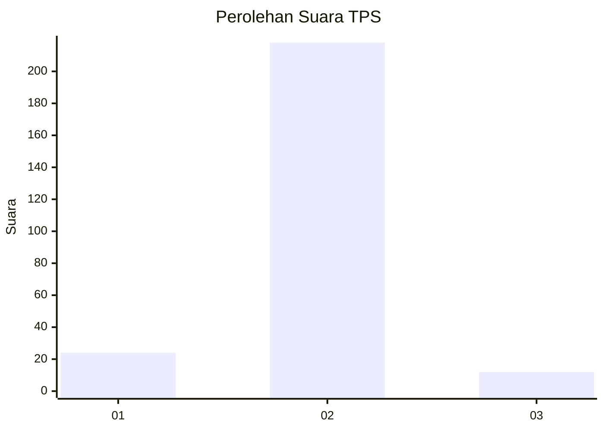
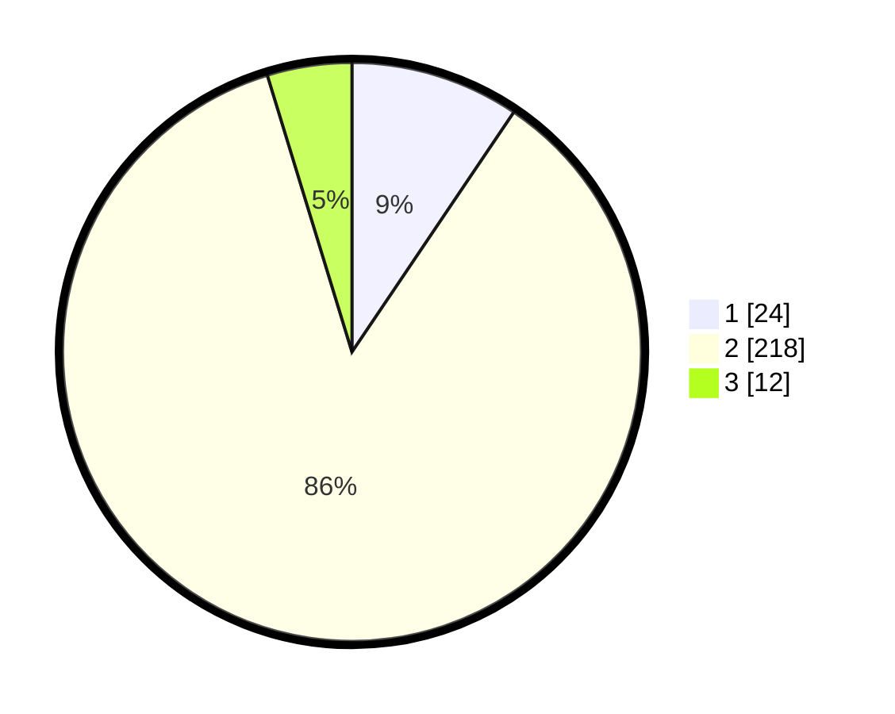

# Hasil

## Grafik

## Tabel

| No. | Nama Paslon    | Suara | Suara (raw) | Persentase |
|:--- |:-------------- | -----:| -----------:| ----------:|
| 1   | ANIES MUHAIMIN | 24    | [24][p-1]   | 9,45       |
| 2   | PRABOWO GIBRAN | 218   | [218][p-2]  | 85,83      |
| 3   | GANJAR MAHFUD  | 12    | [12][p-3]   | 4,72       |

[p-1]: https://github.com/gigit-pemilu/pemilu-2024/blob/main/pilpres/hitung-suara/sub/35-jawa-timur/sub/08-lumajang/sub/15-sukodono/sub/2005-kutorenon/sub/012-tps/sub/paslon-1.txt
[p-2]: https://github.com/gigit-pemilu/pemilu-2024/blob/main/pilpres/hitung-suara/sub/35-jawa-timur/sub/08-lumajang/sub/15-sukodono/sub/2005-kutorenon/sub/012-tps/sub/paslon-2.txt
[p-3]: https://github.com/gigit-pemilu/pemilu-2024/blob/main/pilpres/hitung-suara/sub/35-jawa-timur/sub/08-lumajang/sub/15-sukodono/sub/2005-kutorenon/sub/012-tps/sub/paslon-3.txt

## Foto C Plano

https://sirekap-obj-formc.kpu.go.id/ca50/pemilu/ppwp/35/08/15/20/05/3508152005012-20240215-002649--4c97dcea-21db-4619-bd44-eb79e3ebcb68.jpg

https://sirekap-obj-formc.kpu.go.id/ca50/pemilu/ppwp/35/08/15/20/05/3508152005012-20240215-002715--942abcd8-ef2b-4a3d-9917-5d0aa891bc08.jpg

https://sirekap-obj-formc.kpu.go.id/ca50/pemilu/ppwp/35/08/15/20/05/3508152005012-20240215-002615--50be8c37-126f-4dfd-8d3a-47a6b334aca5.jpg

## Metadata

| Key        | Value               |
| ---------- | ------------------- |
| Time Stamp | 2024-02-16 10:00:28 |

