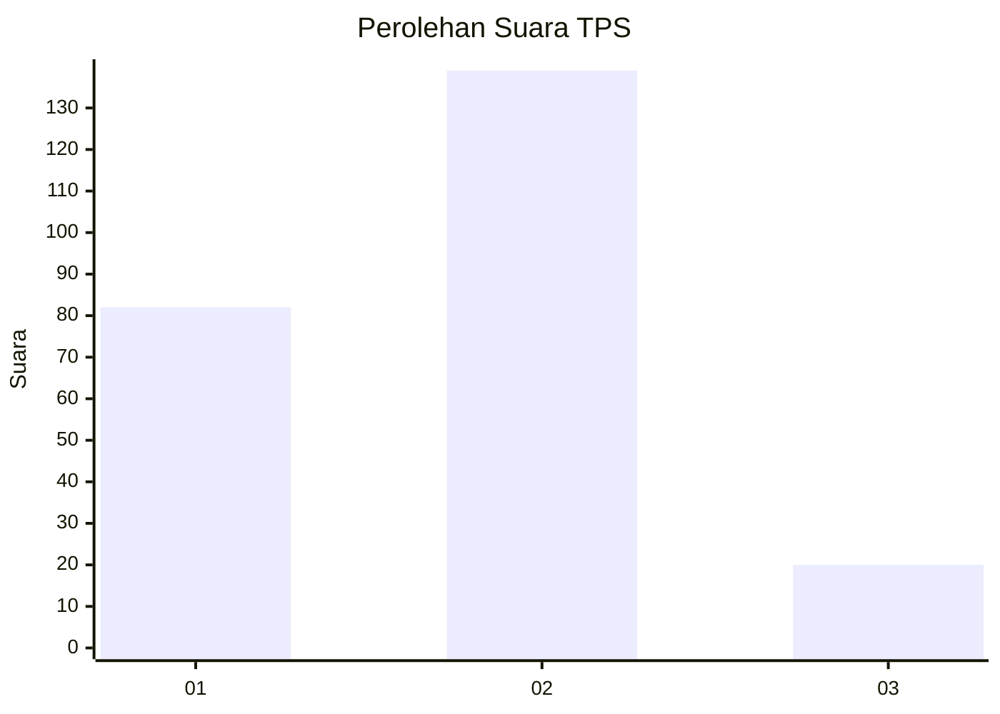
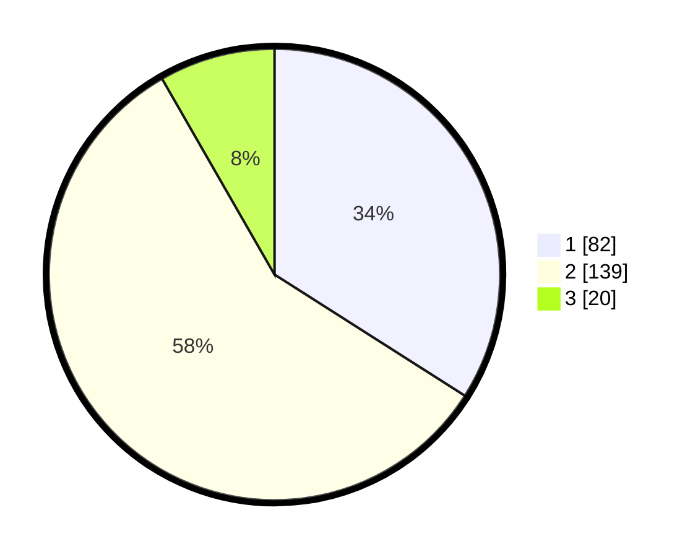

# Hasil

## Grafik

## Tabel

| No. | Nama Paslon    | Suara | Suara (raw) | Persentase |
|:--- |:-------------- | -----:| -----------:| ----------:|
| 1   | ANIES MUHAIMIN | 82    | [82][p-1]   | 34,02      |
| 2   | PRABOWO GIBRAN | 139   | [139][p-2]  | 57,68      |
| 3   | GANJAR MAHFUD  | 20    | [20][p-3]   | 8,30       |

[p-1]: https://github.com/gigit-pemilu/pemilu-2024-35-jawa-timur/blob/main/pilpres/hitung-suara/sub/35-jawa-timur/sub/08-lumajang/sub/15-sukodono/sub/2008-uranggantung/sub/005-tps/sub/paslon-1.txt
[p-2]: https://github.com/gigit-pemilu/pemilu-2024-35-jawa-timur/blob/main/pilpres/hitung-suara/sub/35-jawa-timur/sub/08-lumajang/sub/15-sukodono/sub/2008-uranggantung/sub/005-tps/sub/paslon-2.txt
[p-3]: https://github.com/gigit-pemilu/pemilu-2024-35-jawa-timur/blob/main/pilpres/hitung-suara/sub/35-jawa-timur/sub/08-lumajang/sub/15-sukodono/sub/2008-uranggantung/sub/005-tps/sub/paslon-3.txt

## Foto C Plano

https://sirekap-obj-formc.kpu.go.id/a9c0/pemilu/ppwp/35/08/15/20/08/3508152008005-20240215-002743--eb8df9d0-b6a1-4a46-b550-2e103d43a832.jpg

https://sirekap-obj-formc.kpu.go.id/a9c0/pemilu/ppwp/35/08/15/20/08/3508152008005-20240215-002834--b7c1c057-ad68-436d-be10-c66fbd4ef4ed.jpg

https://sirekap-obj-formc.kpu.go.id/a9c0/pemilu/ppwp/35/08/15/20/08/3508152008005-20240215-005637--d177fb16-e12f-4ea9-909c-dbf001777d29.jpg

## Metadata

| Key        | Value               |
| ---------- | ------------------- |
| Time Stamp | 2024-02-25 15:00:00 |

