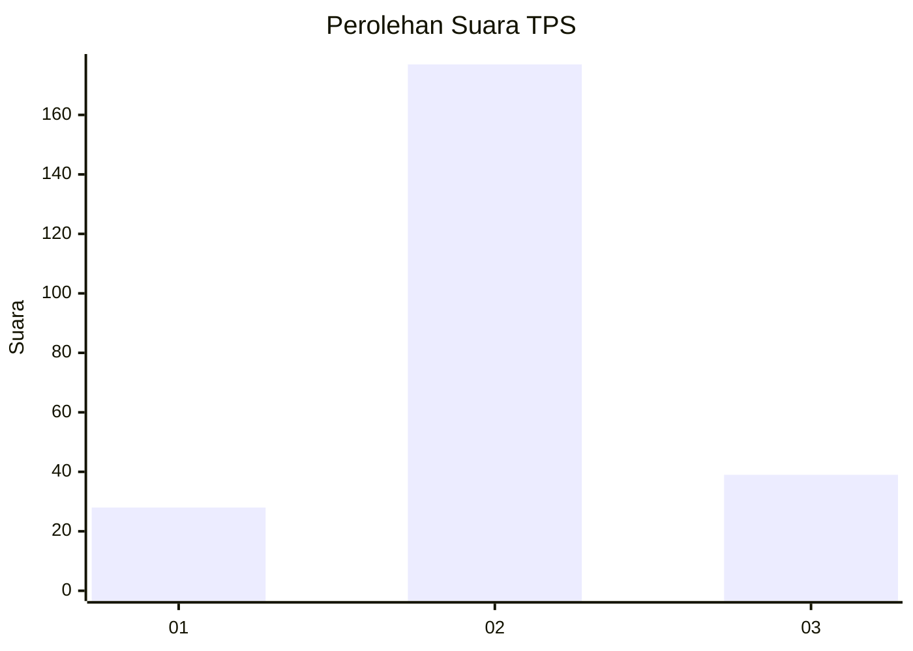
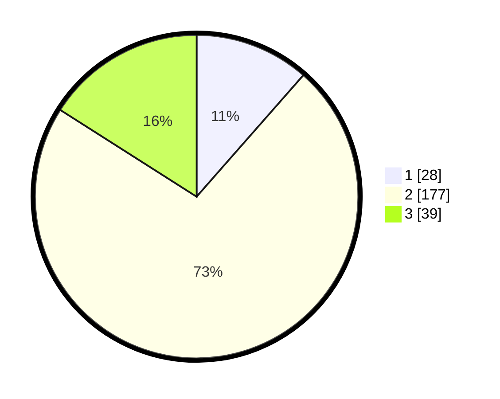

# Hasil

## Grafik

## Tabel

| No. | Nama Paslon    | Suara | Suara (raw) | Persentase |
|:--- |:-------------- | -----:| -----------:| ----------:|
| 1   | ANIES MUHAIMIN | 28    | [28][p-1]   | 11,48      |
| 2   | PRABOWO GIBRAN | 177   | [177][p-2]  | 72,54      |
| 3   | GANJAR MAHFUD  | 39    | [39][p-3]   | 15,98      |

[p-1]: https://github.com/gigit-pemilu/pemilu-2024/blob/main/pilpres/hitung-suara/sub/35-jawa-timur/sub/08-lumajang/sub/15-sukodono/sub/2009-selokgondang/sub/009-tps/sub/paslon-1.txt
[p-2]: https://github.com/gigit-pemilu/pemilu-2024/blob/main/pilpres/hitung-suara/sub/35-jawa-timur/sub/08-lumajang/sub/15-sukodono/sub/2009-selokgondang/sub/009-tps/sub/paslon-2.txt
[p-3]: https://github.com/gigit-pemilu/pemilu-2024/blob/main/pilpres/hitung-suara/sub/35-jawa-timur/sub/08-lumajang/sub/15-sukodono/sub/2009-selokgondang/sub/009-tps/sub/paslon-3.txt

## Foto C Plano

https://sirekap-obj-formc.kpu.go.id/9911/pemilu/ppwp/35/08/15/20/09/3508152009009-20240215-055422--c20679b7-f3b1-4788-9486-9da477944476.jpg

https://sirekap-obj-formc.kpu.go.id/9911/pemilu/ppwp/35/08/15/20/09/3508152009009-20240215-060836--e3d08820-8311-4d87-9433-aed99263fc31.jpg

https://sirekap-obj-formc.kpu.go.id/9911/pemilu/ppwp/35/08/15/20/09/3508152009009-20240215-061010--503c55a4-d44b-4c8a-b24a-89eff91db3be.jpg

## Metadata

| Key        | Value               |
| ---------- | ------------------- |
| Time Stamp | 2024-02-24 22:31:28 |

