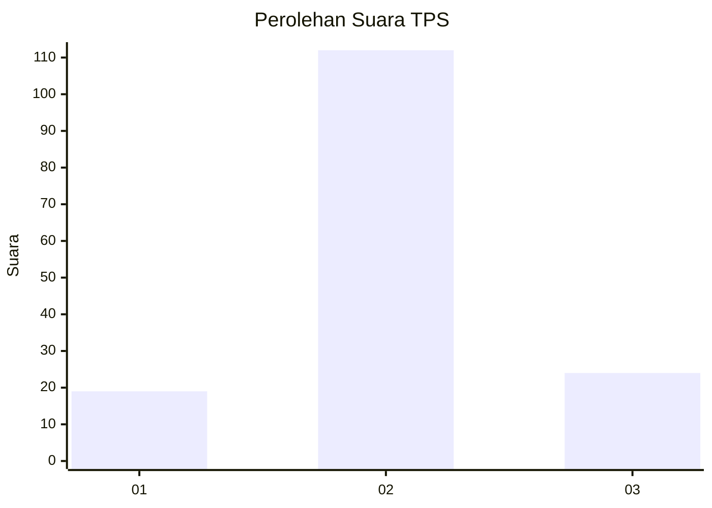
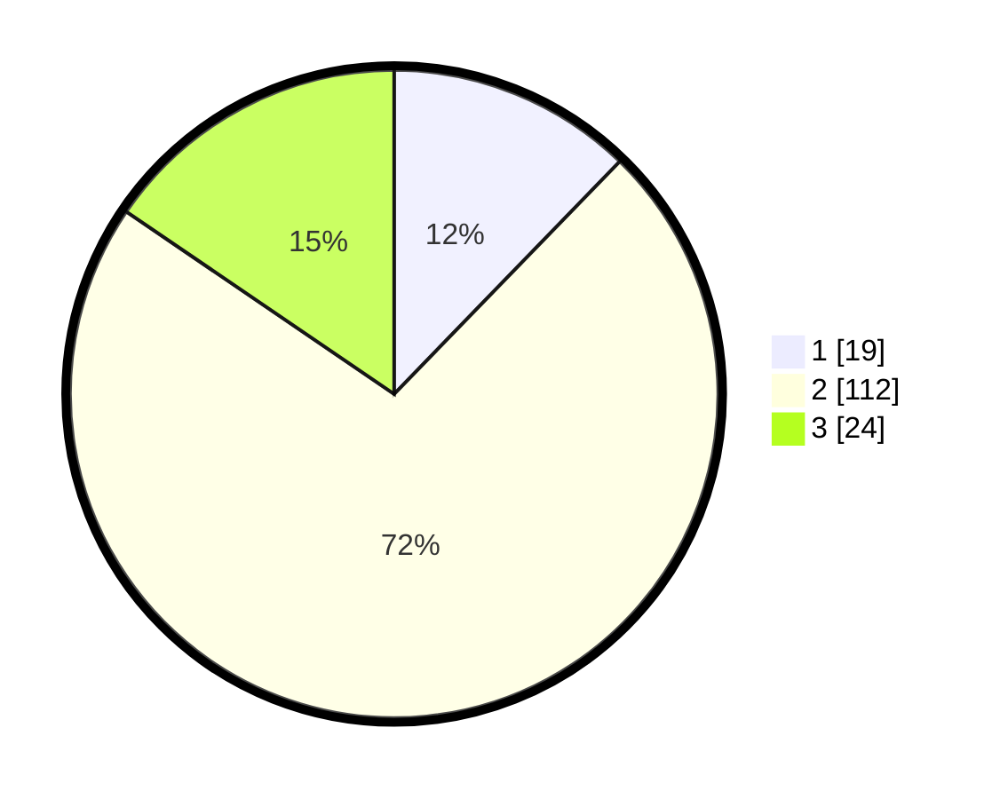

# Hasil

## Grafik

## Tabel

| No. | Nama Paslon    | Suara | Suara (raw) | Persentase |
|:--- |:-------------- | -----:| -----------:| ----------:|
| 1   | ANIES MUHAIMIN | 19    | [19][p-1]   | 12,26      |
| 2   | PRABOWO GIBRAN | 112   | [112][p-2]  | 72,26      |
| 3   | GANJAR MAHFUD  | 24    | [24][p-3]   | 15,48      |

[p-1]: https://github.com/gigit-pemilu/pemilu-2024/blob/main/pilpres/hitung-suara/sub/35-jawa-timur/sub/08-lumajang/sub/15-sukodono/sub/2010-bondoyudo/sub/003-tps/sub/paslon-1.txt
[p-2]: https://github.com/gigit-pemilu/pemilu-2024/blob/main/pilpres/hitung-suara/sub/35-jawa-timur/sub/08-lumajang/sub/15-sukodono/sub/2010-bondoyudo/sub/003-tps/sub/paslon-2.txt
[p-3]: https://github.com/gigit-pemilu/pemilu-2024/blob/main/pilpres/hitung-suara/sub/35-jawa-timur/sub/08-lumajang/sub/15-sukodono/sub/2010-bondoyudo/sub/003-tps/sub/paslon-3.txt

## Foto C Plano

https://sirekap-obj-formc.kpu.go.id/549c/pemilu/ppwp/35/08/15/20/10/3508152010003-20240214-221546--ea22e56f-c03e-42e4-90fd-6f8e7b7c2e54.jpg

https://sirekap-obj-formc.kpu.go.id/549c/pemilu/ppwp/35/08/15/20/10/3508152010003-20240214-222419--7fec95d5-ee79-41f0-a6ad-1465836328f5.jpg

https://sirekap-obj-formc.kpu.go.id/549c/pemilu/ppwp/35/08/15/20/10/3508152010003-20240214-201218--a1ccf1ca-72dc-4c88-8539-a30e19b8e275.jpg

## Metadata

| Key        | Value               |
| ---------- | ------------------- |
| Time Stamp | 2024-02-17 10:30:03 |

