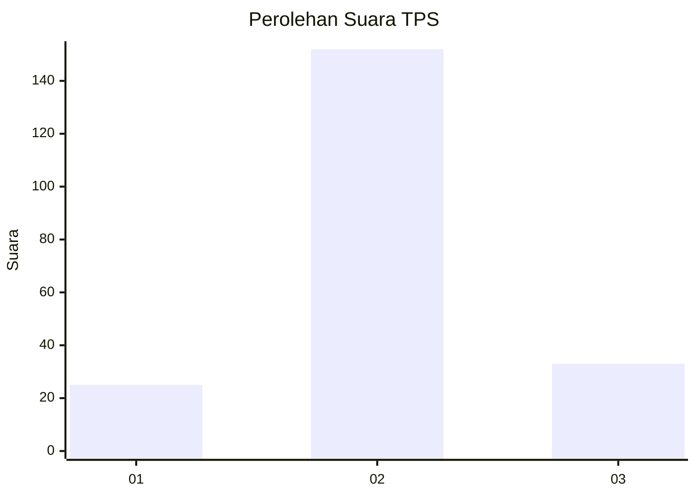
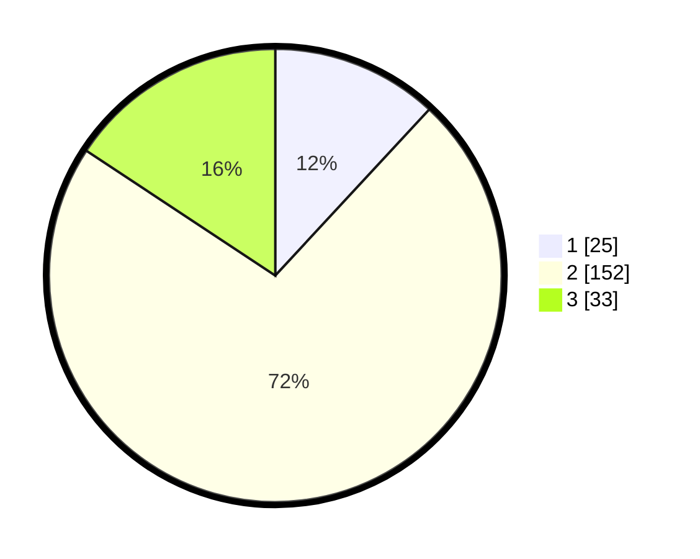

# Hasil

## Grafik

## Tabel

| No. | Nama Paslon    | Suara | Suara (raw) | Persentase |
|:--- |:-------------- | -----:| -----------:| ----------:|
| 1   | ANIES MUHAIMIN | 25    | [25][p-1]   | 11,90      |
| 2   | PRABOWO GIBRAN | 152   | [152][p-2]  | 72,38      |
| 3   | GANJAR MAHFUD  | 33    | [33][p-3]   | 15,71      |

[p-1]: https://github.com/gigit-pemilu/pemilu-2024-35-jawa-timur/blob/main/pilpres/hitung-suara/sub/35-jawa-timur/sub/08-lumajang/sub/15-sukodono/sub/2010-bondoyudo/sub/005-tps/sub/paslon-1.txt
[p-2]: https://github.com/gigit-pemilu/pemilu-2024-35-jawa-timur/blob/main/pilpres/hitung-suara/sub/35-jawa-timur/sub/08-lumajang/sub/15-sukodono/sub/2010-bondoyudo/sub/005-tps/sub/paslon-2.txt
[p-3]: https://github.com/gigit-pemilu/pemilu-2024-35-jawa-timur/blob/main/pilpres/hitung-suara/sub/35-jawa-timur/sub/08-lumajang/sub/15-sukodono/sub/2010-bondoyudo/sub/005-tps/sub/paslon-3.txt

## Foto C Plano

https://sirekap-obj-formc.kpu.go.id/4627/pemilu/ppwp/35/08/15/20/10/3508152010005-20240214-214603--f67f2971-90da-416a-a692-0a36e125c13a.jpg

https://sirekap-obj-formc.kpu.go.id/4627/pemilu/ppwp/35/08/15/20/10/3508152010005-20240214-214958--2e6b5e24-228f-445a-a052-17140137ae77.jpg

https://sirekap-obj-formc.kpu.go.id/4627/pemilu/ppwp/35/08/15/20/10/3508152010005-20240214-230143--e35581a6-6ab6-46cb-bd4f-222615d8a55c.jpg

## Metadata

| Key        | Value               |
| ---------- | ------------------- |
| Time Stamp | 2024-02-15 12:00:28 |

