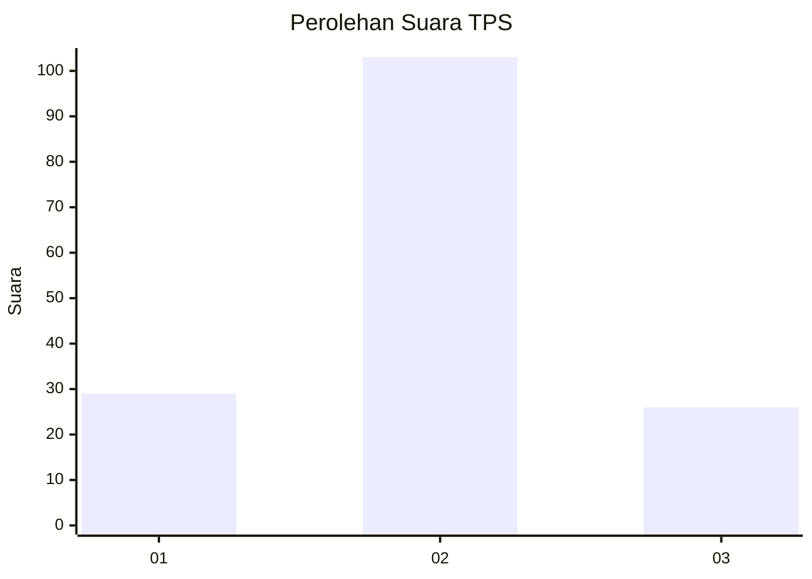
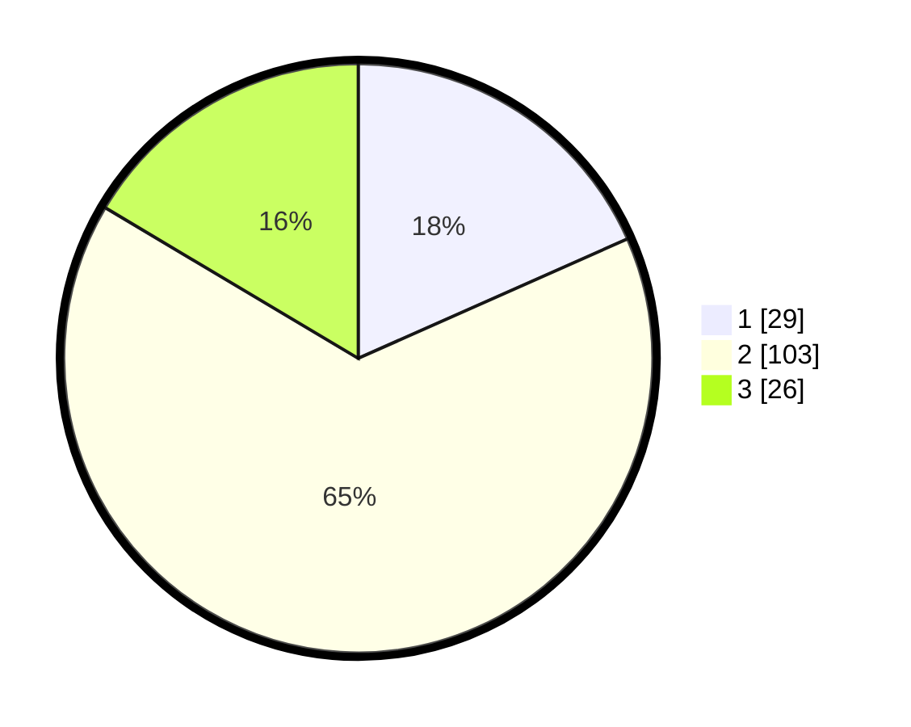

# Hasil

## Grafik

## Tabel

| No. | Nama Paslon    | Suara | Suara (raw) | Persentase |
|:--- |:-------------- | -----:| -----------:| ----------:|
| 1   | ANIES MUHAIMIN | 29    | [29][p-1]   | 18,35      |
| 2   | PRABOWO GIBRAN | 103   | [103][p-2]  | 65,19      |
| 3   | GANJAR MAHFUD  | 26    | [26][p-3]   | 16,46      |

[p-1]: https://github.com/gigit-pemilu/pemilu-2024-35-jawa-timur/blob/main/pilpres/hitung-suara/sub/35-jawa-timur/sub/08-lumajang/sub/15-sukodono/sub/2010-bondoyudo/sub/009-tps/sub/paslon-1.txt
[p-2]: https://github.com/gigit-pemilu/pemilu-2024-35-jawa-timur/blob/main/pilpres/hitung-suara/sub/35-jawa-timur/sub/08-lumajang/sub/15-sukodono/sub/2010-bondoyudo/sub/009-tps/sub/paslon-2.txt
[p-3]: https://github.com/gigit-pemilu/pemilu-2024-35-jawa-timur/blob/main/pilpres/hitung-suara/sub/35-jawa-timur/sub/08-lumajang/sub/15-sukodono/sub/2010-bondoyudo/sub/009-tps/sub/paslon-3.txt

## Foto C Plano

https://sirekap-obj-formc.kpu.go.id/ff47/pemilu/ppwp/35/08/15/20/10/3508152010009-20240214-203914--40ba5f2e-cbed-4988-83c5-28b687726f5e.jpg

https://sirekap-obj-formc.kpu.go.id/ff47/pemilu/ppwp/35/08/15/20/10/3508152010009-20240215-041836--db3574ef-9b63-4a91-8747-99773805dde3.jpg

https://sirekap-obj-formc.kpu.go.id/ff47/pemilu/ppwp/35/08/15/20/10/3508152010009-20240214-204316--1bab518f-5ac5-49b1-891c-7afaa9599d1b.jpg

## Metadata

| Key        | Value               |
| ---------- | ------------------- |
| Time Stamp | 2024-02-25 18:00:00 |

