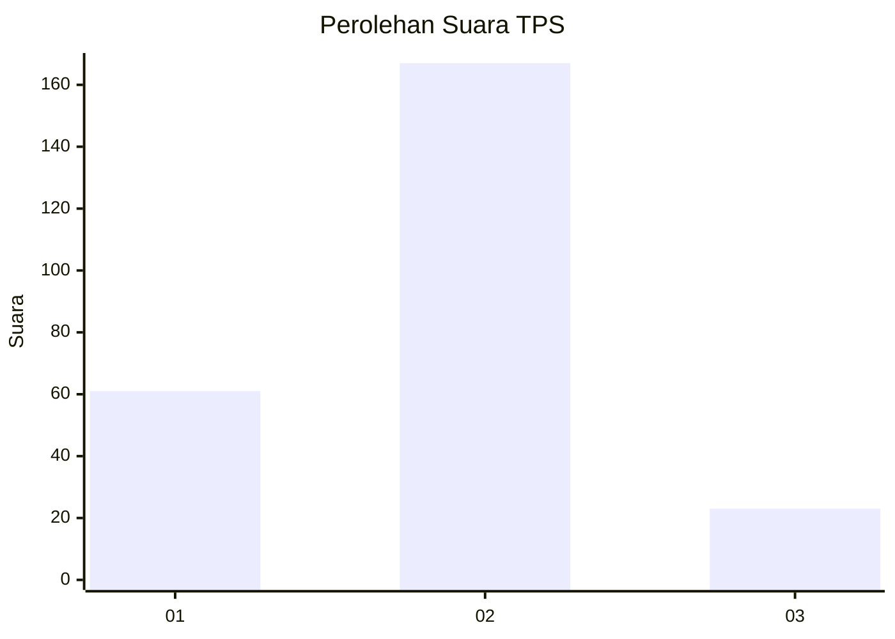
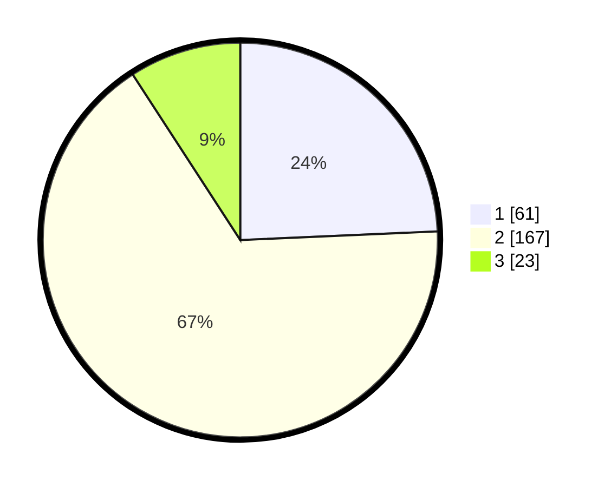

# Hasil

## Grafik

## Tabel

| No. | Nama Paslon    | Suara | Suara (raw) | Persentase |
|:--- |:-------------- | -----:| -----------:| ----------:|
| 1   | ANIES MUHAIMIN | 61    | [61][p-1]   | 24,30      |
| 2   | PRABOWO GIBRAN | 167   | [167][p-2]  | 66,53      |
| 3   | GANJAR MAHFUD  | 23    | [23][p-3]   | 9,16       |

[p-1]: https://github.com/gigit-pemilu/pemilu-2024-35-jawa-timur/blob/main/pilpres/hitung-suara/sub/35-jawa-timur/sub/08-lumajang/sub/16-kedungjajang/sub/2004-wonorejo/sub/007-tps/sub/paslon-1.txt
[p-2]: https://github.com/gigit-pemilu/pemilu-2024-35-jawa-timur/blob/main/pilpres/hitung-suara/sub/35-jawa-timur/sub/08-lumajang/sub/16-kedungjajang/sub/2004-wonorejo/sub/007-tps/sub/paslon-2.txt
[p-3]: https://github.com/gigit-pemilu/pemilu-2024-35-jawa-timur/blob/main/pilpres/hitung-suara/sub/35-jawa-timur/sub/08-lumajang/sub/16-kedungjajang/sub/2004-wonorejo/sub/007-tps/sub/paslon-3.txt

## Foto C Plano

https://sirekap-obj-formc.kpu.go.id/2cb2/pemilu/ppwp/35/08/16/20/04/3508162004007-20240215-011957--7dbb3bf4-714c-490a-bda4-de7750ff3125.jpg

https://sirekap-obj-formc.kpu.go.id/2cb2/pemilu/ppwp/35/08/16/20/04/3508162004007-20240215-012205--84da8e5b-f13a-4cbf-a9df-31d508c79b5c.jpg

https://sirekap-obj-formc.kpu.go.id/2cb2/pemilu/ppwp/35/08/16/20/04/3508162004007-20240215-012358--fcd9c1e2-3198-4712-a066-864781623304.jpg

## Metadata

| Key        | Value               |
| ---------- | ------------------- |
| Time Stamp | 2024-02-19 23:00:00 |

