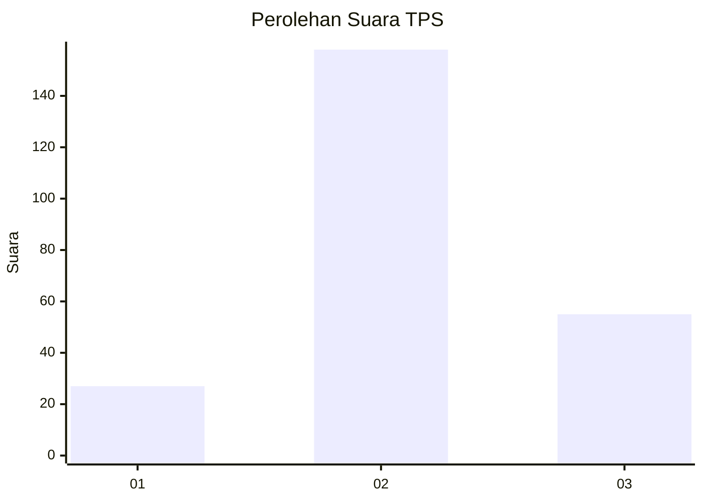
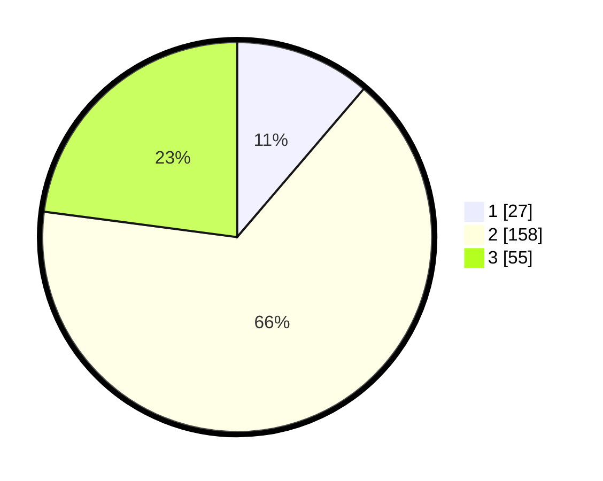

# Hasil

## Grafik

## Tabel

| No. | Nama Paslon    | Suara | Suara (raw) | Persentase |
|:--- |:-------------- | -----:| -----------:| ----------:|
| 1   | ANIES MUHAIMIN | 27    | [27][p-1]   | 11,25      |
| 2   | PRABOWO GIBRAN | 158   | [158][p-2]  | 65,83      |
| 3   | GANJAR MAHFUD  | 55    | [55][p-3]   | 22,92      |

[p-1]: https://github.com/gigit-pemilu/pemilu-2024/blob/main/pilpres/hitung-suara/sub/35-jawa-timur/sub/08-lumajang/sub/16-kedungjajang/sub/2004-wonorejo/sub/011-tps/sub/paslon-1.txt
[p-2]: https://github.com/gigit-pemilu/pemilu-2024/blob/main/pilpres/hitung-suara/sub/35-jawa-timur/sub/08-lumajang/sub/16-kedungjajang/sub/2004-wonorejo/sub/011-tps/sub/paslon-2.txt
[p-3]: https://github.com/gigit-pemilu/pemilu-2024/blob/main/pilpres/hitung-suara/sub/35-jawa-timur/sub/08-lumajang/sub/16-kedungjajang/sub/2004-wonorejo/sub/011-tps/sub/paslon-3.txt

## Foto C Plano

https://sirekap-obj-formc.kpu.go.id/ecb6/pemilu/ppwp/35/08/16/20/04/3508162004011-20240214-205115--8c50938f-8d6e-4f9b-a99f-0613b68f489a.jpg

https://sirekap-obj-formc.kpu.go.id/ecb6/pemilu/ppwp/35/08/16/20/04/3508162004011-20240215-123655--2141da3b-9e50-4e1b-b56a-fe465c612ec6.jpg

https://sirekap-obj-formc.kpu.go.id/ecb6/pemilu/ppwp/35/08/16/20/04/3508162004011-20240214-205458--bf39f1e0-d8ae-4861-bcb4-57bc9358fdcd.jpg

## Metadata

| Key        | Value               |
| ---------- | ------------------- |
| Time Stamp | 2024-02-25 15:00:00 |

