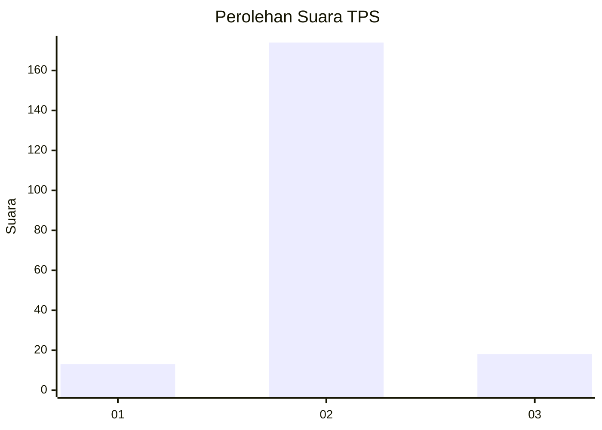
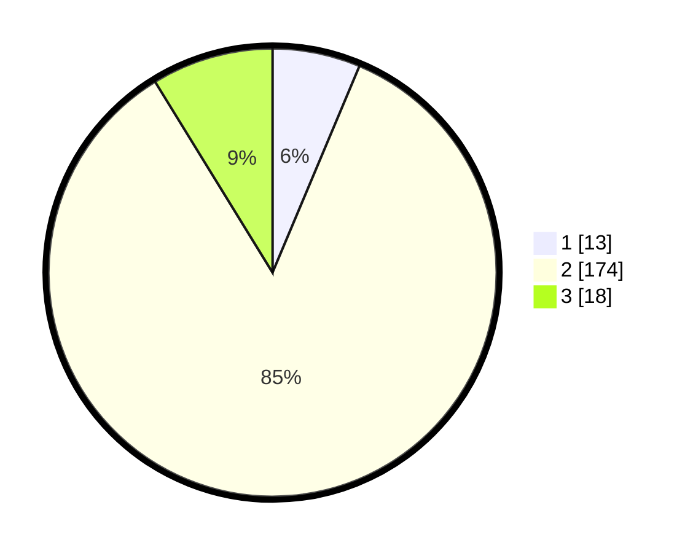

# Hasil

## Grafik

## Tabel

| No. | Nama Paslon    | Suara | Suara (raw) | Persentase |
|:--- |:-------------- | -----:| -----------:| ----------:|
| 1   | ANIES MUHAIMIN | 13    | [13][p-1]   | 6,34       |
| 2   | PRABOWO GIBRAN | 174   | [174][p-2]  | 84,88      |
| 3   | GANJAR MAHFUD  | 18    | [18][p-3]   | 8,78       |

[p-1]: https://github.com/gigit-pemilu/pemilu-2024-35-jawa-timur/blob/main/pilpres/hitung-suara/sub/35-jawa-timur/sub/08-lumajang/sub/16-kedungjajang/sub/2005-umbul/sub/007-tps/sub/paslon-1.txt
[p-2]: https://github.com/gigit-pemilu/pemilu-2024-35-jawa-timur/blob/main/pilpres/hitung-suara/sub/35-jawa-timur/sub/08-lumajang/sub/16-kedungjajang/sub/2005-umbul/sub/007-tps/sub/paslon-2.txt
[p-3]: https://github.com/gigit-pemilu/pemilu-2024-35-jawa-timur/blob/main/pilpres/hitung-suara/sub/35-jawa-timur/sub/08-lumajang/sub/16-kedungjajang/sub/2005-umbul/sub/007-tps/sub/paslon-3.txt

## Foto C Plano

https://sirekap-obj-formc.kpu.go.id/87fc/pemilu/ppwp/35/08/16/20/05/3508162005007-20240216-154131--f93a0522-f7d5-4aaa-9060-0fd6daa04469.jpg

https://sirekap-obj-formc.kpu.go.id/87fc/pemilu/ppwp/35/08/16/20/05/3508162005007-20240215-010617--680ec4cb-c7de-465e-aac7-6d22852c2795.jpg

https://sirekap-obj-formc.kpu.go.id/87fc/pemilu/ppwp/35/08/16/20/05/3508162005007-20240215-010432--96a45189-fc98-4a9d-9cd6-25f1ec35a171.jpg

## Metadata

| Key        | Value               |
| ---------- | ------------------- |
| Time Stamp | 2024-02-16 16:25:10 |

