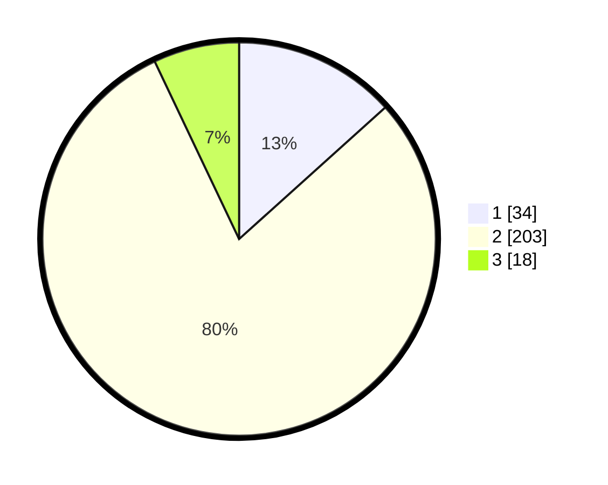

# Hasil

## Grafik

## Tabel

| No. | Nama Paslon    | Suara | Suara (raw) | Persentase |
|:--- |:-------------- | -----:| -----------:| ----------:|
| 1   | ANIES MUHAIMIN | 34    | [34][p-1]   | 13,33      |
| 2   | PRABOWO GIBRAN | 203   | [203][p-2]  | 79,61      |
| 3   | GANJAR MAHFUD  | 18    | [18][p-3]   | 7,06       |

[p-1]: https://github.com/gigit-pemilu/pemilu-2024/blob/main/pilpres/hitung-suara/sub/35-jawa-timur/sub/08-lumajang/sub/16-kedungjajang/sub/2005-umbul/sub/013-tps/sub/paslon-1.txt
[p-2]: https://github.com/gigit-pemilu/pemilu-2024/blob/main/pilpres/hitung-suara/sub/35-jawa-timur/sub/08-lumajang/sub/16-kedungjajang/sub/2005-umbul/sub/013-tps/sub/paslon-2.txt
[p-3]: https://github.com/gigit-pemilu/pemilu-2024/blob/main/pilpres/hitung-suara/sub/35-jawa-timur/sub/08-lumajang/sub/16-kedungjajang/sub/2005-umbul/sub/013-tps/sub/paslon-3.txt

## Foto C Plano

https://sirekap-obj-formc.kpu.go.id/e014/pemilu/ppwp/35/08/16/20/05/3508162005013-20240215-010951--de28ae0d-f3ff-4e7d-bdaa-59dc3650de7e.jpg

https://sirekap-obj-formc.kpu.go.id/e014/pemilu/ppwp/35/08/16/20/05/3508162005013-20240215-011218--b5d4483f-305e-4afe-8236-928b7040890b.jpg

https://sirekap-obj-formc.kpu.go.id/e014/pemilu/ppwp/35/08/16/20/05/3508162005013-20240215-011358--edf7dbb5-2bae-46b7-84f6-591f28914957.jpg

## Metadata

| Key        | Value               |
| ---------- | ------------------- |
| Time Stamp | 2024-02-17 10:30:03 |

