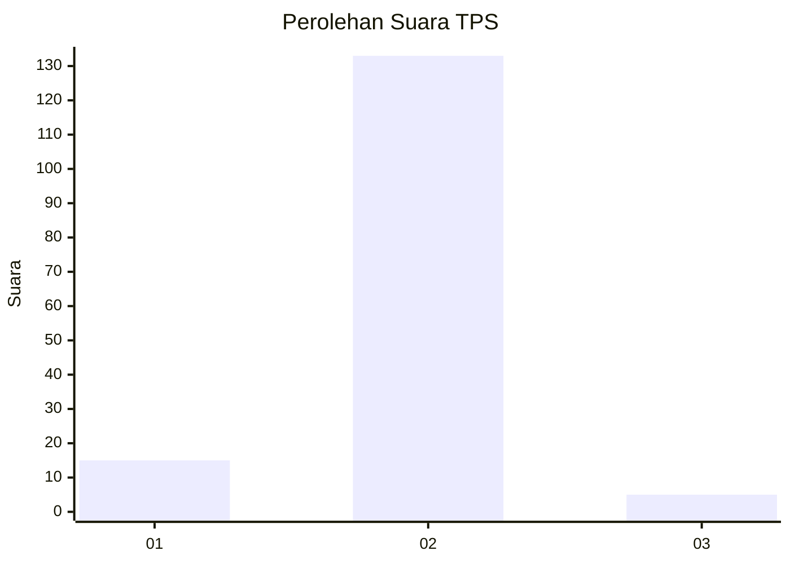
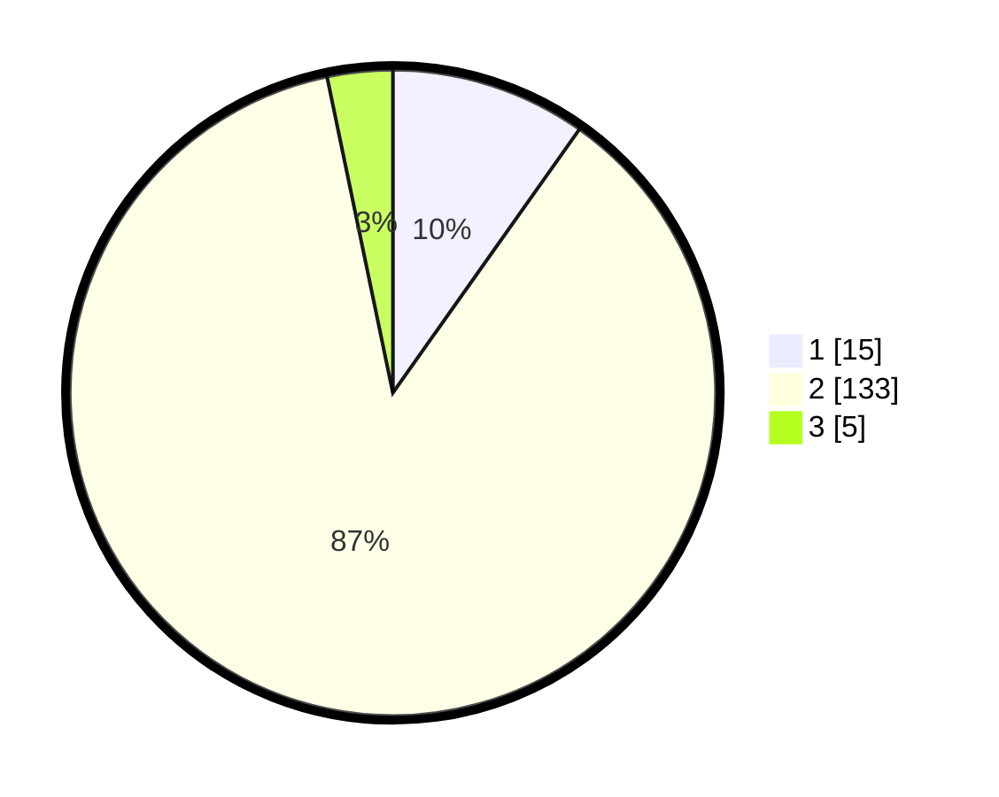

# Hasil

## Grafik

## Tabel

| No. | Nama Paslon    | Suara | Suara (raw) | Persentase |
|:--- |:-------------- | -----:| -----------:| ----------:|
| 1   | ANIES MUHAIMIN | 15    | [15][p-1]   | 9,80       |
| 2   | PRABOWO GIBRAN | 133   | [133][p-2]  | 86,93      |
| 3   | GANJAR MAHFUD  | 5     | [5][p-3]    | 3,27       |

[p-1]: https://github.com/gigit-pemilu/pemilu-2024/blob/main/pilpres/hitung-suara/sub/35-jawa-timur/sub/08-lumajang/sub/16-kedungjajang/sub/2008-bence/sub/002-tps/sub/paslon-1.txt
[p-2]: https://github.com/gigit-pemilu/pemilu-2024/blob/main/pilpres/hitung-suara/sub/35-jawa-timur/sub/08-lumajang/sub/16-kedungjajang/sub/2008-bence/sub/002-tps/sub/paslon-2.txt
[p-3]: https://github.com/gigit-pemilu/pemilu-2024/blob/main/pilpres/hitung-suara/sub/35-jawa-timur/sub/08-lumajang/sub/16-kedungjajang/sub/2008-bence/sub/002-tps/sub/paslon-3.txt

## Foto C Plano

https://sirekap-obj-formc.kpu.go.id/9c59/pemilu/ppwp/35/08/16/20/08/3508162008002-20240214-140939--848c3ec3-d70e-4a29-a367-6e20ddee6d6d.jpg

https://sirekap-obj-formc.kpu.go.id/9c59/pemilu/ppwp/35/08/16/20/08/3508162008002-20240214-141228--22b90d53-17ce-47ad-a67c-3bf3d91fbdab.jpg

https://sirekap-obj-formc.kpu.go.id/9c59/pemilu/ppwp/35/08/16/20/08/3508162008002-20240215-124158--40cf8de1-e062-4760-b20c-91c1a5f84e27.jpg

## Metadata

| Key        | Value               |
| ---------- | ------------------- |
| Time Stamp | 2024-02-15 15:00:29 |

