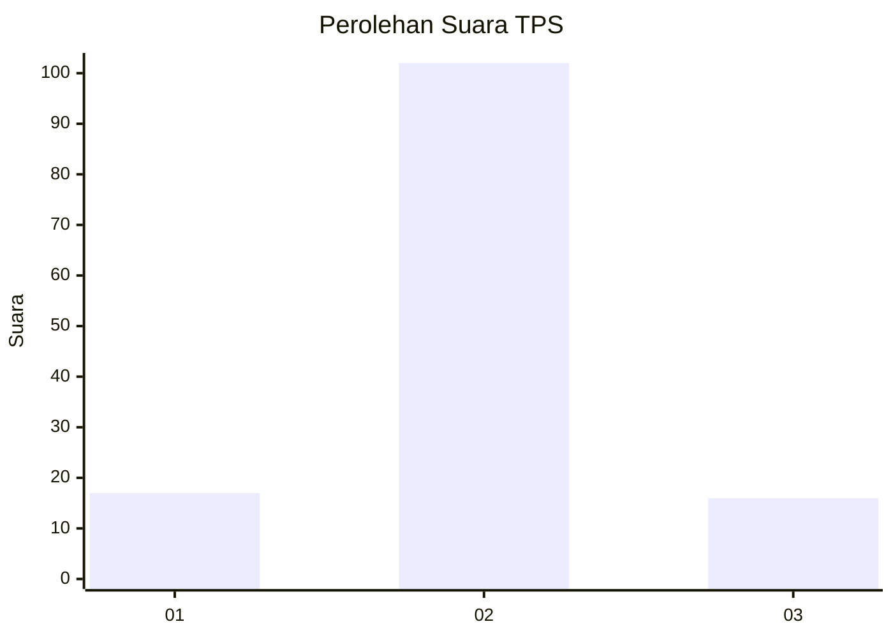
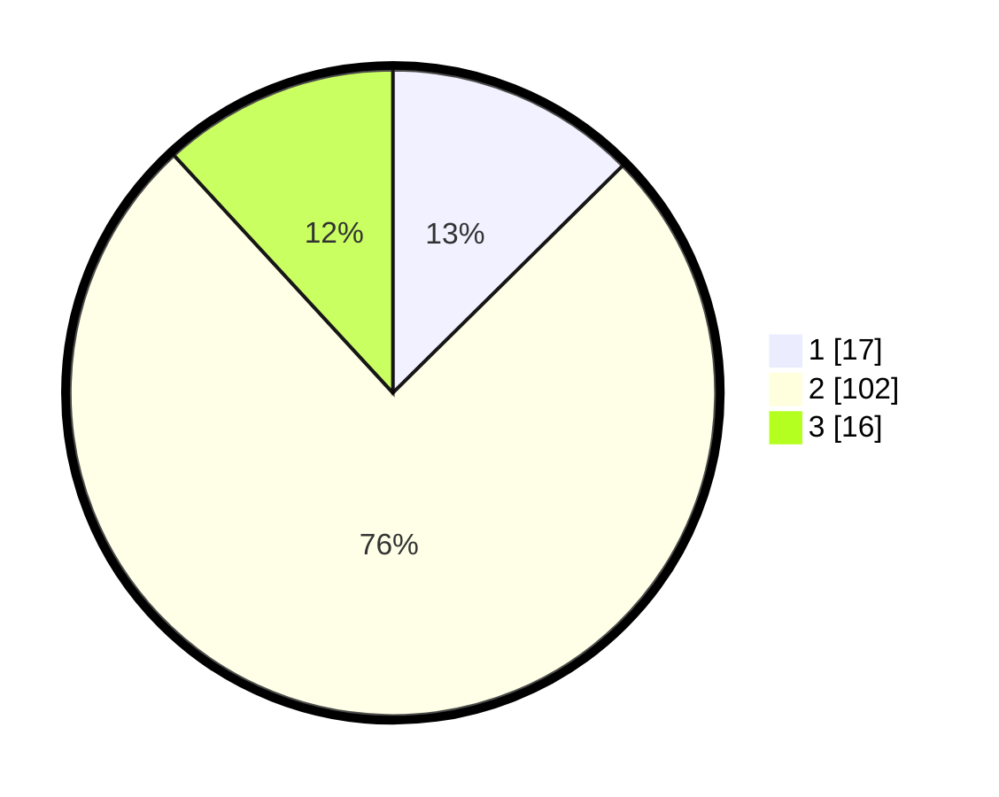

# Hasil

## Grafik

## Tabel

| No. | Nama Paslon    | Suara | Suara (raw) | Persentase |
|:--- |:-------------- | -----:| -----------:| ----------:|
| 1   | ANIES MUHAIMIN | 17    | [17][p-1]   | 12,59      |
| 2   | PRABOWO GIBRAN | 102   | [102][p-2]  | 75,56      |
| 3   | GANJAR MAHFUD  | 16    | [16][p-3]   | 11,85      |

[p-1]: https://github.com/gigit-pemilu/pemilu-2024/blob/main/pilpres/hitung-suara/sub/35-jawa-timur/sub/08-lumajang/sub/16-kedungjajang/sub/2009-jatisari/sub/005-tps/sub/paslon-1.txt
[p-2]: https://github.com/gigit-pemilu/pemilu-2024/blob/main/pilpres/hitung-suara/sub/35-jawa-timur/sub/08-lumajang/sub/16-kedungjajang/sub/2009-jatisari/sub/005-tps/sub/paslon-2.txt
[p-3]: https://github.com/gigit-pemilu/pemilu-2024/blob/main/pilpres/hitung-suara/sub/35-jawa-timur/sub/08-lumajang/sub/16-kedungjajang/sub/2009-jatisari/sub/005-tps/sub/paslon-3.txt

## Foto C Plano

https://sirekap-obj-formc.kpu.go.id/2fbb/pemilu/ppwp/35/08/16/20/09/3508162009005-20240214-231534--b98e1661-d794-47dd-8d4c-d417343019ad.jpg

https://sirekap-obj-formc.kpu.go.id/2fbb/pemilu/ppwp/35/08/16/20/09/3508162009005-20240214-231817--703f14fe-3bcb-4762-b501-8545ddf8ef78.jpg

https://sirekap-obj-formc.kpu.go.id/2fbb/pemilu/ppwp/35/08/16/20/09/3508162009005-20240214-232112--c01ae6f0-c5db-4377-bd43-54534d9a1e48.jpg

## Metadata

| Key        | Value               |
| ---------- | ------------------- |
| Time Stamp | 2024-02-15 12:00:28 |

