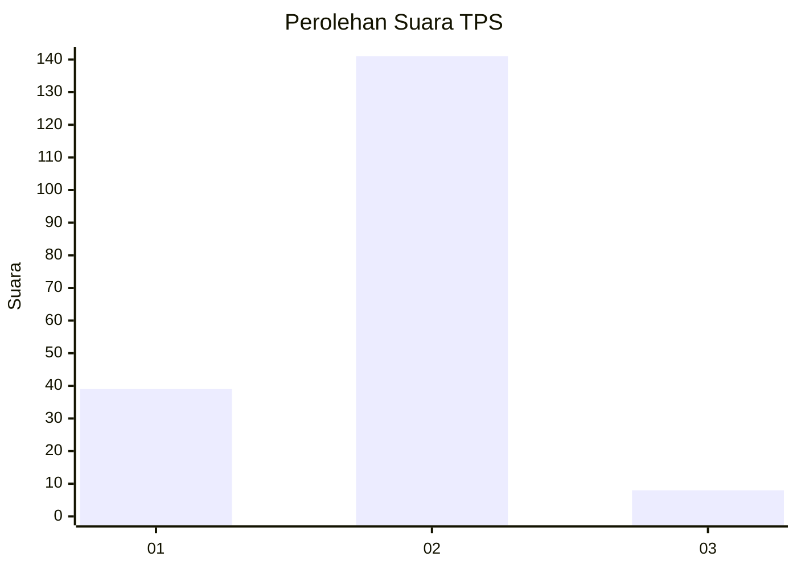
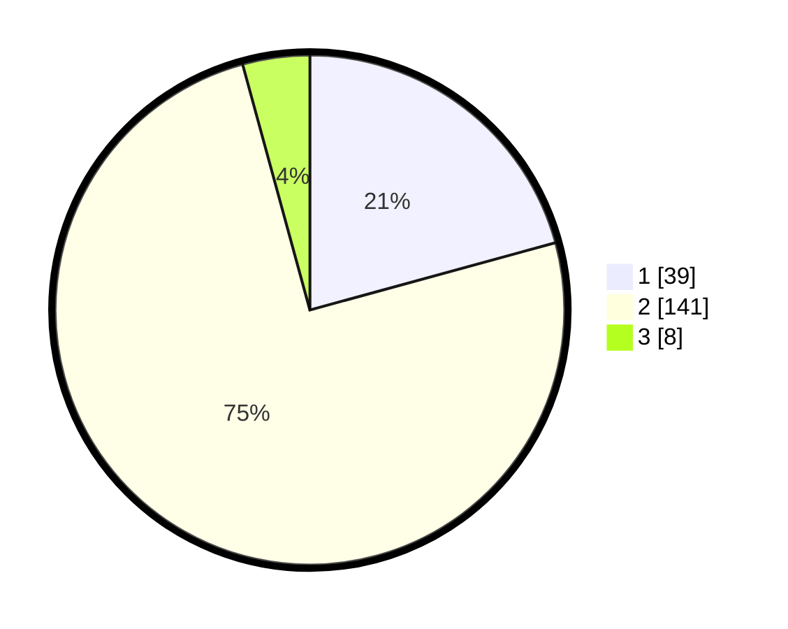

# Hasil

## Grafik

## Tabel

| No. | Nama Paslon    | Suara | Suara (raw) | Persentase |
|:--- |:-------------- | -----:| -----------:| ----------:|
| 1   | ANIES MUHAIMIN | 39    | [39][p-1]   | 20,74      |
| 2   | PRABOWO GIBRAN | 141   | [141][p-2]  | 75,00      |
| 3   | GANJAR MAHFUD  | 8     | [8][p-3]    | 4,26       |

[p-1]: https://github.com/gigit-pemilu/pemilu-2024/blob/main/pilpres/hitung-suara/sub/35-jawa-timur/sub/08-lumajang/sub/16-kedungjajang/sub/2010-tempursari/sub/005-tps/sub/paslon-1.txt
[p-2]: https://github.com/gigit-pemilu/pemilu-2024/blob/main/pilpres/hitung-suara/sub/35-jawa-timur/sub/08-lumajang/sub/16-kedungjajang/sub/2010-tempursari/sub/005-tps/sub/paslon-2.txt
[p-3]: https://github.com/gigit-pemilu/pemilu-2024/blob/main/pilpres/hitung-suara/sub/35-jawa-timur/sub/08-lumajang/sub/16-kedungjajang/sub/2010-tempursari/sub/005-tps/sub/paslon-3.txt

## Foto C Plano

https://sirekap-obj-formc.kpu.go.id/fbbe/pemilu/ppwp/35/08/16/20/10/3508162010005-20240215-030401--1abb7452-92ef-4d02-a97f-910ea9fabdd2.jpg

https://sirekap-obj-formc.kpu.go.id/fbbe/pemilu/ppwp/35/08/16/20/10/3508162010005-20240215-030433--083f4a38-c95e-4772-b052-e77fe9aebda9.jpg

https://sirekap-obj-formc.kpu.go.id/fbbe/pemilu/ppwp/35/08/16/20/10/3508162010005-20240215-030504--d65e923d-ee59-40ed-bc79-272c923ac205.jpg

## Metadata

| Key        | Value               |
| ---------- | ------------------- |
| Time Stamp | 2024-02-15 12:00:28 |

