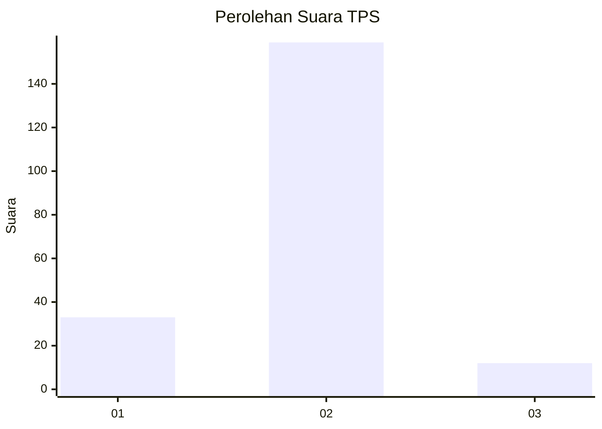
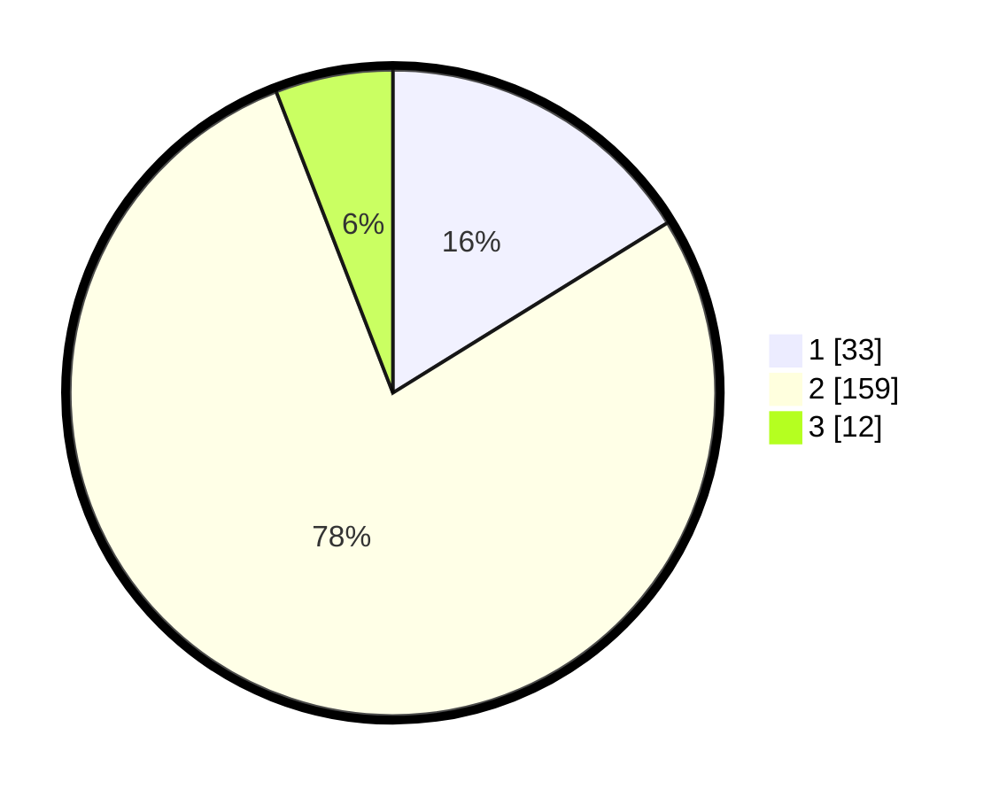

# Hasil

## Grafik

## Tabel

| No. | Nama Paslon    | Suara | Suara (raw) | Persentase |
|:--- |:-------------- | -----:| -----------:| ----------:|
| 1   | ANIES MUHAIMIN | 33    | [33][p-1]   | 16,18      |
| 2   | PRABOWO GIBRAN | 159   | [159][p-2]  | 77,94      |
| 3   | GANJAR MAHFUD  | 12    | [12][p-3]   | 5,88       |

[p-1]: https://github.com/gigit-pemilu/pemilu-2024/blob/main/pilpres/hitung-suara/sub/35-jawa-timur/sub/08-lumajang/sub/16-kedungjajang/sub/2010-tempursari/sub/009-tps/sub/paslon-1.txt
[p-2]: https://github.com/gigit-pemilu/pemilu-2024/blob/main/pilpres/hitung-suara/sub/35-jawa-timur/sub/08-lumajang/sub/16-kedungjajang/sub/2010-tempursari/sub/009-tps/sub/paslon-2.txt
[p-3]: https://github.com/gigit-pemilu/pemilu-2024/blob/main/pilpres/hitung-suara/sub/35-jawa-timur/sub/08-lumajang/sub/16-kedungjajang/sub/2010-tempursari/sub/009-tps/sub/paslon-3.txt

## Foto C Plano

https://sirekap-obj-formc.kpu.go.id/9102/pemilu/ppwp/35/08/16/20/10/3508162010009-20240214-214938--2d77018c-385e-45e0-94c5-451104e260a0.jpg

https://sirekap-obj-formc.kpu.go.id/9102/pemilu/ppwp/35/08/16/20/10/3508162010009-20240214-214952--acbf7b7d-3bed-457d-9103-61fbe36a2fda.jpg

https://sirekap-obj-formc.kpu.go.id/9102/pemilu/ppwp/35/08/16/20/10/3508162010009-20240214-215001--96f8f454-1a79-4da6-877a-5363eae3a54e.jpg

## Metadata

| Key        | Value               |
| ---------- | ------------------- |
| Time Stamp | 2024-02-17 10:30:03 |

