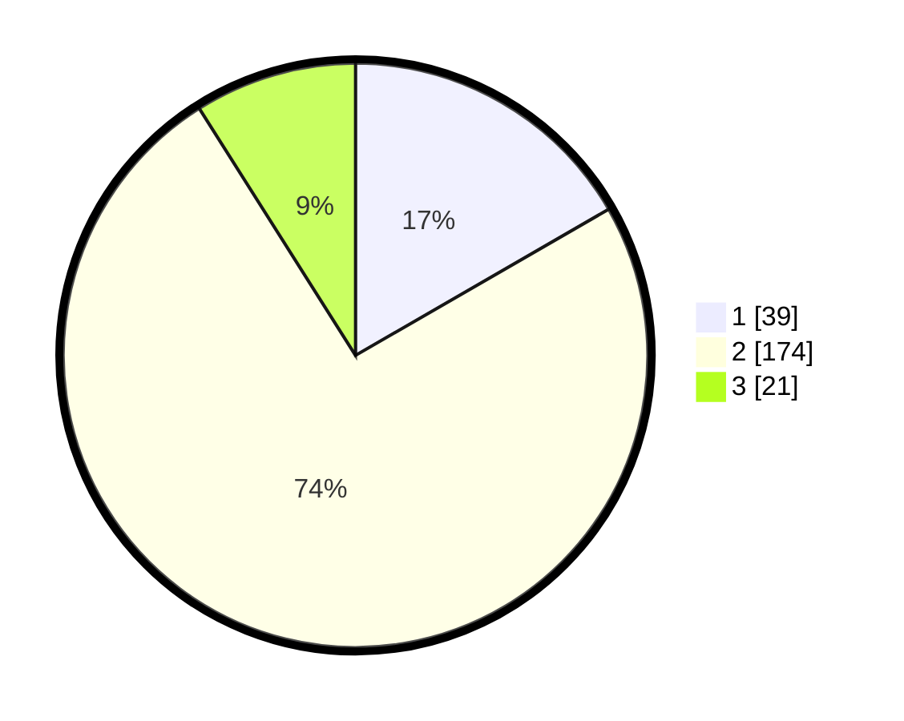

# Hasil

## Grafik

## Tabel

| No. | Nama Paslon    | Suara | Suara (raw) | Persentase |
|:--- |:-------------- | -----:| -----------:| ----------:|
| 1   | ANIES MUHAIMIN | 39    | [39][p-1]   | 16,67      |
| 2   | PRABOWO GIBRAN | 174   | [174][p-2]  | 74,36      |
| 3   | GANJAR MAHFUD  | 21    | [21][p-3]   | 8,97       |

[p-1]: https://github.com/gigit-pemilu/pemilu-2024/blob/main/pilpres/hitung-suara/sub/35-jawa-timur/sub/08-lumajang/sub/16-kedungjajang/sub/2011-bandaran/sub/004-tps/sub/paslon-1.txt
[p-2]: https://github.com/gigit-pemilu/pemilu-2024/blob/main/pilpres/hitung-suara/sub/35-jawa-timur/sub/08-lumajang/sub/16-kedungjajang/sub/2011-bandaran/sub/004-tps/sub/paslon-2.txt
[p-3]: https://github.com/gigit-pemilu/pemilu-2024/blob/main/pilpres/hitung-suara/sub/35-jawa-timur/sub/08-lumajang/sub/16-kedungjajang/sub/2011-bandaran/sub/004-tps/sub/paslon-3.txt

## Foto C Plano

https://sirekap-obj-formc.kpu.go.id/90cd/pemilu/ppwp/35/08/16/20/11/3508162011004-20240214-233920--6ebf524a-28ba-4d9a-88fa-e21dc7afe1bc.jpg

https://sirekap-obj-formc.kpu.go.id/90cd/pemilu/ppwp/35/08/16/20/11/3508162011004-20240214-234227--c581214f-00e0-4c04-822b-825f8fa931f9.jpg

https://sirekap-obj-formc.kpu.go.id/90cd/pemilu/ppwp/35/08/16/20/11/3508162011004-20240214-230205--64a7c9eb-5c4a-48f6-b6cb-52bd08e93174.jpg

## Metadata

| Key        | Value               |
| ---------- | ------------------- |
| Time Stamp | 2024-02-15 16:00:26 |

