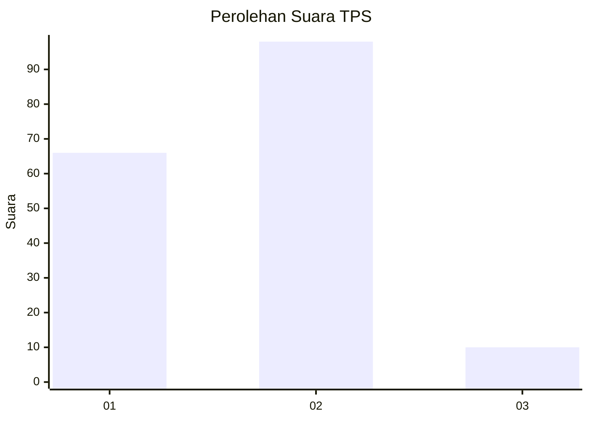
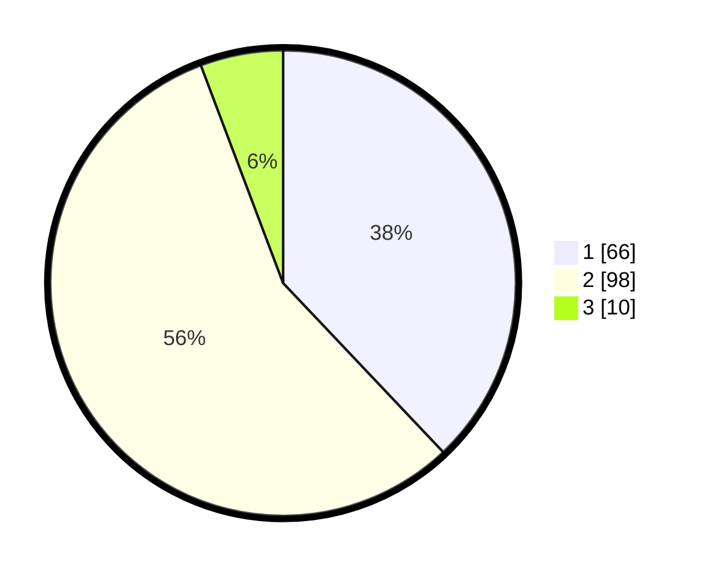

# Hasil

## Grafik

## Tabel

| No. | Nama Paslon    | Suara | Suara (raw) | Persentase |
|:--- |:-------------- | -----:| -----------:| ----------:|
| 1   | ANIES MUHAIMIN | 66    | [66][p-1]   | 37,93      |
| 2   | PRABOWO GIBRAN | 98    | [98][p-2]   | 56,32      |
| 3   | GANJAR MAHFUD  | 10    | [10][p-3]   | 5,75       |

[p-1]: https://github.com/gigit-pemilu/pemilu-2024/blob/main/pilpres/hitung-suara/sub/35-jawa-timur/sub/08-lumajang/sub/17-jatiroto/sub/2002-rojopolo/sub/003-tps/sub/paslon-1.txt
[p-2]: https://github.com/gigit-pemilu/pemilu-2024/blob/main/pilpres/hitung-suara/sub/35-jawa-timur/sub/08-lumajang/sub/17-jatiroto/sub/2002-rojopolo/sub/003-tps/sub/paslon-2.txt
[p-3]: https://github.com/gigit-pemilu/pemilu-2024/blob/main/pilpres/hitung-suara/sub/35-jawa-timur/sub/08-lumajang/sub/17-jatiroto/sub/2002-rojopolo/sub/003-tps/sub/paslon-3.txt

## Foto C Plano

https://sirekap-obj-formc.kpu.go.id/1f4c/pemilu/ppwp/35/08/17/20/02/3508172002003-20240214-155619--61637c2b-6d2c-4280-bd19-847660b8fe55.jpg

https://sirekap-obj-formc.kpu.go.id/1f4c/pemilu/ppwp/35/08/17/20/02/3508172002003-20240214-155639--7a642f4e-d469-46b9-9ace-c2696a64acde.jpg

https://sirekap-obj-formc.kpu.go.id/1f4c/pemilu/ppwp/35/08/17/20/02/3508172002003-20240215-093858--5ac33b5d-b6b0-4d1b-a3f6-e4bfb550b07a.jpg

## Metadata

| Key        | Value               |
| ---------- | ------------------- |
| Time Stamp | 2024-02-16 09:00:28 |

