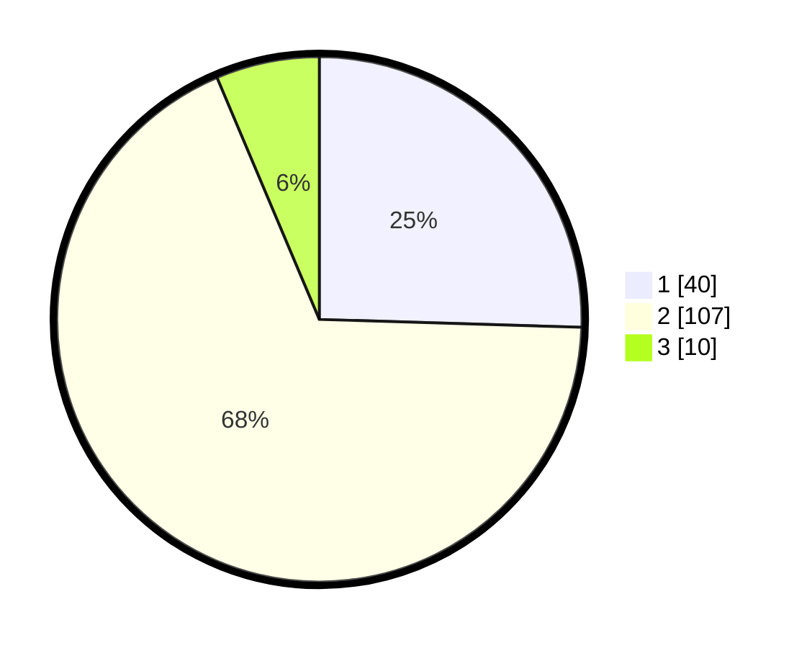

# Hasil

## Grafik

## Tabel

| No. | Nama Paslon    | Suara | Suara (raw) | Persentase |
|:--- |:-------------- | -----:| -----------:| ----------:|
| 1   | ANIES MUHAIMIN | 40    | [40][p-1]   | 25,48      |
| 2   | PRABOWO GIBRAN | 107   | [107][p-2]  | 68,15      |
| 3   | GANJAR MAHFUD  | 10    | [10][p-3]   | 6,37       |

[p-1]: https://github.com/gigit-pemilu/pemilu-2024/blob/main/pilpres/hitung-suara/sub/35-jawa-timur/sub/08-lumajang/sub/17-jatiroto/sub/2002-rojopolo/sub/021-tps/sub/paslon-1.txt
[p-2]: https://github.com/gigit-pemilu/pemilu-2024/blob/main/pilpres/hitung-suara/sub/35-jawa-timur/sub/08-lumajang/sub/17-jatiroto/sub/2002-rojopolo/sub/021-tps/sub/paslon-2.txt
[p-3]: https://github.com/gigit-pemilu/pemilu-2024/blob/main/pilpres/hitung-suara/sub/35-jawa-timur/sub/08-lumajang/sub/17-jatiroto/sub/2002-rojopolo/sub/021-tps/sub/paslon-3.txt

## Foto C Plano

https://sirekap-obj-formc.kpu.go.id/a8d1/pemilu/ppwp/35/08/17/20/02/3508172002021-20240214-204340--35d17cf0-7d58-4915-a81a-a00dfc9dcf5a.jpg

https://sirekap-obj-formc.kpu.go.id/a8d1/pemilu/ppwp/35/08/17/20/02/3508172002021-20240214-204357--cca87ed6-94a1-425c-ad83-fdddee090c89.jpg

https://sirekap-obj-formc.kpu.go.id/a8d1/pemilu/ppwp/35/08/17/20/02/3508172002021-20240214-204349--c74f9055-d315-48a5-aab1-37c22a2c7cd3.jpg

## Metadata

| Key        | Value               |
| ---------- | ------------------- |
| Time Stamp | 2024-02-16 09:30:28 |

