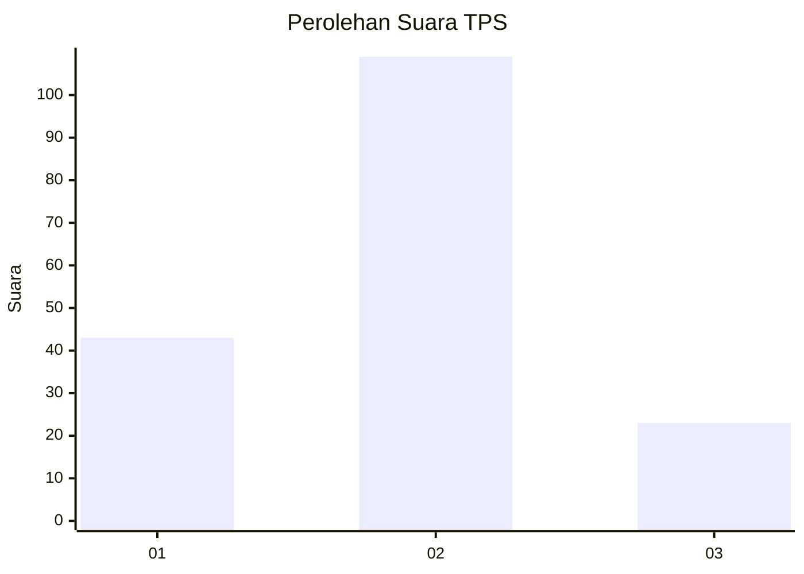
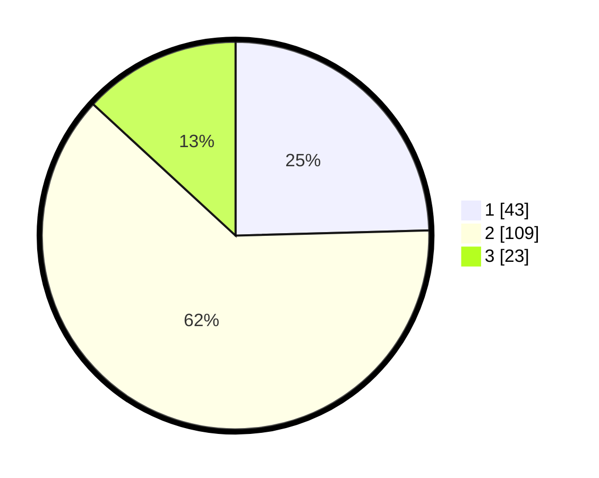

# Hasil

## Grafik

## Tabel

| No. | Nama Paslon    | Suara | Suara (raw) | Persentase |
|:--- |:-------------- | -----:| -----------:| ----------:|
| 1   | ANIES MUHAIMIN | 43    | [43][p-1]   | 24,57      |
| 2   | PRABOWO GIBRAN | 109   | [109][p-2]  | 62,29      |
| 3   | GANJAR MAHFUD  | 23    | [23][p-3]   | 13,14      |

[p-1]: https://github.com/gigit-pemilu/pemilu-2024-35-jawa-timur/blob/main/pilpres/hitung-suara/sub/35-jawa-timur/sub/08-lumajang/sub/17-jatiroto/sub/2005-sukosari/sub/013-tps/sub/paslon-1.txt
[p-2]: https://github.com/gigit-pemilu/pemilu-2024-35-jawa-timur/blob/main/pilpres/hitung-suara/sub/35-jawa-timur/sub/08-lumajang/sub/17-jatiroto/sub/2005-sukosari/sub/013-tps/sub/paslon-2.txt
[p-3]: https://github.com/gigit-pemilu/pemilu-2024-35-jawa-timur/blob/main/pilpres/hitung-suara/sub/35-jawa-timur/sub/08-lumajang/sub/17-jatiroto/sub/2005-sukosari/sub/013-tps/sub/paslon-3.txt

## Foto C Plano

https://sirekap-obj-formc.kpu.go.id/569c/pemilu/ppwp/35/08/17/20/05/3508172005013-20240216-101346--f4e74d22-da92-4572-9634-53281da05741.jpg

https://sirekap-obj-formc.kpu.go.id/569c/pemilu/ppwp/35/08/17/20/05/3508172005013-20240215-022555--d3012bfd-082e-4c51-bb60-4acbbc070ad1.jpg

https://sirekap-obj-formc.kpu.go.id/569c/pemilu/ppwp/35/08/17/20/05/3508172005013-20240214-162221--d2217587-2375-456a-9b23-9cfd9462d506.jpg

## Metadata

| Key        | Value               |
| ---------- | ------------------- |
| Time Stamp | 2024-02-16 10:30:29 |

