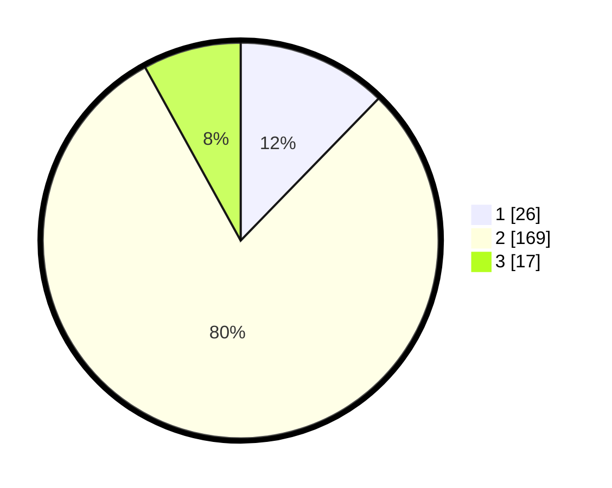

# Hasil

## Grafik

## Tabel

| No. | Nama Paslon    | Suara | Suara (raw) | Persentase |
|:--- |:-------------- | -----:| -----------:| ----------:|
| 1   | ANIES MUHAIMIN | 26    | [26][p-1]   | 12,26      |
| 2   | PRABOWO GIBRAN | 169   | [169][p-2]  | 79,72      |
| 3   | GANJAR MAHFUD  | 17    | [17][p-3]   | 8,02       |

[p-1]: https://github.com/gigit-pemilu/pemilu-2024-35-jawa-timur/blob/main/pilpres/hitung-suara/sub/35-jawa-timur/sub/08-lumajang/sub/18-randuagung/sub/2005-kalipenggung/sub/007-tps/sub/paslon-1.txt
[p-2]: https://github.com/gigit-pemilu/pemilu-2024-35-jawa-timur/blob/main/pilpres/hitung-suara/sub/35-jawa-timur/sub/08-lumajang/sub/18-randuagung/sub/2005-kalipenggung/sub/007-tps/sub/paslon-2.txt
[p-3]: https://github.com/gigit-pemilu/pemilu-2024-35-jawa-timur/blob/main/pilpres/hitung-suara/sub/35-jawa-timur/sub/08-lumajang/sub/18-randuagung/sub/2005-kalipenggung/sub/007-tps/sub/paslon-3.txt

## Foto C Plano

https://sirekap-obj-formc.kpu.go.id/0dc4/pemilu/ppwp/35/08/18/20/05/3508182005007-20240215-014647--5b149b73-56d2-46a0-82e2-39199c1ab212.jpg

https://sirekap-obj-formc.kpu.go.id/0dc4/pemilu/ppwp/35/08/18/20/05/3508182005007-20240215-015625--08d10f87-a3fc-44a4-925d-d73e636100b3.jpg

https://sirekap-obj-formc.kpu.go.id/0dc4/pemilu/ppwp/35/08/18/20/05/3508182005007-20240215-015721--96ec4844-bf63-4282-a7c4-321ee1dee627.jpg

## Metadata

| Key        | Value               |
| ---------- | ------------------- |
| Time Stamp | 2024-02-16 12:51:22 |

