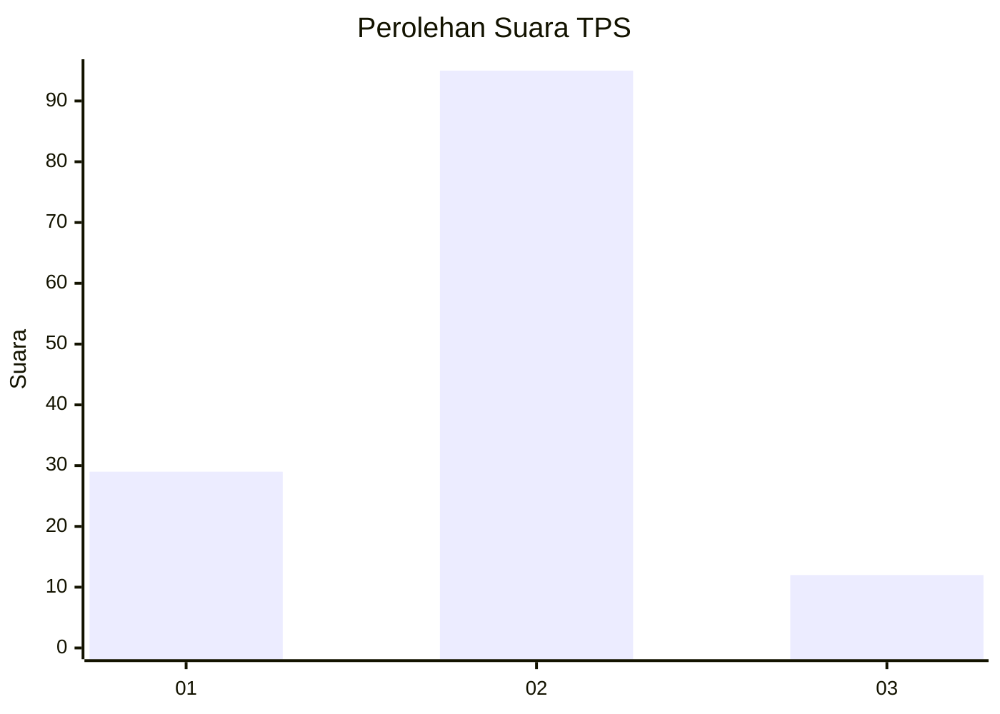

# Hasil

## Grafik

## Tabel

| No. | Nama Paslon    | Suara | Suara (raw) | Persentase |
|:--- |:-------------- | -----:| -----------:| ----------:|
| 1   | ANIES MUHAIMIN | 29    | [29][p-1]   | 21,32      |
| 2   | PRABOWO GIBRAN | 95    | [95][p-2]   | 69,85      |
| 3   | GANJAR MAHFUD  | 12    | [12][p-3]   | 8,82       |

[p-1]: https://github.com/gigit-pemilu/pemilu-2024/blob/main/pilpres/hitung-suara/sub/35-jawa-timur/sub/08-lumajang/sub/18-randuagung/sub/2005-kalipenggung/sub/023-tps/sub/paslon-1.txt
[p-2]: https://github.com/gigit-pemilu/pemilu-2024/blob/main/pilpres/hitung-suara/sub/35-jawa-timur/sub/08-lumajang/sub/18-randuagung/sub/2005-kalipenggung/sub/023-tps/sub/paslon-2.txt
[p-3]: https://github.com/gigit-pemilu/pemilu-2024/blob/main/pilpres/hitung-suara/sub/35-jawa-timur/sub/08-lumajang/sub/18-randuagung/sub/2005-kalipenggung/sub/023-tps/sub/paslon-3.txt

## Foto C Plano

https://sirekap-obj-formc.kpu.go.id/145a/pemilu/ppwp/35/08/18/20/05/3508182005023-20240214-155239--4c59104c-541c-42c6-8b99-bca769451303.jpg

https://sirekap-obj-formc.kpu.go.id/145a/pemilu/ppwp/35/08/18/20/05/3508182005023-20240214-155011--44f5339f-2ab9-426e-a467-74bb58ae167e.jpg

https://sirekap-obj-formc.kpu.go.id/145a/pemilu/ppwp/35/08/18/20/05/3508182005023-20240214-155114--fba476ff-5369-4253-92e0-8618292f2a9c.jpg

## Metadata

| Key        | Value               |
| ---------- | ------------------- |
| Time Stamp | 2024-02-25 17:00:00 |

