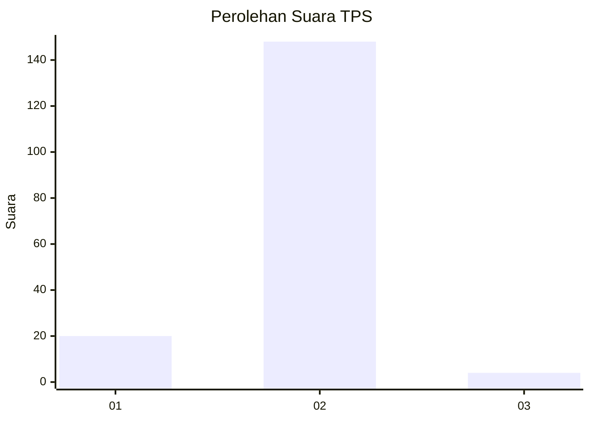
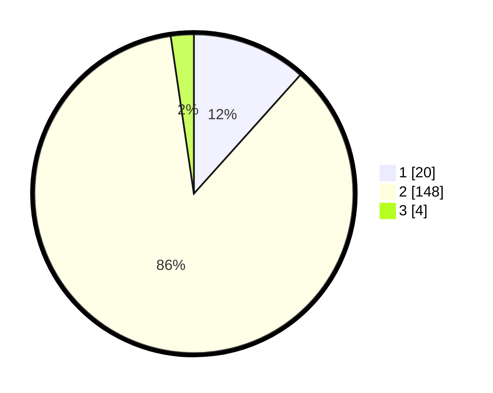

# Hasil

## Grafik

## Tabel

| No. | Nama Paslon    | Suara | Suara (raw) | Persentase |
|:--- |:-------------- | -----:| -----------:| ----------:|
| 1   | ANIES MUHAIMIN | 20    | [20][p-1]   | 11,63      |
| 2   | PRABOWO GIBRAN | 148   | [148][p-2]  | 86,05      |
| 3   | GANJAR MAHFUD  | 4     | [4][p-3]    | 2,33       |

[p-1]: https://github.com/gigit-pemilu/pemilu-2024/blob/main/pilpres/hitung-suara/sub/35-jawa-timur/sub/08-lumajang/sub/18-randuagung/sub/2009-pajarakan/sub/001-tps/sub/paslon-1.txt
[p-2]: https://github.com/gigit-pemilu/pemilu-2024/blob/main/pilpres/hitung-suara/sub/35-jawa-timur/sub/08-lumajang/sub/18-randuagung/sub/2009-pajarakan/sub/001-tps/sub/paslon-2.txt
[p-3]: https://github.com/gigit-pemilu/pemilu-2024/blob/main/pilpres/hitung-suara/sub/35-jawa-timur/sub/08-lumajang/sub/18-randuagung/sub/2009-pajarakan/sub/001-tps/sub/paslon-3.txt

## Foto C Plano

https://sirekap-obj-formc.kpu.go.id/878b/pemilu/ppwp/35/08/18/20/09/3508182009001-20240215-005846--3abb3f18-712e-4507-a352-89d1c4072d17.jpg

https://sirekap-obj-formc.kpu.go.id/878b/pemilu/ppwp/35/08/18/20/09/3508182009001-20240215-005848--c9883f90-0cc9-43be-808b-4aa36d4c64e3.jpg

https://sirekap-obj-formc.kpu.go.id/878b/pemilu/ppwp/35/08/18/20/09/3508182009001-20240215-010004--181333b6-b113-42c5-8412-28adbae80db9.jpg

## Metadata

| Key        | Value               |
| ---------- | ------------------- |
| Time Stamp | 2024-02-25 23:00:00 |

