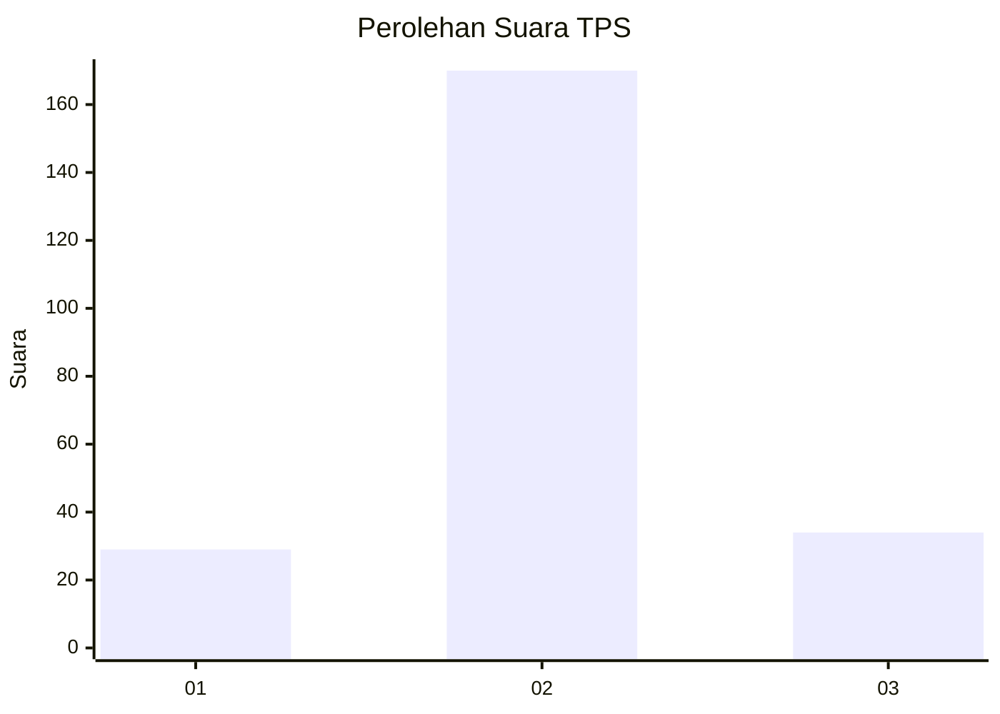
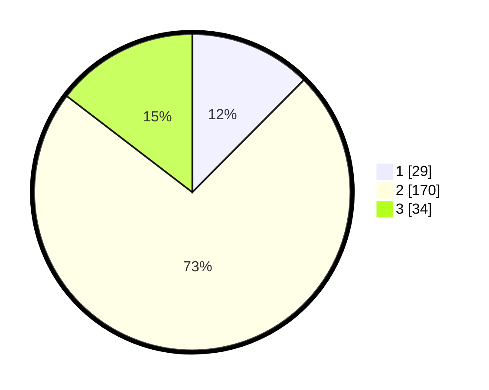

# Hasil

## Grafik

## Tabel

| No. | Nama Paslon    | Suara | Suara (raw) | Persentase |
|:--- |:-------------- | -----:| -----------:| ----------:|
| 1   | ANIES MUHAIMIN | 29    | [29][p-1]   | 12,45      |
| 2   | PRABOWO GIBRAN | 170   | [170][p-2]  | 72,96      |
| 3   | GANJAR MAHFUD  | 34    | [34][p-3]   | 14,59      |

[p-1]: https://github.com/gigit-pemilu/pemilu-2024/blob/main/pilpres/hitung-suara/sub/35-jawa-timur/sub/08-lumajang/sub/19-klakah/sub/2008-klakah/sub/004-tps/sub/paslon-1.txt
[p-2]: https://github.com/gigit-pemilu/pemilu-2024/blob/main/pilpres/hitung-suara/sub/35-jawa-timur/sub/08-lumajang/sub/19-klakah/sub/2008-klakah/sub/004-tps/sub/paslon-2.txt
[p-3]: https://github.com/gigit-pemilu/pemilu-2024/blob/main/pilpres/hitung-suara/sub/35-jawa-timur/sub/08-lumajang/sub/19-klakah/sub/2008-klakah/sub/004-tps/sub/paslon-3.txt

## Foto C Plano

https://sirekap-obj-formc.kpu.go.id/79b8/pemilu/ppwp/35/08/19/20/08/3508192008004-20240214-210233--4bacdf1d-6a46-4186-a854-2c1cf348a26e.jpg

https://sirekap-obj-formc.kpu.go.id/79b8/pemilu/ppwp/35/08/19/20/08/3508192008004-20240214-210454--a523b66b-327b-452f-ab74-2e6e0f7fdb93.jpg

https://sirekap-obj-formc.kpu.go.id/79b8/pemilu/ppwp/35/08/19/20/08/3508192008004-20240214-210815--b0e5beed-5c3e-4ff1-87b5-ba2f2016086e.jpg

## Metadata

| Key        | Value               |
| ---------- | ------------------- |
| Time Stamp | 2024-02-15 12:00:28 |

