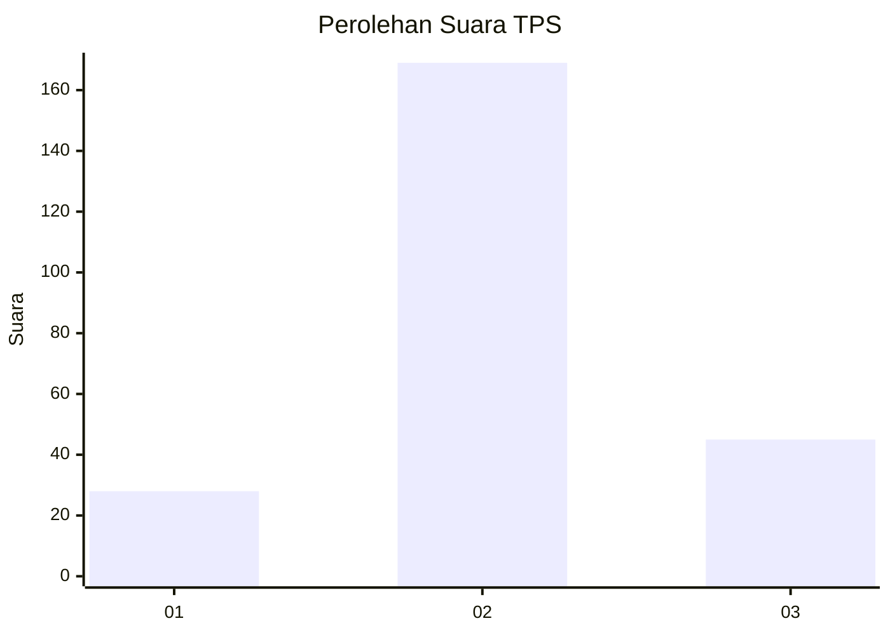
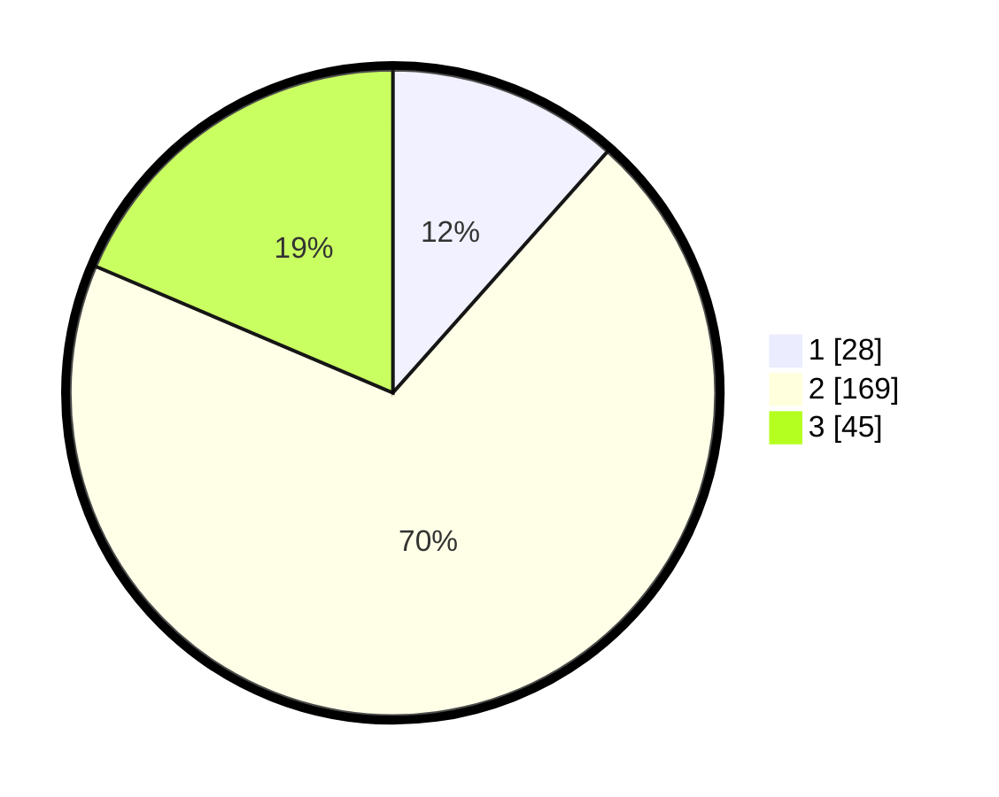

# Hasil

## Grafik

## Tabel

| No. | Nama Paslon    | Suara | Suara (raw) | Persentase |
|:--- |:-------------- | -----:| -----------:| ----------:|
| 1   | ANIES MUHAIMIN | 28    | [28][p-1]   | 11,57      |
| 2   | PRABOWO GIBRAN | 169   | [169][p-2]  | 69,83      |
| 3   | GANJAR MAHFUD  | 45    | [45][p-3]   | 18,60      |

[p-1]: https://github.com/gigit-pemilu/pemilu-2024/blob/main/pilpres/hitung-suara/sub/35-jawa-timur/sub/08-lumajang/sub/19-klakah/sub/2010-sruni/sub/005-tps/sub/paslon-1.txt
[p-2]: https://github.com/gigit-pemilu/pemilu-2024/blob/main/pilpres/hitung-suara/sub/35-jawa-timur/sub/08-lumajang/sub/19-klakah/sub/2010-sruni/sub/005-tps/sub/paslon-2.txt
[p-3]: https://github.com/gigit-pemilu/pemilu-2024/blob/main/pilpres/hitung-suara/sub/35-jawa-timur/sub/08-lumajang/sub/19-klakah/sub/2010-sruni/sub/005-tps/sub/paslon-3.txt

## Foto C Plano

https://sirekap-obj-formc.kpu.go.id/a7cf/pemilu/ppwp/35/08/19/20/10/3508192010005-20240214-141109--329f3db2-9218-436f-a159-11ca3c5257f2.jpg

https://sirekap-obj-formc.kpu.go.id/a7cf/pemilu/ppwp/35/08/19/20/10/3508192010005-20240214-141247--59f977d4-be63-4d9f-80da-87b051626d56.jpg

https://sirekap-obj-formc.kpu.go.id/a7cf/pemilu/ppwp/35/08/19/20/10/3508192010005-20240214-141341--5bdac452-3dbd-4ba7-9b90-be3633fd687e.jpg

## Metadata

| Key        | Value               |
| ---------- | ------------------- |
| Time Stamp | 2024-02-15 12:00:28 |

