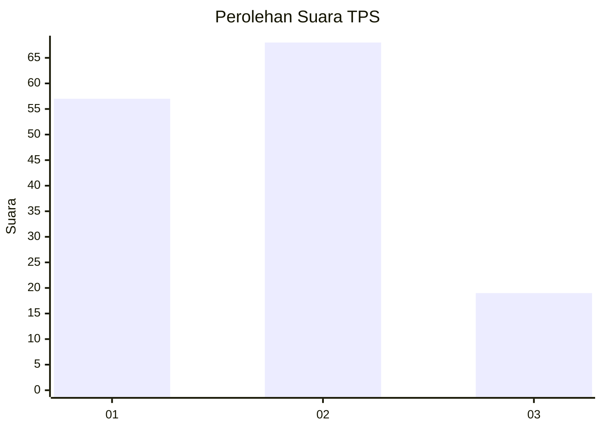
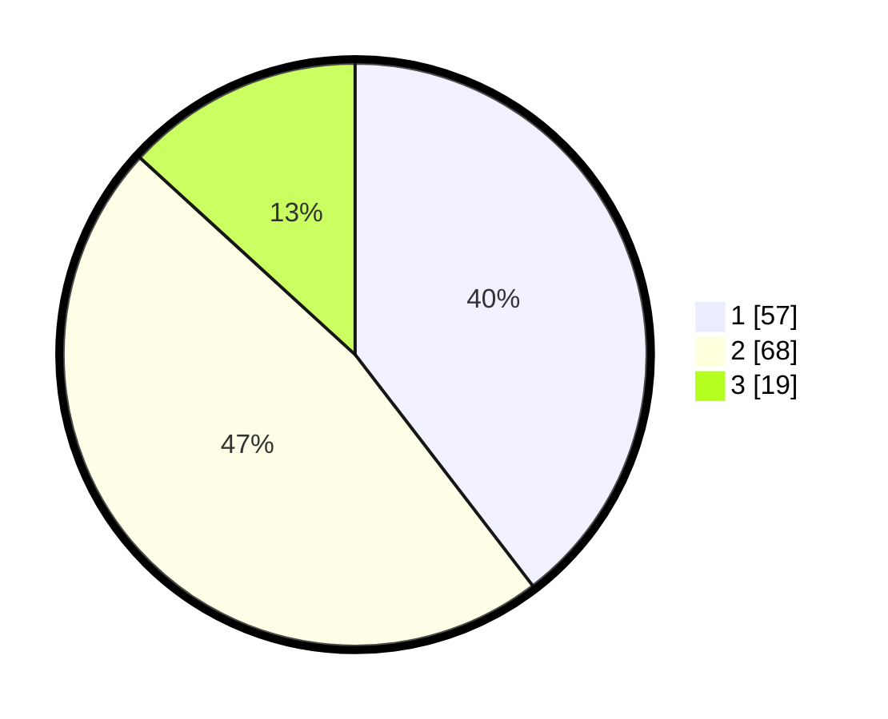

# Hasil

## Grafik

## Tabel

| No. | Nama Paslon    | Suara | Suara (raw) | Persentase |
|:--- |:-------------- | -----:| -----------:| ----------:|
| 1   | ANIES MUHAIMIN | 57    | [57][p-1]   | 39,58      |
| 2   | PRABOWO GIBRAN | 68    | [68][p-2]   | 47,22      |
| 3   | GANJAR MAHFUD  | 19    | [19][p-3]   | 13,19      |

[p-1]: https://github.com/gigit-pemilu/pemilu-2024-35-jawa-timur/blob/main/pilpres/hitung-suara/sub/35-jawa-timur/sub/08-lumajang/sub/19-klakah/sub/2011-tegalciut/sub/007-tps/sub/paslon-1.txt
[p-2]: https://github.com/gigit-pemilu/pemilu-2024-35-jawa-timur/blob/main/pilpres/hitung-suara/sub/35-jawa-timur/sub/08-lumajang/sub/19-klakah/sub/2011-tegalciut/sub/007-tps/sub/paslon-2.txt
[p-3]: https://github.com/gigit-pemilu/pemilu-2024-35-jawa-timur/blob/main/pilpres/hitung-suara/sub/35-jawa-timur/sub/08-lumajang/sub/19-klakah/sub/2011-tegalciut/sub/007-tps/sub/paslon-3.txt

## Foto C Plano

https://sirekap-obj-formc.kpu.go.id/3e67/pemilu/ppwp/35/08/19/20/11/3508192011007-20240215-051130--8c78f5dc-6eef-4167-88be-5b87adff97cf.jpg

https://sirekap-obj-formc.kpu.go.id/3e67/pemilu/ppwp/35/08/19/20/11/3508192011007-20240215-054040--13737445-985f-4163-bf74-3382f6c37d3a.jpg

https://sirekap-obj-formc.kpu.go.id/3e67/pemilu/ppwp/35/08/19/20/11/3508192011007-20240215-054203--9b9f6fbd-a54e-4076-858d-bcc2580ad220.jpg

## Metadata

| Key        | Value               |
| ---------- | ------------------- |
| Time Stamp | 2024-02-15 15:00:29 |

