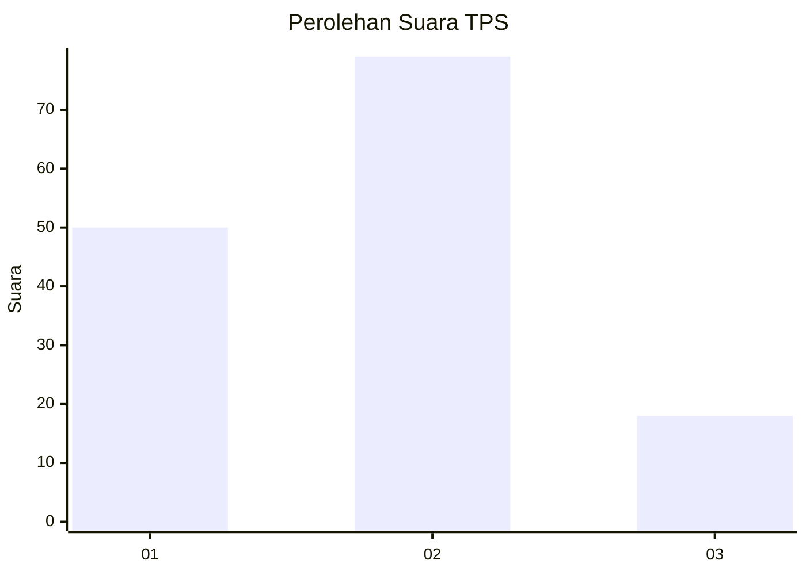
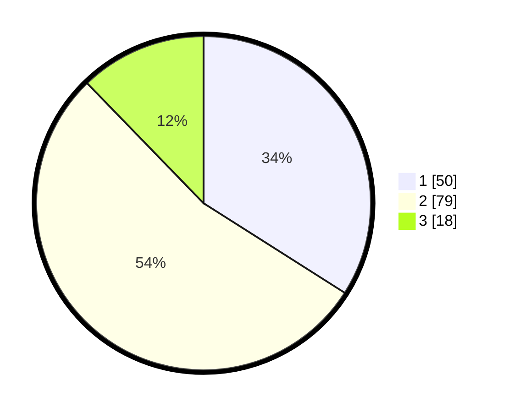

# Hasil

## Grafik

## Tabel

| No. | Nama Paslon    | Suara | Suara (raw) | Persentase |
|:--- |:-------------- | -----:| -----------:| ----------:|
| 1   | ANIES MUHAIMIN | 50    | [50][p-1]   | 34,01      |
| 2   | PRABOWO GIBRAN | 79    | [79][p-2]   | 53,74      |
| 3   | GANJAR MAHFUD  | 18    | [18][p-3]   | 12,24      |

[p-1]: https://github.com/gigit-pemilu/pemilu-2024-35-jawa-timur/blob/main/pilpres/hitung-suara/sub/35-jawa-timur/sub/08-lumajang/sub/20-ranuyoso/sub/2001-jenggrong/sub/002-tps/sub/paslon-1.txt
[p-2]: https://github.com/gigit-pemilu/pemilu-2024-35-jawa-timur/blob/main/pilpres/hitung-suara/sub/35-jawa-timur/sub/08-lumajang/sub/20-ranuyoso/sub/2001-jenggrong/sub/002-tps/sub/paslon-2.txt
[p-3]: https://github.com/gigit-pemilu/pemilu-2024-35-jawa-timur/blob/main/pilpres/hitung-suara/sub/35-jawa-timur/sub/08-lumajang/sub/20-ranuyoso/sub/2001-jenggrong/sub/002-tps/sub/paslon-3.txt

## Foto C Plano

https://sirekap-obj-formc.kpu.go.id/eb5e/pemilu/ppwp/35/08/20/20/01/3508202001002-20240216-115837--a736f941-2fe2-49b9-a65b-4a404110871c.jpg

https://sirekap-obj-formc.kpu.go.id/eb5e/pemilu/ppwp/35/08/20/20/01/3508202001002-20240216-115838--110a417f-e9c2-4da5-832b-6b51da870a2b.jpg

https://sirekap-obj-formc.kpu.go.id/eb5e/pemilu/ppwp/35/08/20/20/01/3508202001002-20240216-115837--7b91761f-c37f-4c51-a416-37cfbd932d19.jpg

## Metadata

| Key        | Value               |
| ---------- | ------------------- |
| Time Stamp | 2024-02-16 16:25:10 |

## DATA PEMILIH TETAP

Jumlah pemilih dalam DPT: **181**.
 * L: **75**.
 * P: **106**.

## DATA PENGGUNA HAK PILIH

Jumlah pengguna hak pilih dalam DPT: **158**.
 * L: **64**.
 * P: **94**.

Jumlah pengguna hak pilih dalam DPTb: **0**.
 * L: **0**.
 * P: **0**.

Jumlah pengguna hak pilih dalam DPK: **0**.
 * L: **0**.
 * P: **0**.

Jumlah pengguna hak pilih: **158**.
 * L: **64**.
 * P: **94**.

## JUMLAH SUARA SAH DAN TIDAK SAH

JUMLAH SELURUH SUARA SAH: **147**.

JUMLAH SUARA TIDAK SAH: **11**.

JUMLAH SELURUH SUARA SAH DAN SUARA TIDAK SAH: **158**.

