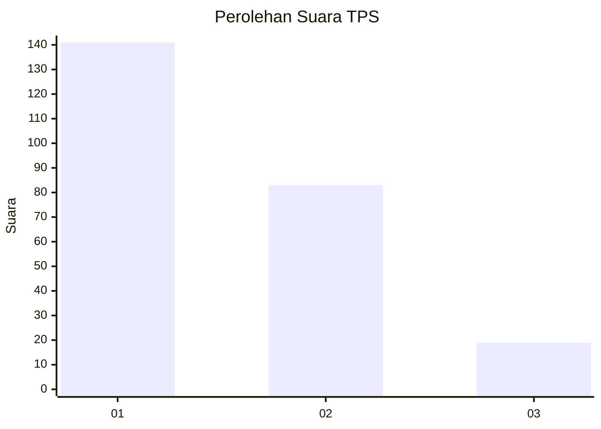
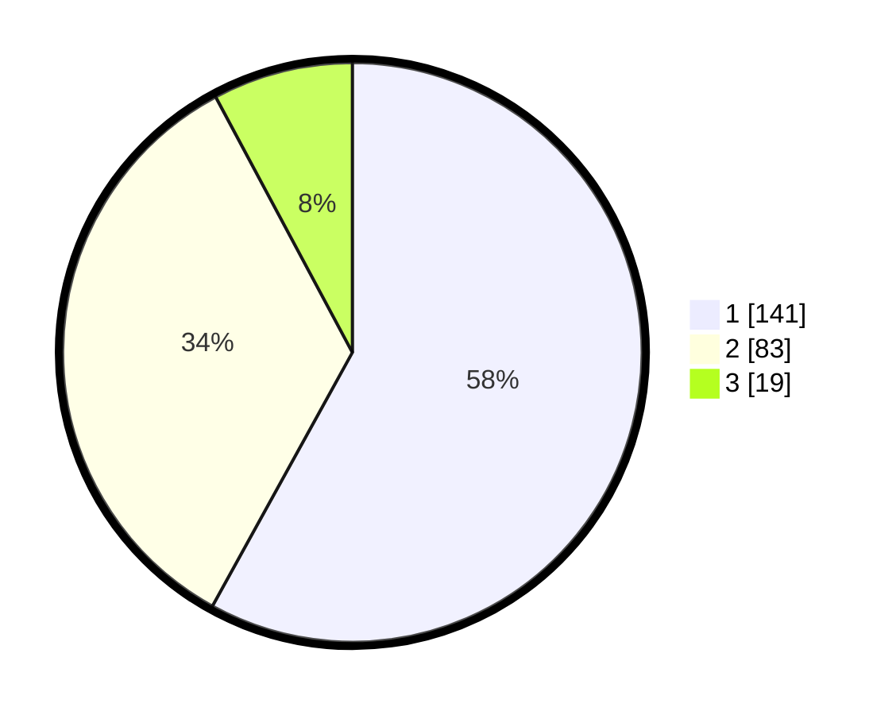

# Hasil

## Grafik

## Tabel

| No. | Nama Paslon    | Suara | Suara (raw) | Persentase |
|:--- |:-------------- | -----:| -----------:| ----------:|
| 1   | ANIES MUHAIMIN | 141   | [141][p-1]  | 58,02      |
| 2   | PRABOWO GIBRAN | 83    | [83][p-2]   | 34,16      |
| 3   | GANJAR MAHFUD  | 19    | [19][p-3]   | 7,82       |

[p-1]: https://github.com/gigit-pemilu/pemilu-2024/blob/main/pilpres/hitung-suara/sub/35-jawa-timur/sub/08-lumajang/sub/20-ranuyoso/sub/2001-jenggrong/sub/003-tps/sub/paslon-1.txt
[p-2]: https://github.com/gigit-pemilu/pemilu-2024/blob/main/pilpres/hitung-suara/sub/35-jawa-timur/sub/08-lumajang/sub/20-ranuyoso/sub/2001-jenggrong/sub/003-tps/sub/paslon-2.txt
[p-3]: https://github.com/gigit-pemilu/pemilu-2024/blob/main/pilpres/hitung-suara/sub/35-jawa-timur/sub/08-lumajang/sub/20-ranuyoso/sub/2001-jenggrong/sub/003-tps/sub/paslon-3.txt

## Foto C Plano

https://sirekap-obj-formc.kpu.go.id/144b/pemilu/ppwp/35/08/20/20/01/3508202001003-20240215-223322--a4876caf-eed1-4aae-9a6e-16c27f1b976d.jpg

https://sirekap-obj-formc.kpu.go.id/144b/pemilu/ppwp/35/08/20/20/01/3508202001003-20240215-223325--4b7e917b-2a94-4f73-adf6-dcda84658764.jpg

https://sirekap-obj-formc.kpu.go.id/144b/pemilu/ppwp/35/08/20/20/01/3508202001003-20240215-223323--8b37e6ca-d034-4e98-9796-c9d1338043e1.jpg

## Metadata

| Key        | Value               |
| ---------- | ------------------- |
| Time Stamp | 2024-02-16 09:30:28 |

## DATA PEMILIH TETAP

Jumlah pemilih dalam DPT: **297**.
 * L: **143**.
 * P: **154**.

## DATA PENGGUNA HAK PILIH

Jumlah pengguna hak pilih dalam DPT: **249**.
 * L: **119**.
 * P: **130**.

Jumlah pengguna hak pilih dalam DPTb: **0**.
 * L: **0**.
 * P: **0**.

Jumlah pengguna hak pilih dalam DPK: **0**.
 * L: **0**.
 * P: **0**.

Jumlah pengguna hak pilih: **249**.
 * L: **119**.
 * P: **130**.

## JUMLAH SUARA SAH DAN TIDAK SAH

JUMLAH SELURUH SUARA SAH: **243**.

JUMLAH SUARA TIDAK SAH: **6**.

JUMLAH SELURUH SUARA SAH DAN SUARA TIDAK SAH: **249**.

