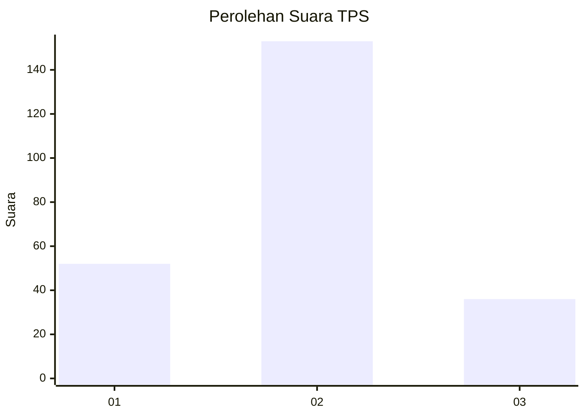
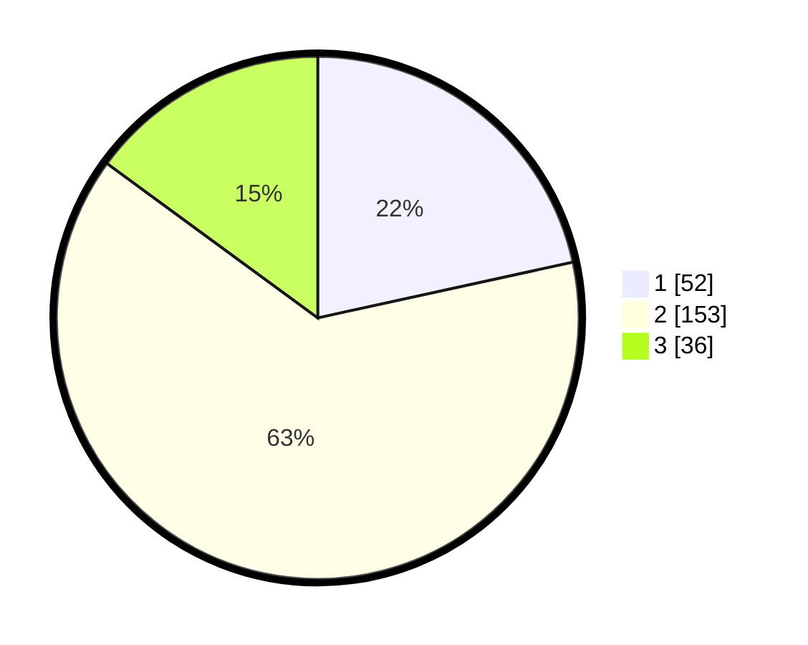

# Hasil

## Grafik

## Tabel

| No. | Nama Paslon    | Suara | Suara (raw) | Persentase |
|:--- |:-------------- | -----:| -----------:| ----------:|
| 1   | ANIES MUHAIMIN | 52    | [52][p-1]   | 21,58      |
| 2   | PRABOWO GIBRAN | 153   | [153][p-2]  | 63,49      |
| 3   | GANJAR MAHFUD  | 36    | [36][p-3]   | 14,94      |

[p-1]: https://github.com/gigit-pemilu/pemilu-2024-35-jawa-timur/blob/main/pilpres/hitung-suara/sub/35-jawa-timur/sub/08-lumajang/sub/20-ranuyoso/sub/2002-meninjo/sub/001-tps/sub/paslon-1.txt
[p-2]: https://github.com/gigit-pemilu/pemilu-2024-35-jawa-timur/blob/main/pilpres/hitung-suara/sub/35-jawa-timur/sub/08-lumajang/sub/20-ranuyoso/sub/2002-meninjo/sub/001-tps/sub/paslon-2.txt
[p-3]: https://github.com/gigit-pemilu/pemilu-2024-35-jawa-timur/blob/main/pilpres/hitung-suara/sub/35-jawa-timur/sub/08-lumajang/sub/20-ranuyoso/sub/2002-meninjo/sub/001-tps/sub/paslon-3.txt

## Foto C Plano

https://sirekap-obj-formc.kpu.go.id/1a90/pemilu/ppwp/35/08/20/20/02/3508202002001-20240218-184400--8dcac219-a0fa-40dc-bfae-0c91ea92025c.jpg

https://sirekap-obj-formc.kpu.go.id/1a90/pemilu/ppwp/35/08/20/20/02/3508202002001-20240218-184529--e10b6782-fd73-4656-9702-7d1b86d88e68.jpg

https://sirekap-obj-formc.kpu.go.id/1a90/pemilu/ppwp/35/08/20/20/02/3508202002001-20240218-184632--025e0424-6e3a-41f9-ac17-436c2a2bb2f7.jpg

## Metadata

| Key        | Value               |
| ---------- | ------------------- |
| Time Stamp | 2024-02-27 22:00:00 |

