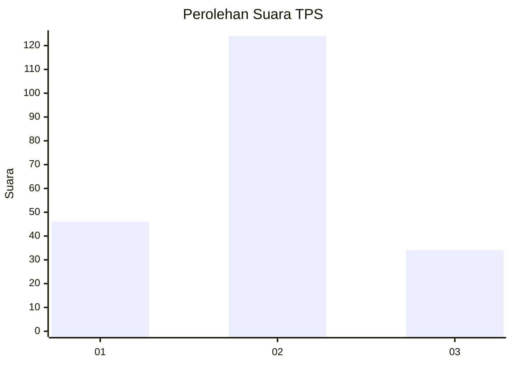

# Hasil

## Grafik

## Tabel

| No. | Nama Paslon    | Suara | Suara (raw) | Persentase |
|:--- |:-------------- | -----:| -----------:| ----------:|
| 1   | ANIES MUHAIMIN | 46    | [46][p-1]   | 22,55      |
| 2   | PRABOWO GIBRAN | 124   | [124][p-2]  | 60,78      |
| 3   | GANJAR MAHFUD  | 34    | [34][p-3]   | 16,67      |

[p-1]: https://github.com/gigit-pemilu/pemilu-2024/blob/main/pilpres/hitung-suara/sub/35-jawa-timur/sub/08-lumajang/sub/20-ranuyoso/sub/2007-ranuyoso/sub/003-tps/sub/paslon-1.txt
[p-2]: https://github.com/gigit-pemilu/pemilu-2024/blob/main/pilpres/hitung-suara/sub/35-jawa-timur/sub/08-lumajang/sub/20-ranuyoso/sub/2007-ranuyoso/sub/003-tps/sub/paslon-2.txt
[p-3]: https://github.com/gigit-pemilu/pemilu-2024/blob/main/pilpres/hitung-suara/sub/35-jawa-timur/sub/08-lumajang/sub/20-ranuyoso/sub/2007-ranuyoso/sub/003-tps/sub/paslon-3.txt

## Foto C Plano

https://sirekap-obj-formc.kpu.go.id/23d8/pemilu/ppwp/35/08/20/20/07/3508202007003-20240218-112338--393b4089-43cb-4354-9844-8ed29d348bea.jpg

https://sirekap-obj-formc.kpu.go.id/23d8/pemilu/ppwp/35/08/20/20/07/3508202007003-20240218-112941--8769612d-84cc-4acc-9dda-774494ab9061.jpg

https://sirekap-obj-formc.kpu.go.id/23d8/pemilu/ppwp/35/08/20/20/07/3508202007003-20240218-113034--98b1f4f3-37f4-412c-ab32-7ee08c996782.jpg

## Metadata

| Key        | Value               |
| ---------- | ------------------- |
| Time Stamp | 2024-02-19 06:16:00 |

