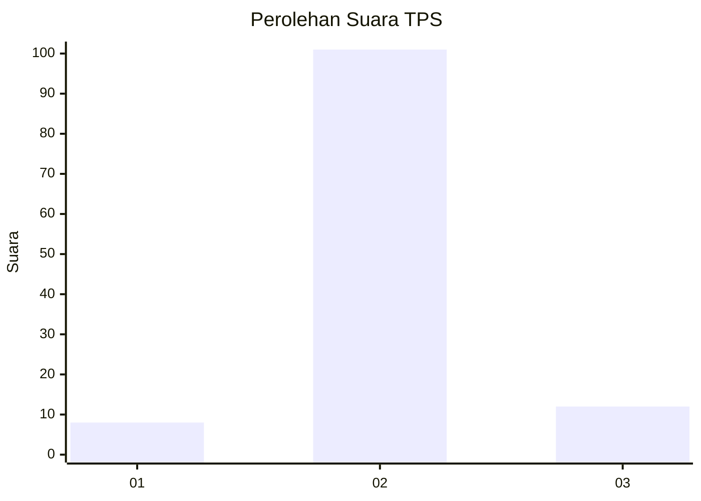
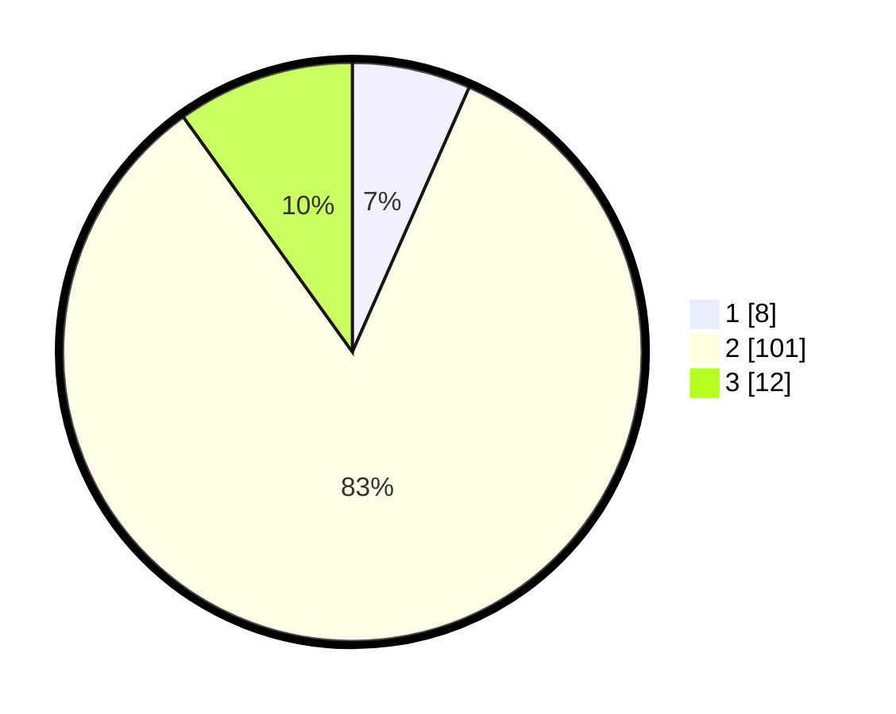

# Hasil

## Grafik

## Tabel

| No. | Nama Paslon    | Suara | Suara (raw) | Persentase |
|:--- |:-------------- | -----:| -----------:| ----------:|
| 1   | ANIES MUHAIMIN | 8     | [8][p-1]    | 6,61       |
| 2   | PRABOWO GIBRAN | 101   | [101][p-2]  | 83,47      |
| 3   | GANJAR MAHFUD  | 12    | [12][p-3]   | 9,92       |

[p-1]: https://github.com/gigit-pemilu/pemilu-2024-35-jawa-timur/blob/main/pilpres/hitung-suara/sub/35-jawa-timur/sub/08-lumajang/sub/21-sumbersuko/sub/2001-sumbersuko/sub/004-tps/sub/paslon-1.txt
[p-2]: https://github.com/gigit-pemilu/pemilu-2024-35-jawa-timur/blob/main/pilpres/hitung-suara/sub/35-jawa-timur/sub/08-lumajang/sub/21-sumbersuko/sub/2001-sumbersuko/sub/004-tps/sub/paslon-2.txt
[p-3]: https://github.com/gigit-pemilu/pemilu-2024-35-jawa-timur/blob/main/pilpres/hitung-suara/sub/35-jawa-timur/sub/08-lumajang/sub/21-sumbersuko/sub/2001-sumbersuko/sub/004-tps/sub/paslon-3.txt

## Foto C Plano

https://sirekap-obj-formc.kpu.go.id/1f12/pemilu/ppwp/35/08/21/20/01/3508212001004-20240215-234322--f0cee6b7-f765-40eb-84ae-0d04d17216c5.jpg

https://sirekap-obj-formc.kpu.go.id/1f12/pemilu/ppwp/35/08/21/20/01/3508212001004-20240215-234324--e36773cc-774a-45bf-b443-0d071d158871.jpg

https://sirekap-obj-formc.kpu.go.id/1f12/pemilu/ppwp/35/08/21/20/01/3508212001004-20240215-234323--f97a659b-5206-473d-b617-2f3e4931865c.jpg

## Metadata

| Key        | Value               |
| ---------- | ------------------- |
| Time Stamp | 2024-02-16 13:30:32 |

## DATA PEMILIH TETAP

Jumlah pemilih dalam DPT: **184**.
 * L: **79**.
 * P: **105**.

## DATA PENGGUNA HAK PILIH

Jumlah pengguna hak pilih dalam DPT: **126**.
 * L: **54**.
 * P: **72**.

Jumlah pengguna hak pilih dalam DPTb: **0**.
 * L: **0**.
 * P: **0**.

Jumlah pengguna hak pilih dalam DPK: **3**.
 * L: **1**.
 * P: **2**.

Jumlah pengguna hak pilih: **129**.
 * L: **55**.
 * P: **74**.

## JUMLAH SUARA SAH DAN TIDAK SAH

JUMLAH SELURUH SUARA SAH: **121**.

JUMLAH SUARA TIDAK SAH: **8**.

JUMLAH SELURUH SUARA SAH DAN SUARA TIDAK SAH: **129**.

