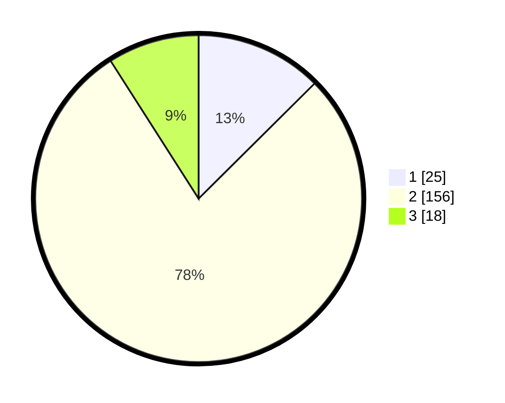

# Hasil

## Grafik

## Tabel

| No. | Nama Paslon    | Suara | Suara (raw) | Persentase |
|:--- |:-------------- | -----:| -----------:| ----------:|
| 1   | ANIES MUHAIMIN | 25    | [25][p-1]   | 12,56      |
| 2   | PRABOWO GIBRAN | 156   | [156][p-2]  | 78,39      |
| 3   | GANJAR MAHFUD  | 18    | [18][p-3]   | 9,05       |

[p-1]: https://github.com/gigit-pemilu/pemilu-2024-35-jawa-timur/blob/main/pilpres/hitung-suara/sub/35-jawa-timur/sub/08-lumajang/sub/21-sumbersuko/sub/2002-kebonsari/sub/001-tps/sub/paslon-1.txt
[p-2]: https://github.com/gigit-pemilu/pemilu-2024-35-jawa-timur/blob/main/pilpres/hitung-suara/sub/35-jawa-timur/sub/08-lumajang/sub/21-sumbersuko/sub/2002-kebonsari/sub/001-tps/sub/paslon-2.txt
[p-3]: https://github.com/gigit-pemilu/pemilu-2024-35-jawa-timur/blob/main/pilpres/hitung-suara/sub/35-jawa-timur/sub/08-lumajang/sub/21-sumbersuko/sub/2002-kebonsari/sub/001-tps/sub/paslon-3.txt

## Foto C Plano

https://sirekap-obj-formc.kpu.go.id/31bb/pemilu/ppwp/35/08/21/20/02/3508212002001-20240214-155242--f1f25880-c197-4818-ba4e-11bf047b2215.jpg

https://sirekap-obj-formc.kpu.go.id/31bb/pemilu/ppwp/35/08/21/20/02/3508212002001-20240214-155312--bbee2058-3543-4239-9b27-59f4c564111f.jpg

https://sirekap-obj-formc.kpu.go.id/31bb/pemilu/ppwp/35/08/21/20/02/3508212002001-20240214-155407--855b21a4-0b0a-4546-9233-3d268e123b2c.jpg

## Metadata

| Key        | Value               |
| ---------- | ------------------- |
| Time Stamp | 2024-02-15 21:30:27 |

