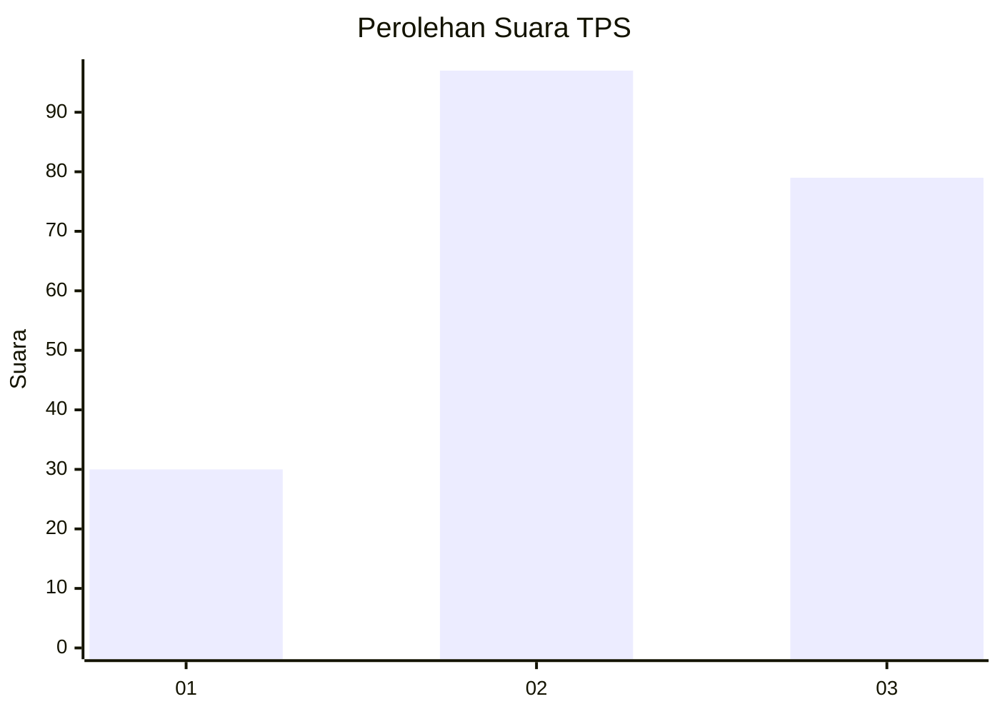
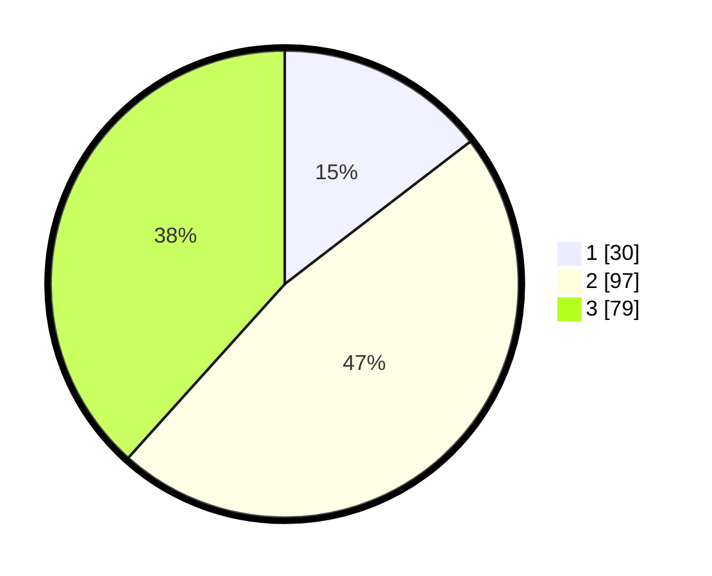

# Hasil

## Grafik

## Tabel

| No. | Nama Paslon    | Suara | Suara (raw) | Persentase |
|:--- |:-------------- | -----:| -----------:| ----------:|
| 1   | ANIES MUHAIMIN | 30    | [30][p-1]   | 14,56      |
| 2   | PRABOWO GIBRAN | 97    | [97][p-2]   | 47,09      |
| 3   | GANJAR MAHFUD  | 79    | [79][p-3]   | 38,35      |

[p-1]: https://github.com/gigit-pemilu/pemilu-2024/blob/main/pilpres/hitung-suara/sub/35-jawa-timur/sub/08-lumajang/sub/21-sumbersuko/sub/2007-purwosono/sub/013-tps/sub/paslon-1.txt
[p-2]: https://github.com/gigit-pemilu/pemilu-2024/blob/main/pilpres/hitung-suara/sub/35-jawa-timur/sub/08-lumajang/sub/21-sumbersuko/sub/2007-purwosono/sub/013-tps/sub/paslon-2.txt
[p-3]: https://github.com/gigit-pemilu/pemilu-2024/blob/main/pilpres/hitung-suara/sub/35-jawa-timur/sub/08-lumajang/sub/21-sumbersuko/sub/2007-purwosono/sub/013-tps/sub/paslon-3.txt

## Foto C Plano

https://sirekap-obj-formc.kpu.go.id/e53c/pemilu/ppwp/35/08/21/20/07/3508212007013-20240215-010530--9af90f8e-e06e-4519-bd45-940fac63c66b.jpg

https://sirekap-obj-formc.kpu.go.id/e53c/pemilu/ppwp/35/08/21/20/07/3508212007013-20240214-192752--ecefb035-14b9-452a-9e6e-5b2a412d4142.jpg

https://sirekap-obj-formc.kpu.go.id/e53c/pemilu/ppwp/35/08/21/20/07/3508212007013-20240214-192827--1474415a-9bf3-418d-9b57-6786a49e61ba.jpg

## Metadata

| Key        | Value               |
| ---------- | ------------------- |
| Time Stamp | 2024-02-15 22:00:27 |

