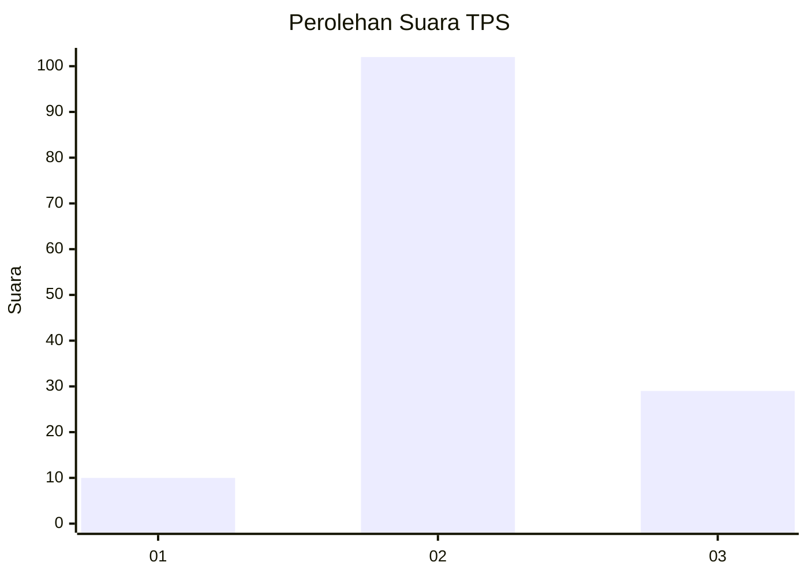

# Hasil

## Grafik

## Tabel

| No. | Nama Paslon    | Suara | Suara (raw) | Persentase |
|:--- |:-------------- | -----:| -----------:| ----------:|
| 1   | ANIES MUHAIMIN | 10    | [10][p-1]   | 7,09       |
| 2   | PRABOWO GIBRAN | 102   | [102][p-2]  | 72,34      |
| 3   | GANJAR MAHFUD  | 29    | [29][p-3]   | 20,57      |

[p-1]: https://github.com/gigit-pemilu/pemilu-2024/blob/main/pilpres/hitung-suara/sub/35-jawa-timur/sub/09-jember/sub/01-jombang/sub/2001-padomasan/sub/001-tps/sub/paslon-1.txt
[p-2]: https://github.com/gigit-pemilu/pemilu-2024/blob/main/pilpres/hitung-suara/sub/35-jawa-timur/sub/09-jember/sub/01-jombang/sub/2001-padomasan/sub/001-tps/sub/paslon-2.txt
[p-3]: https://github.com/gigit-pemilu/pemilu-2024/blob/main/pilpres/hitung-suara/sub/35-jawa-timur/sub/09-jember/sub/01-jombang/sub/2001-padomasan/sub/001-tps/sub/paslon-3.txt

## Foto C Plano

https://sirekap-obj-formc.kpu.go.id/df8e/pemilu/ppwp/35/09/01/20/01/3509012001001-20240215-143032--36d5b176-564a-4e45-b287-451ae994e32c.jpg

https://sirekap-obj-formc.kpu.go.id/df8e/pemilu/ppwp/35/09/01/20/01/3509012001001-20240215-143053--4913a1c5-f5bf-4641-b54b-36604ae61a4b.jpg

https://sirekap-obj-formc.kpu.go.id/df8e/pemilu/ppwp/35/09/01/20/01/3509012001001-20240215-143042--9c7a3bec-4256-4e46-83b5-d6450c282f63.jpg

## Metadata

| Key        | Value               |
| ---------- | ------------------- |
| Time Stamp | 2024-02-15 18:00:26 |

## DATA PEMILIH TETAP

Jumlah pemilih dalam DPT: **261**.
 * L: **128**.
 * P: **133**.

## DATA PENGGUNA HAK PILIH

Jumlah pengguna hak pilih dalam DPT: **148**.
 * L: **64**.
 * P: **84**.

Jumlah pengguna hak pilih dalam DPTb: **0**.
 * L: **0**.
 * P: **0**.

Jumlah pengguna hak pilih dalam DPK: **0**.
 * L: **0**.
 * P: **0**.

Jumlah pengguna hak pilih: **148**.
 * L: **64**.
 * P: **84**.

## JUMLAH SUARA SAH DAN TIDAK SAH

JUMLAH SELURUH SUARA SAH: **141**.

JUMLAH SUARA TIDAK SAH: **7**.

JUMLAH SELURUH SUARA SAH DAN SUARA TIDAK SAH: **148**.

