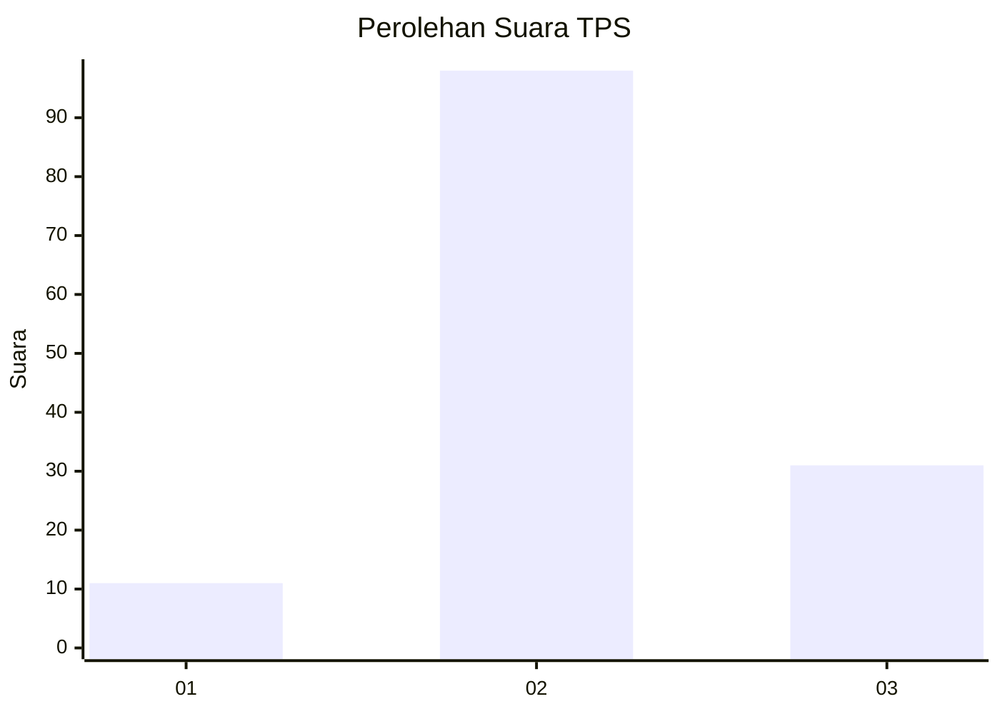
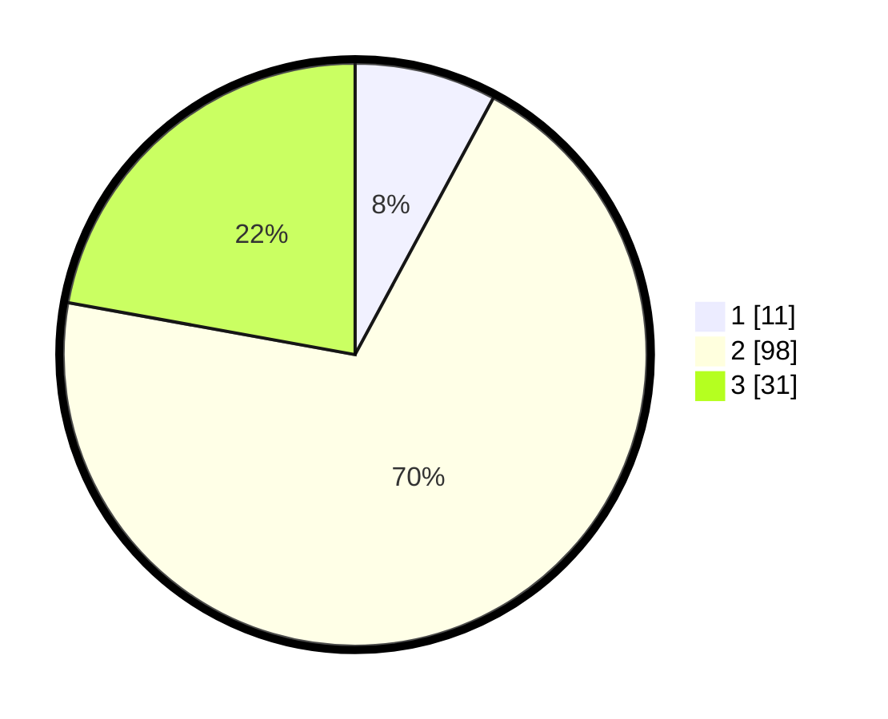

# Hasil

## Grafik

## Tabel

| No. | Nama Paslon    | Suara | Suara (raw) | Persentase |
|:--- |:-------------- | -----:| -----------:| ----------:|
| 1   | ANIES MUHAIMIN | 11    | [11][p-1]   | 7,86       |
| 2   | PRABOWO GIBRAN | 98    | [98][p-2]   | 70,00      |
| 3   | GANJAR MAHFUD  | 31    | [31][p-3]   | 22,14      |

[p-1]: https://github.com/gigit-pemilu/pemilu-2024-35-jawa-timur/blob/main/pilpres/hitung-suara/sub/35-jawa-timur/sub/09-jember/sub/01-jombang/sub/2001-padomasan/sub/003-tps/sub/paslon-1.txt
[p-2]: https://github.com/gigit-pemilu/pemilu-2024-35-jawa-timur/blob/main/pilpres/hitung-suara/sub/35-jawa-timur/sub/09-jember/sub/01-jombang/sub/2001-padomasan/sub/003-tps/sub/paslon-2.txt
[p-3]: https://github.com/gigit-pemilu/pemilu-2024-35-jawa-timur/blob/main/pilpres/hitung-suara/sub/35-jawa-timur/sub/09-jember/sub/01-jombang/sub/2001-padomasan/sub/003-tps/sub/paslon-3.txt

## Foto C Plano

https://sirekap-obj-formc.kpu.go.id/c4be/pemilu/ppwp/35/09/01/20/01/3509012001003-20240215-195736--78a41230-9a08-41b8-b59c-d57cb2e0e25e.jpg

https://sirekap-obj-formc.kpu.go.id/c4be/pemilu/ppwp/35/09/01/20/01/3509012001003-20240215-195758--28d885ff-30ce-4d92-88b8-1fbf513c2b7d.jpg

https://sirekap-obj-formc.kpu.go.id/c4be/pemilu/ppwp/35/09/01/20/01/3509012001003-20240215-195746--daaab540-c1f7-4b26-a0b6-bb2b87d014be.jpg

## Metadata

| Key        | Value               |
| ---------- | ------------------- |
| Time Stamp | 2024-02-15 21:01:18 |

## DATA PEMILIH TETAP

Jumlah pemilih dalam DPT: **257**.
 * L: **122**.
 * P: **135**.

## DATA PENGGUNA HAK PILIH

Jumlah pengguna hak pilih dalam DPT: **141**.
 * L: **58**.
 * P: **83**.

Jumlah pengguna hak pilih dalam DPTb: **0**.
 * L: **0**.
 * P: **0**.

Jumlah pengguna hak pilih dalam DPK: **0**.
 * L: **0**.
 * P: **0**.

Jumlah pengguna hak pilih: **141**.
 * L: **58**.
 * P: **83**.

## JUMLAH SUARA SAH DAN TIDAK SAH

JUMLAH SELURUH SUARA SAH: **141**.

JUMLAH SUARA TIDAK SAH: **1**.

JUMLAH SELURUH SUARA SAH DAN SUARA TIDAK SAH: **142**.

