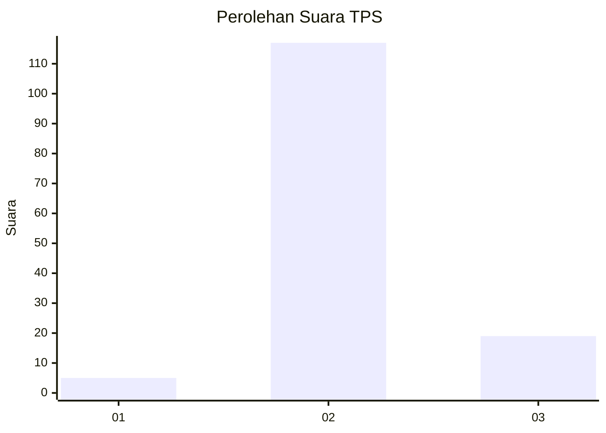
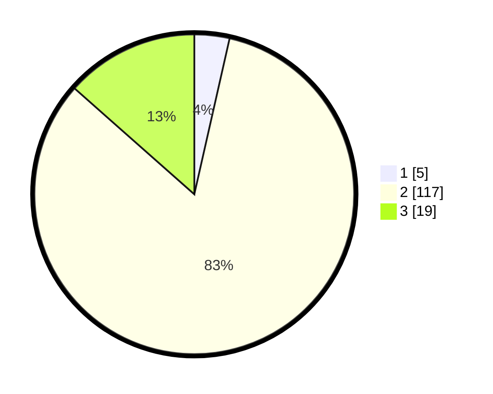

# Hasil

## Grafik

## Tabel

| No. | Nama Paslon    | Suara | Suara (raw) | Persentase |
|:--- |:-------------- | -----:| -----------:| ----------:|
| 1   | ANIES MUHAIMIN | 5     | [5][p-1]    | 3,55       |
| 2   | PRABOWO GIBRAN | 117   | [117][p-2]  | 82,98      |
| 3   | GANJAR MAHFUD  | 19    | [19][p-3]   | 13,48      |

[p-1]: https://github.com/gigit-pemilu/pemilu-2024-35-jawa-timur/blob/main/pilpres/hitung-suara/sub/35-jawa-timur/sub/09-jember/sub/01-jombang/sub/2001-padomasan/sub/008-tps/sub/paslon-1.txt
[p-2]: https://github.com/gigit-pemilu/pemilu-2024-35-jawa-timur/blob/main/pilpres/hitung-suara/sub/35-jawa-timur/sub/09-jember/sub/01-jombang/sub/2001-padomasan/sub/008-tps/sub/paslon-2.txt
[p-3]: https://github.com/gigit-pemilu/pemilu-2024-35-jawa-timur/blob/main/pilpres/hitung-suara/sub/35-jawa-timur/sub/09-jember/sub/01-jombang/sub/2001-padomasan/sub/008-tps/sub/paslon-3.txt

## Foto C Plano

https://sirekap-obj-formc.kpu.go.id/52b3/pemilu/ppwp/35/09/01/20/01/3509012001008-20240216-013734--9155adee-b67e-4bee-a882-105b0f35b229.jpg

https://sirekap-obj-formc.kpu.go.id/52b3/pemilu/ppwp/35/09/01/20/01/3509012001008-20240216-013739--0066e586-4a0e-4517-8435-8741c6e0ae98.jpg

https://sirekap-obj-formc.kpu.go.id/52b3/pemilu/ppwp/35/09/01/20/01/3509012001008-20240216-013735--2105fb92-343d-4045-9a82-79316438bd4b.jpg

## Metadata

| Key        | Value               |
| ---------- | ------------------- |
| Time Stamp | 2024-02-16 12:51:22 |

## DATA PEMILIH TETAP

Jumlah pemilih dalam DPT: **243**.
 * L: **129**.
 * P: **114**.

## DATA PENGGUNA HAK PILIH

Jumlah pengguna hak pilih dalam DPT: **148**.
 * L: **71**.
 * P: **77**.

Jumlah pengguna hak pilih dalam DPTb: **0**.
 * L: **0**.
 * P: **0**.

Jumlah pengguna hak pilih dalam DPK: **0**.
 * L: **0**.
 * P: **0**.

Jumlah pengguna hak pilih: **148**.
 * L: **71**.
 * P: **77**.

## JUMLAH SUARA SAH DAN TIDAK SAH

JUMLAH SELURUH SUARA SAH: **141**.

JUMLAH SUARA TIDAK SAH: **7**.

JUMLAH SELURUH SUARA SAH DAN SUARA TIDAK SAH: **148**.

