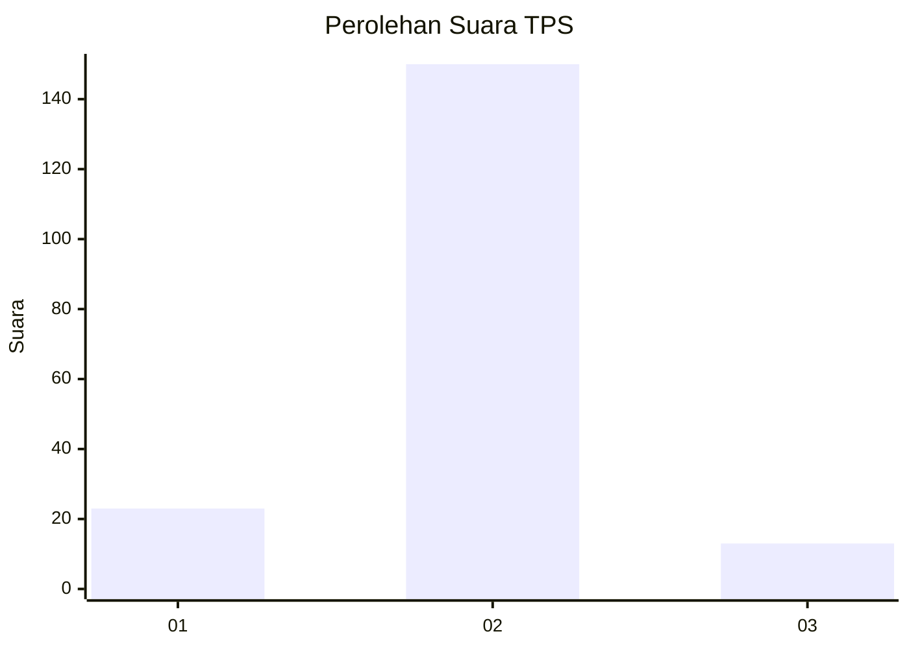
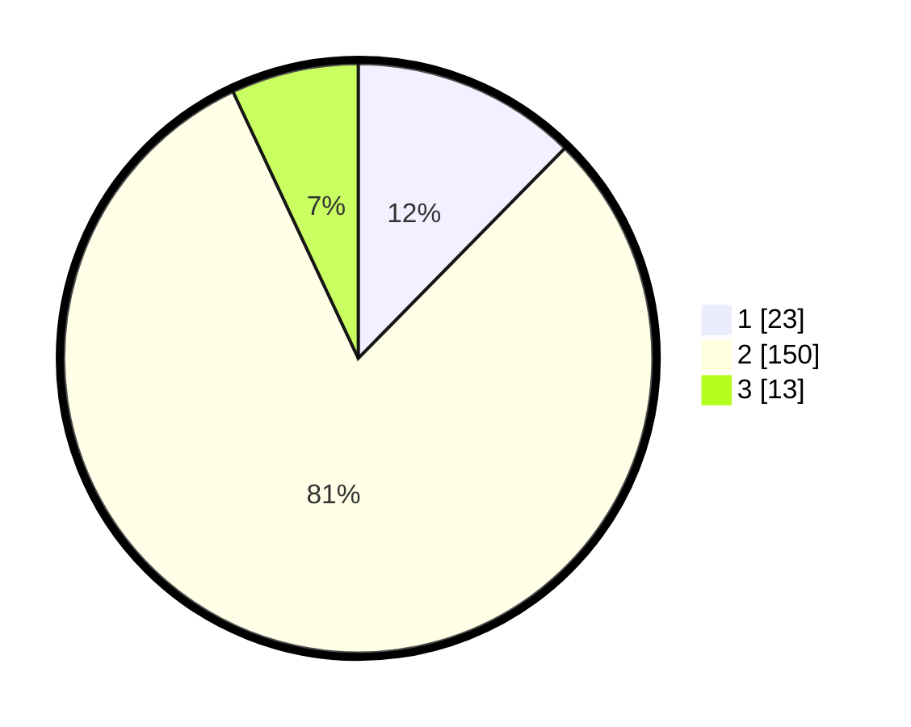

# Hasil

## Grafik

## Tabel

| No. | Nama Paslon    | Suara | Suara (raw) | Persentase |
|:--- |:-------------- | -----:| -----------:| ----------:|
| 1   | ANIES MUHAIMIN | 23    | [23][p-1]   | 12,37      |
| 2   | PRABOWO GIBRAN | 150   | [150][p-2]  | 80,65      |
| 3   | GANJAR MAHFUD  | 13    | [13][p-3]   | 6,99       |

[p-1]: https://github.com/gigit-pemilu/pemilu-2024-35-jawa-timur/blob/main/pilpres/hitung-suara/sub/35-jawa-timur/sub/09-jember/sub/01-jombang/sub/2002-keting/sub/011-tps/sub/paslon-1.txt
[p-2]: https://github.com/gigit-pemilu/pemilu-2024-35-jawa-timur/blob/main/pilpres/hitung-suara/sub/35-jawa-timur/sub/09-jember/sub/01-jombang/sub/2002-keting/sub/011-tps/sub/paslon-2.txt
[p-3]: https://github.com/gigit-pemilu/pemilu-2024-35-jawa-timur/blob/main/pilpres/hitung-suara/sub/35-jawa-timur/sub/09-jember/sub/01-jombang/sub/2002-keting/sub/011-tps/sub/paslon-3.txt

## Foto C Plano

https://sirekap-obj-formc.kpu.go.id/49b4/pemilu/ppwp/35/09/01/20/02/3509012002011-20240215-031009--3b991559-fc43-4eec-9e4c-3ea4b4c9b6c2.jpg

https://sirekap-obj-formc.kpu.go.id/49b4/pemilu/ppwp/35/09/01/20/02/3509012002011-20240215-031106--beb1efc5-6a9d-4a38-88d7-7c62061f9a63.jpg

https://sirekap-obj-formc.kpu.go.id/49b4/pemilu/ppwp/35/09/01/20/02/3509012002011-20240215-031154--0aa69f57-d2b1-4c4c-a8df-af5ee1a0331c.jpg

## Metadata

| Key        | Value               |
| ---------- | ------------------- |
| Time Stamp | 2024-02-16 00:00:26 |

