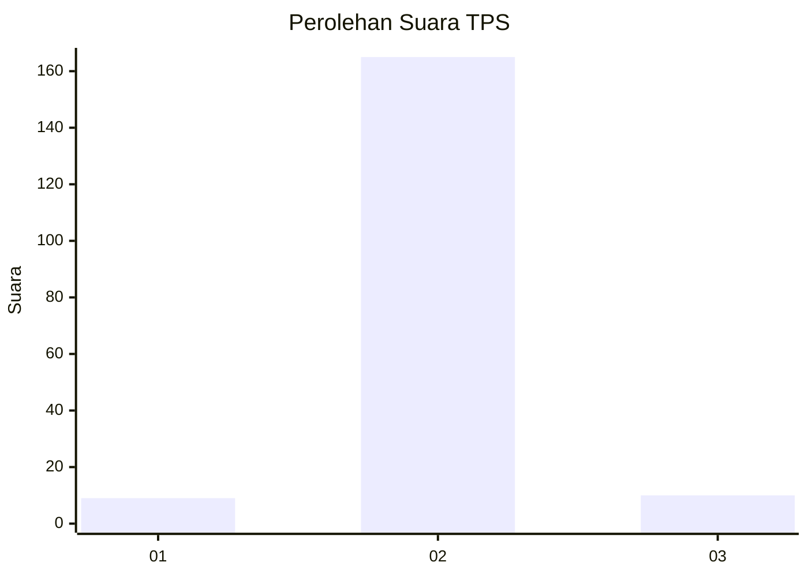
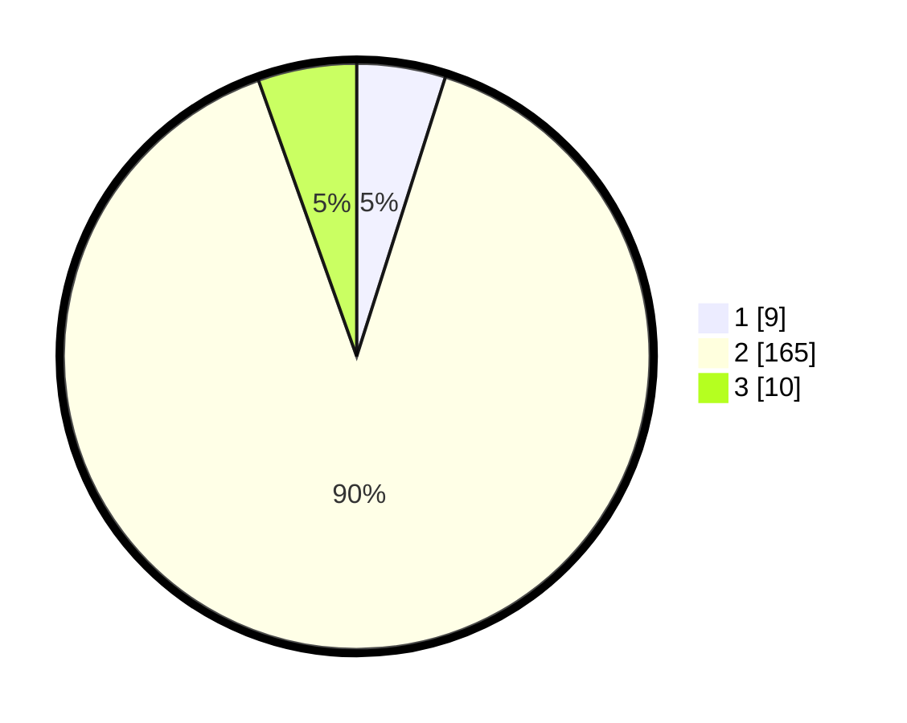

# Hasil

## Grafik

## Tabel

| No. | Nama Paslon    | Suara | Suara (raw) | Persentase |
|:--- |:-------------- | -----:| -----------:| ----------:|
| 1   | ANIES MUHAIMIN | 9     | [9][p-1]    | 4,89       |
| 2   | PRABOWO GIBRAN | 165   | [165][p-2]  | 89,67      |
| 3   | GANJAR MAHFUD  | 10    | [10][p-3]   | 5,43       |

[p-1]: https://github.com/gigit-pemilu/pemilu-2024-35-jawa-timur/blob/main/pilpres/hitung-suara/sub/35-jawa-timur/sub/09-jember/sub/01-jombang/sub/2002-keting/sub/014-tps/sub/paslon-1.txt
[p-2]: https://github.com/gigit-pemilu/pemilu-2024-35-jawa-timur/blob/main/pilpres/hitung-suara/sub/35-jawa-timur/sub/09-jember/sub/01-jombang/sub/2002-keting/sub/014-tps/sub/paslon-2.txt
[p-3]: https://github.com/gigit-pemilu/pemilu-2024-35-jawa-timur/blob/main/pilpres/hitung-suara/sub/35-jawa-timur/sub/09-jember/sub/01-jombang/sub/2002-keting/sub/014-tps/sub/paslon-3.txt

## Foto C Plano

https://sirekap-obj-formc.kpu.go.id/869c/pemilu/ppwp/35/09/01/20/02/3509012002014-20240215-002801--9e91d88b-ec98-4b6c-88ca-6ce4174a68f8.jpg

https://sirekap-obj-formc.kpu.go.id/869c/pemilu/ppwp/35/09/01/20/02/3509012002014-20240215-002902--aadbcc75-513c-4b55-b032-27bde366cc44.jpg

https://sirekap-obj-formc.kpu.go.id/869c/pemilu/ppwp/35/09/01/20/02/3509012002014-20240215-003014--d5f96a43-5ac2-4ac9-a2ee-827aec3bf44b.jpg

## Metadata

| Key        | Value               |
| ---------- | ------------------- |
| Time Stamp | 2024-02-15 15:00:29 |

