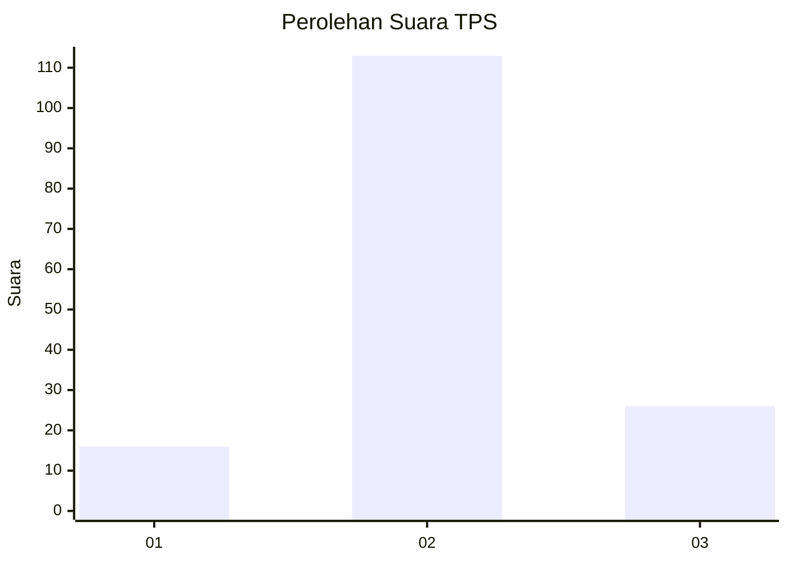
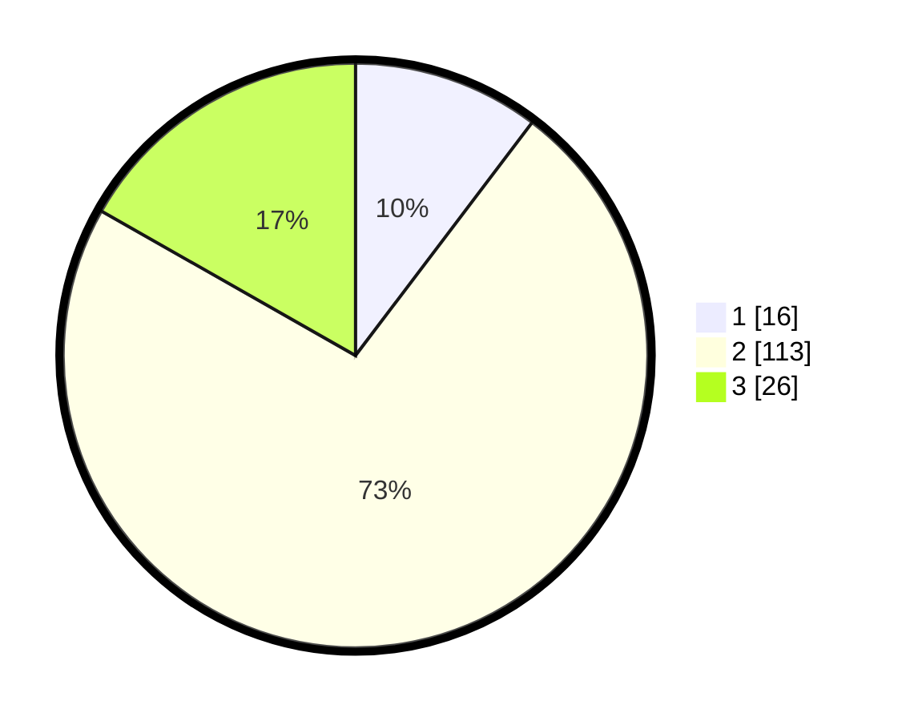

# Hasil

## Grafik

## Tabel

| No. | Nama Paslon    | Suara | Suara (raw) | Persentase |
|:--- |:-------------- | -----:| -----------:| ----------:|
| 1   | ANIES MUHAIMIN | 16    | [16][p-1]   | 10,32      |
| 2   | PRABOWO GIBRAN | 113   | [113][p-2]  | 72,90      |
| 3   | GANJAR MAHFUD  | 26    | [26][p-3]   | 16,77      |

[p-1]: https://github.com/gigit-pemilu/pemilu-2024/blob/main/pilpres/hitung-suara/sub/35-jawa-timur/sub/09-jember/sub/01-jombang/sub/2003-jombang/sub/006-tps/sub/paslon-1.txt
[p-2]: https://github.com/gigit-pemilu/pemilu-2024/blob/main/pilpres/hitung-suara/sub/35-jawa-timur/sub/09-jember/sub/01-jombang/sub/2003-jombang/sub/006-tps/sub/paslon-2.txt
[p-3]: https://github.com/gigit-pemilu/pemilu-2024/blob/main/pilpres/hitung-suara/sub/35-jawa-timur/sub/09-jember/sub/01-jombang/sub/2003-jombang/sub/006-tps/sub/paslon-3.txt

## Foto C Plano

https://sirekap-obj-formc.kpu.go.id/58ac/pemilu/ppwp/35/09/01/20/03/3509012003006-20240214-213106--4bc5e2d4-e7ad-4b25-91ed-aa27cf7fa4d1.jpg

https://sirekap-obj-formc.kpu.go.id/58ac/pemilu/ppwp/35/09/01/20/03/3509012003006-20240214-224110--b0c9f299-6aef-40a6-8a0d-54cd7f9d2b8b.jpg

https://sirekap-obj-formc.kpu.go.id/58ac/pemilu/ppwp/35/09/01/20/03/3509012003006-20240214-213418--f9c45bcf-7254-4bb2-a0bd-3164b1d2561a.jpg

## Metadata

| Key        | Value               |
| ---------- | ------------------- |
| Time Stamp | 2024-02-16 00:00:26 |

