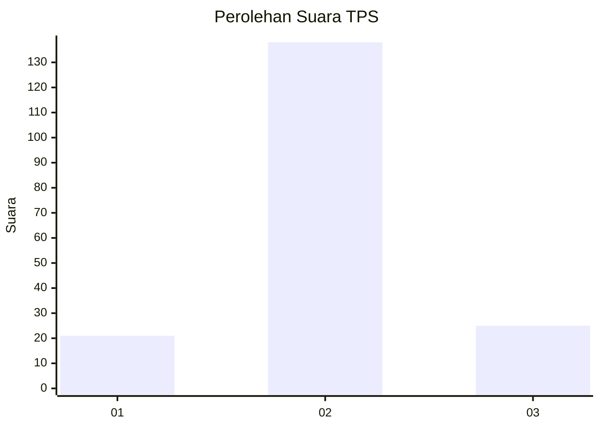
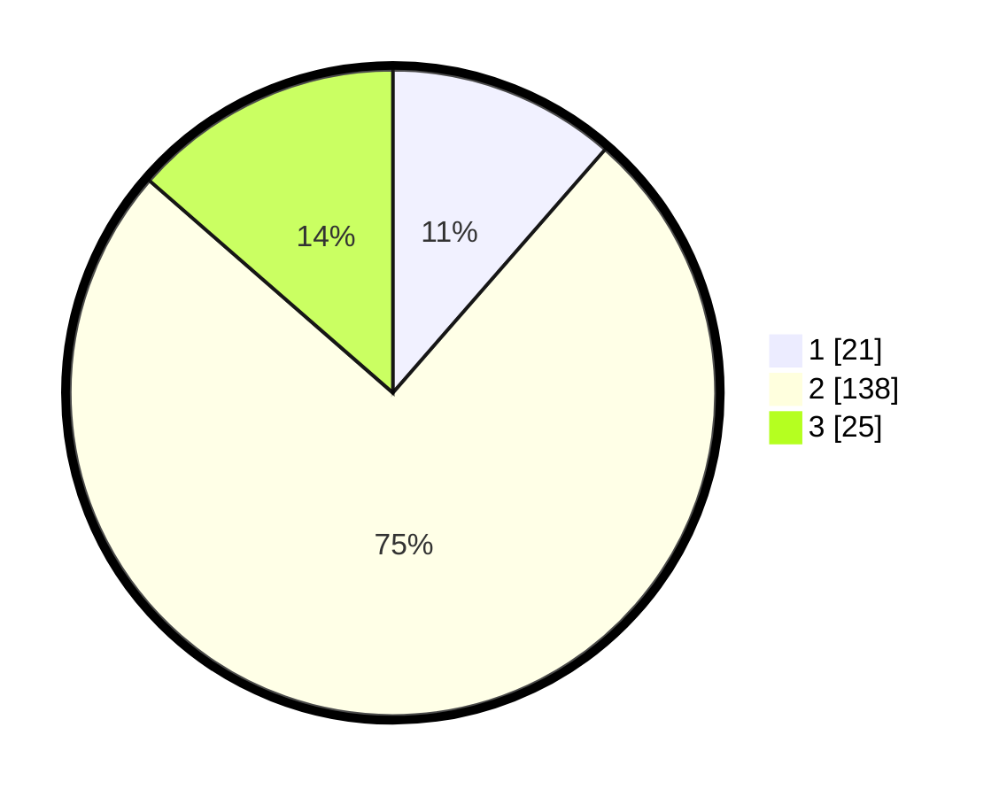

# Hasil

## Grafik

## Tabel

| No. | Nama Paslon    | Suara | Suara (raw) | Persentase |
|:--- |:-------------- | -----:| -----------:| ----------:|
| 1   | ANIES MUHAIMIN | 21    | [21][p-1]   | 11,41      |
| 2   | PRABOWO GIBRAN | 138   | [138][p-2]  | 75,00      |
| 3   | GANJAR MAHFUD  | 25    | [25][p-3]   | 13,59      |

[p-1]: https://github.com/gigit-pemilu/pemilu-2024-35-jawa-timur/blob/main/pilpres/hitung-suara/sub/35-jawa-timur/sub/09-jember/sub/01-jombang/sub/2003-jombang/sub/007-tps/sub/paslon-1.txt
[p-2]: https://github.com/gigit-pemilu/pemilu-2024-35-jawa-timur/blob/main/pilpres/hitung-suara/sub/35-jawa-timur/sub/09-jember/sub/01-jombang/sub/2003-jombang/sub/007-tps/sub/paslon-2.txt
[p-3]: https://github.com/gigit-pemilu/pemilu-2024-35-jawa-timur/blob/main/pilpres/hitung-suara/sub/35-jawa-timur/sub/09-jember/sub/01-jombang/sub/2003-jombang/sub/007-tps/sub/paslon-3.txt

## Foto C Plano

https://sirekap-obj-formc.kpu.go.id/9346/pemilu/ppwp/35/09/01/20/03/3509012003007-20240215-000906--b09245f8-382d-4872-9200-810c31fd67da.jpg

https://sirekap-obj-formc.kpu.go.id/9346/pemilu/ppwp/35/09/01/20/03/3509012003007-20240218-095035--ebb97a4a-d399-4345-a5d1-a330f1eac64c.jpg

https://sirekap-obj-formc.kpu.go.id/9346/pemilu/ppwp/35/09/01/20/03/3509012003007-20240215-001305--23b382f5-c028-405e-a0b2-078ef149633a.jpg

## Metadata

| Key        | Value               |
| ---------- | ------------------- |
| Time Stamp | 2024-02-19 06:16:00 |

