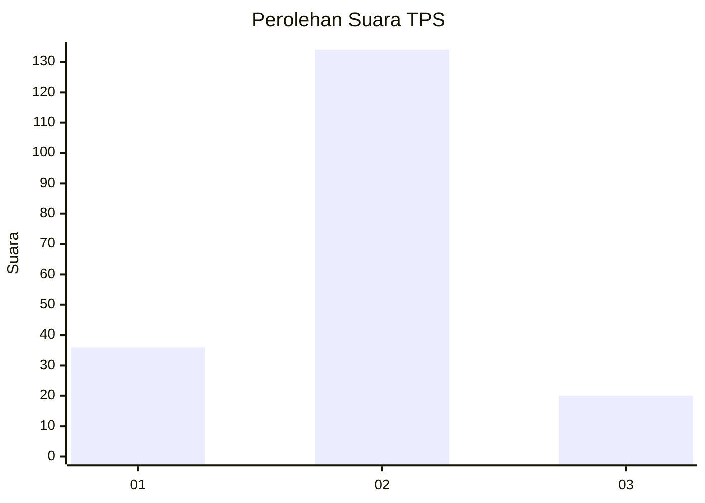
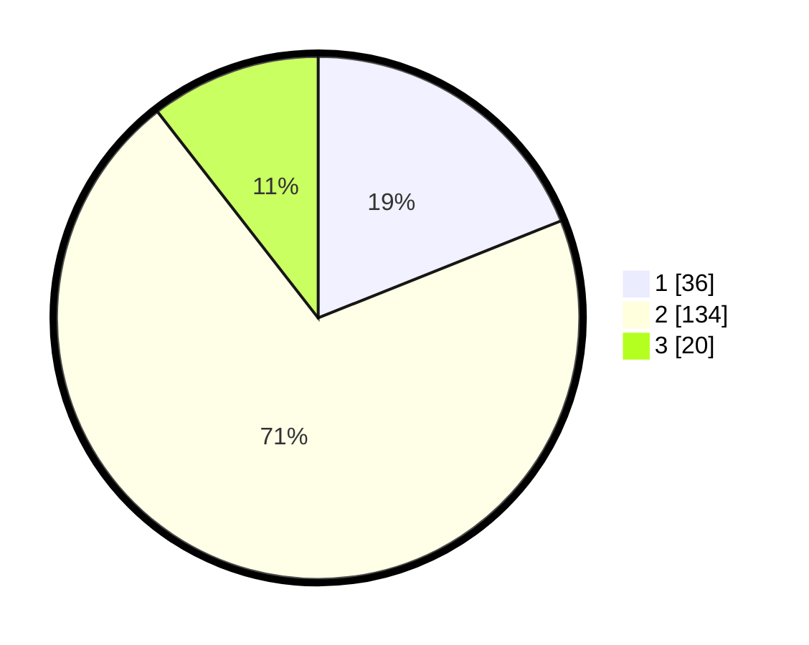

# Hasil

## Grafik

## Tabel

| No. | Nama Paslon    | Suara | Suara (raw) | Persentase |
|:--- |:-------------- | -----:| -----------:| ----------:|
| 1   | ANIES MUHAIMIN | 36    | [36][p-1]   | 18,95      |
| 2   | PRABOWO GIBRAN | 134   | [134][p-2]  | 70,53      |
| 3   | GANJAR MAHFUD  | 20    | [20][p-3]   | 10,53      |

[p-1]: https://github.com/gigit-pemilu/pemilu-2024-35-jawa-timur/blob/main/pilpres/hitung-suara/sub/35-jawa-timur/sub/09-jember/sub/01-jombang/sub/2003-jombang/sub/022-tps/sub/paslon-1.txt
[p-2]: https://github.com/gigit-pemilu/pemilu-2024-35-jawa-timur/blob/main/pilpres/hitung-suara/sub/35-jawa-timur/sub/09-jember/sub/01-jombang/sub/2003-jombang/sub/022-tps/sub/paslon-2.txt
[p-3]: https://github.com/gigit-pemilu/pemilu-2024-35-jawa-timur/blob/main/pilpres/hitung-suara/sub/35-jawa-timur/sub/09-jember/sub/01-jombang/sub/2003-jombang/sub/022-tps/sub/paslon-3.txt

## Foto C Plano

https://sirekap-obj-formc.kpu.go.id/2467/pemilu/ppwp/35/09/01/20/03/3509012003022-20240214-213849--525ac10e-d2c4-4e29-aed1-6ab7fc85ffa2.jpg

https://sirekap-obj-formc.kpu.go.id/2467/pemilu/ppwp/35/09/01/20/03/3509012003022-20240214-200525--6ff987a0-bd88-452e-8f5f-a19885c7d19b.jpg

https://sirekap-obj-formc.kpu.go.id/2467/pemilu/ppwp/35/09/01/20/03/3509012003022-20240214-194635--3def61dc-8360-4045-9f9b-8bc0a92819a5.jpg

## Metadata

| Key        | Value               |
| ---------- | ------------------- |
| Time Stamp | 2024-02-16 00:00:26 |

