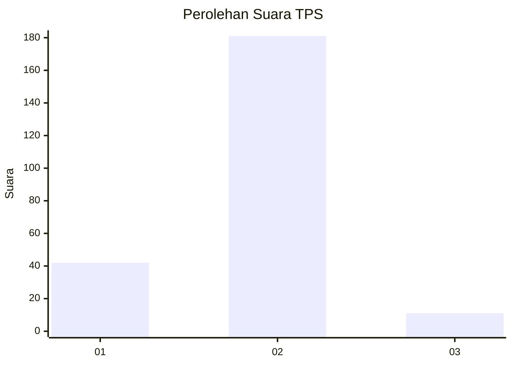
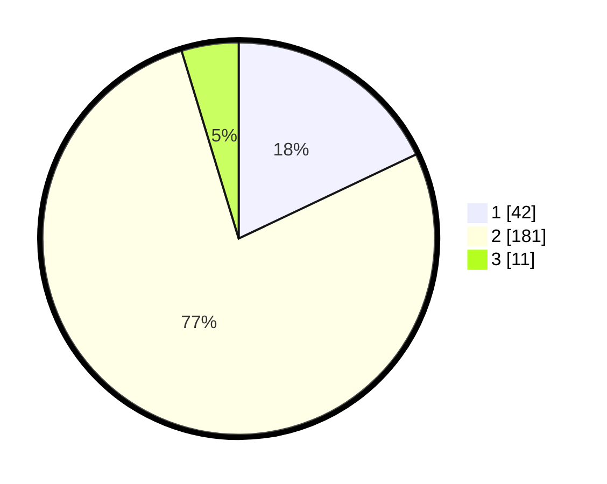

# Hasil

## Grafik

## Tabel

| No. | Nama Paslon    | Suara | Suara (raw) | Persentase |
|:--- |:-------------- | -----:| -----------:| ----------:|
| 1   | ANIES MUHAIMIN | 42    | [42][p-1]   | 17,95      |
| 2   | PRABOWO GIBRAN | 181   | [181][p-2]  | 77,35      |
| 3   | GANJAR MAHFUD  | 11    | [11][p-3]   | 4,70       |

[p-1]: https://github.com/gigit-pemilu/pemilu-2024/blob/main/pilpres/hitung-suara/sub/35-jawa-timur/sub/09-jember/sub/01-jombang/sub/2004-ngampelrejo/sub/015-tps/sub/paslon-1.txt
[p-2]: https://github.com/gigit-pemilu/pemilu-2024/blob/main/pilpres/hitung-suara/sub/35-jawa-timur/sub/09-jember/sub/01-jombang/sub/2004-ngampelrejo/sub/015-tps/sub/paslon-2.txt
[p-3]: https://github.com/gigit-pemilu/pemilu-2024/blob/main/pilpres/hitung-suara/sub/35-jawa-timur/sub/09-jember/sub/01-jombang/sub/2004-ngampelrejo/sub/015-tps/sub/paslon-3.txt

## Foto C Plano

https://sirekap-obj-formc.kpu.go.id/d49a/pemilu/ppwp/35/09/01/20/04/3509012004015-20240214-205227--10f8883f-a581-44eb-b9c2-9abb95823925.jpg

https://sirekap-obj-formc.kpu.go.id/d49a/pemilu/ppwp/35/09/01/20/04/3509012004015-20240214-205357--3ce17ad6-06f8-4931-9f21-3c44caf49e42.jpg

https://sirekap-obj-formc.kpu.go.id/d49a/pemilu/ppwp/35/09/01/20/04/3509012004015-20240214-205459--f5690a1d-7ce0-40c5-bc6f-9c5af54798b5.jpg

## Metadata

| Key        | Value               |
| ---------- | ------------------- |
| Time Stamp | 2024-02-15 00:41:44 |

