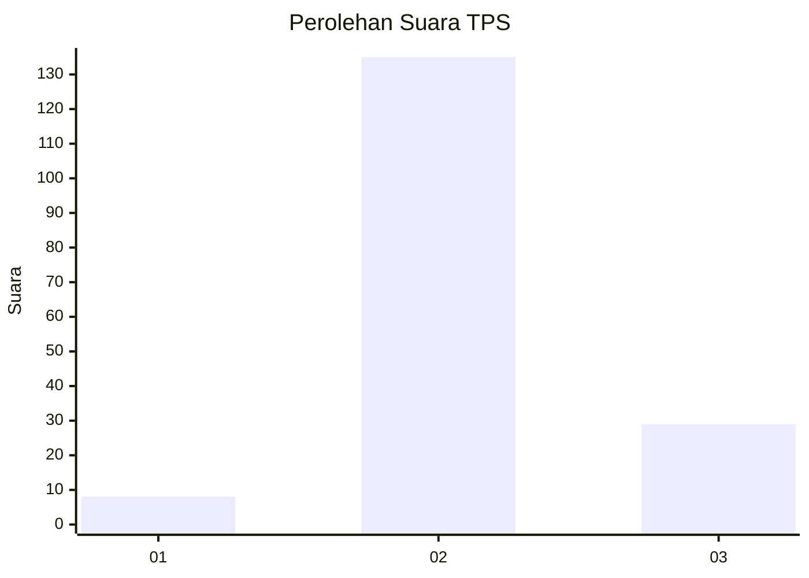
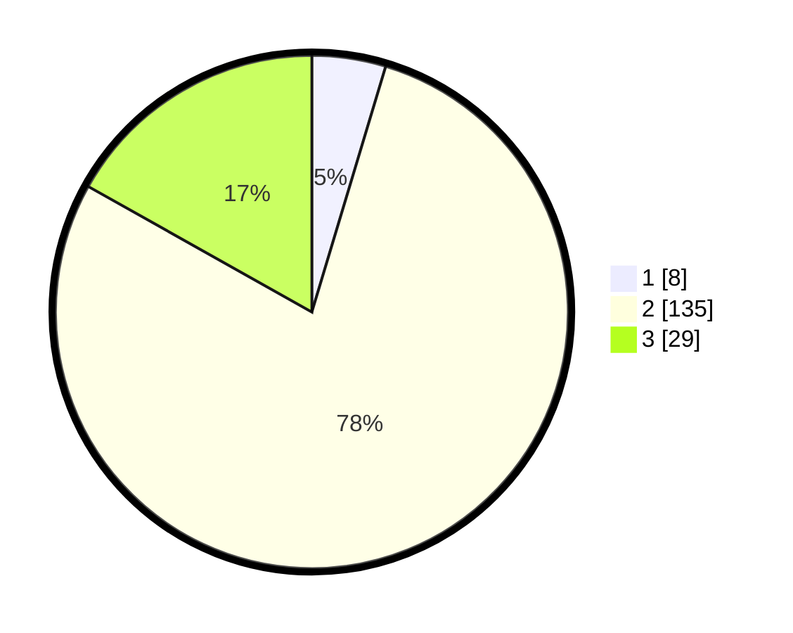

# Hasil

## Grafik

## Tabel

| No. | Nama Paslon    | Suara | Suara (raw) | Persentase |
|:--- |:-------------- | -----:| -----------:| ----------:|
| 1   | ANIES MUHAIMIN | 8     | [8][p-1]    | 4,65       |
| 2   | PRABOWO GIBRAN | 135   | [135][p-2]  | 78,49      |
| 3   | GANJAR MAHFUD  | 29    | [29][p-3]   | 16,86      |

[p-1]: https://github.com/gigit-pemilu/pemilu-2024/blob/main/pilpres/hitung-suara/sub/35-jawa-timur/sub/09-jember/sub/01-jombang/sub/2005-wringinagung/sub/002-tps/sub/paslon-1.txt
[p-2]: https://github.com/gigit-pemilu/pemilu-2024/blob/main/pilpres/hitung-suara/sub/35-jawa-timur/sub/09-jember/sub/01-jombang/sub/2005-wringinagung/sub/002-tps/sub/paslon-2.txt
[p-3]: https://github.com/gigit-pemilu/pemilu-2024/blob/main/pilpres/hitung-suara/sub/35-jawa-timur/sub/09-jember/sub/01-jombang/sub/2005-wringinagung/sub/002-tps/sub/paslon-3.txt

## Foto C Plano

https://sirekap-obj-formc.kpu.go.id/7da8/pemilu/ppwp/35/09/01/20/05/3509012005002-20240214-184617--470c9394-ab09-4e00-9627-fb776d45ff73.jpg

https://sirekap-obj-formc.kpu.go.id/7da8/pemilu/ppwp/35/09/01/20/05/3509012005002-20240214-184458--700f0bfc-0cd0-47e2-b32d-5a991c1231b2.jpg

https://sirekap-obj-formc.kpu.go.id/7da8/pemilu/ppwp/35/09/01/20/05/3509012005002-20240214-184442--150d9be2-f3d9-439a-ad64-b9f4ab4d4d4a.jpg

## Metadata

| Key        | Value               |
| ---------- | ------------------- |
| Time Stamp | 2024-02-16 00:30:27 |

