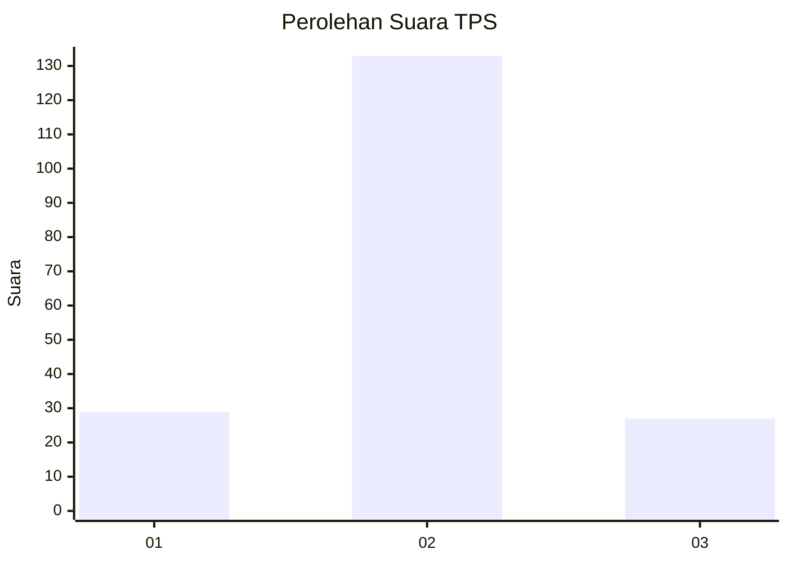

# Hasil

## Grafik

## Tabel

| No. | Nama Paslon    | Suara | Suara (raw) | Persentase |
|:--- |:-------------- | -----:| -----------:| ----------:|
| 1   | ANIES MUHAIMIN | 29    | [29][p-1]   | 15,34      |
| 2   | PRABOWO GIBRAN | 133   | [133][p-2]  | 70,37      |
| 3   | GANJAR MAHFUD  | 27    | [27][p-3]   | 14,29      |

[p-1]: https://github.com/gigit-pemilu/pemilu-2024/blob/main/pilpres/hitung-suara/sub/35-jawa-timur/sub/09-jember/sub/01-jombang/sub/2005-wringinagung/sub/003-tps/sub/paslon-1.txt
[p-2]: https://github.com/gigit-pemilu/pemilu-2024/blob/main/pilpres/hitung-suara/sub/35-jawa-timur/sub/09-jember/sub/01-jombang/sub/2005-wringinagung/sub/003-tps/sub/paslon-2.txt
[p-3]: https://github.com/gigit-pemilu/pemilu-2024/blob/main/pilpres/hitung-suara/sub/35-jawa-timur/sub/09-jember/sub/01-jombang/sub/2005-wringinagung/sub/003-tps/sub/paslon-3.txt

## Foto C Plano

https://sirekap-obj-formc.kpu.go.id/bdf7/pemilu/ppwp/35/09/01/20/05/3509012005003-20240214-224247--40430d8e-a5bf-473c-aadc-bfa29d398bdc.jpg

https://sirekap-obj-formc.kpu.go.id/bdf7/pemilu/ppwp/35/09/01/20/05/3509012005003-20240217-000157--874427be-a82e-4336-b6c5-ef2562cfc680.jpg

https://sirekap-obj-formc.kpu.go.id/bdf7/pemilu/ppwp/35/09/01/20/05/3509012005003-20240214-224100--58f2b55e-202c-43cb-acb0-6550ed9b2b3c.jpg

## Metadata

| Key        | Value               |
| ---------- | ------------------- |
| Time Stamp | 2024-02-19 06:16:00 |

