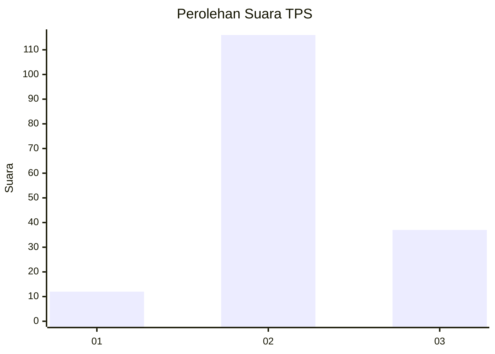
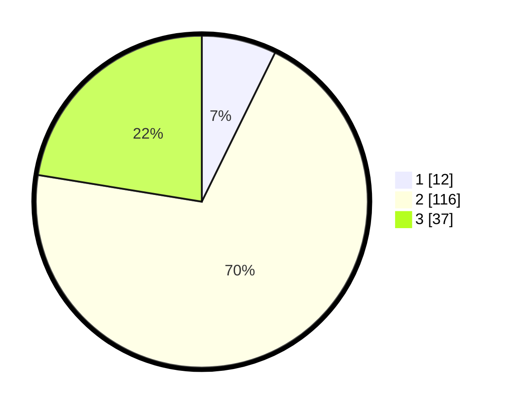

# Hasil

## Grafik

## Tabel

| No. | Nama Paslon    | Suara | Suara (raw) | Persentase |
|:--- |:-------------- | -----:| -----------:| ----------:|
| 1   | ANIES MUHAIMIN | 12    | [12][p-1]   | 7,27       |
| 2   | PRABOWO GIBRAN | 116   | [116][p-2]  | 70,30      |
| 3   | GANJAR MAHFUD  | 37    | [37][p-3]   | 22,42      |

[p-1]: https://github.com/gigit-pemilu/pemilu-2024-35-jawa-timur/blob/main/pilpres/hitung-suara/sub/35-jawa-timur/sub/09-jember/sub/01-jombang/sub/2005-wringinagung/sub/006-tps/sub/paslon-1.txt
[p-2]: https://github.com/gigit-pemilu/pemilu-2024-35-jawa-timur/blob/main/pilpres/hitung-suara/sub/35-jawa-timur/sub/09-jember/sub/01-jombang/sub/2005-wringinagung/sub/006-tps/sub/paslon-2.txt
[p-3]: https://github.com/gigit-pemilu/pemilu-2024-35-jawa-timur/blob/main/pilpres/hitung-suara/sub/35-jawa-timur/sub/09-jember/sub/01-jombang/sub/2005-wringinagung/sub/006-tps/sub/paslon-3.txt

## Foto C Plano

https://sirekap-obj-formc.kpu.go.id/9671/pemilu/ppwp/35/09/01/20/05/3509012005006-20240217-205011--a2bc9ec5-36ab-4b93-9a4c-630d053082cf.jpg

https://sirekap-obj-formc.kpu.go.id/9671/pemilu/ppwp/35/09/01/20/05/3509012005006-20240214-224730--76ae4a7c-6e85-4b54-a441-a801e3c0a9cf.jpg

https://sirekap-obj-formc.kpu.go.id/9671/pemilu/ppwp/35/09/01/20/05/3509012005006-20240214-200522--fc13f353-3214-4910-867b-54fe53d35168.jpg

## Metadata

| Key        | Value               |
| ---------- | ------------------- |
| Time Stamp | 2024-02-19 06:16:00 |

