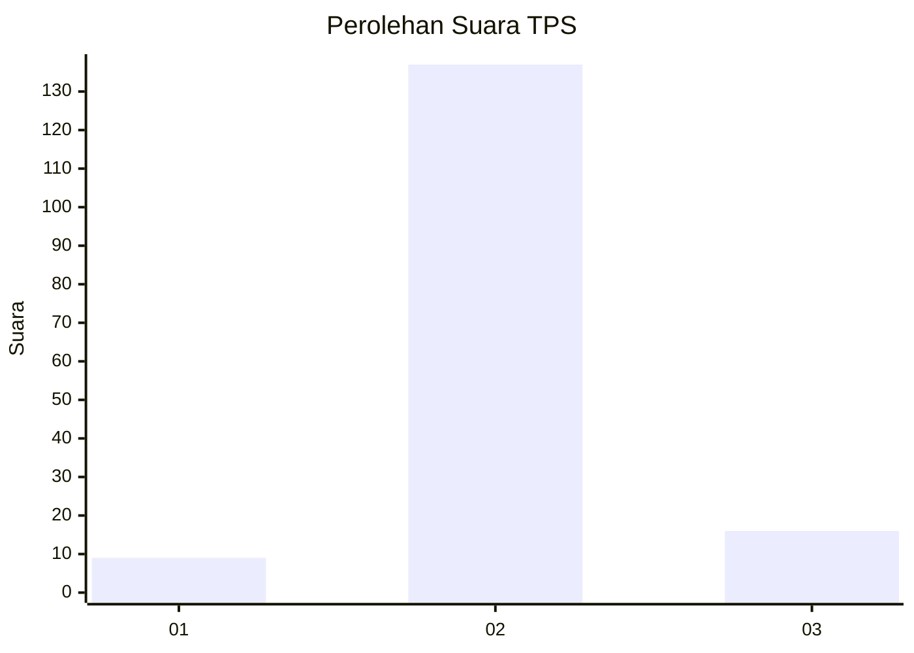
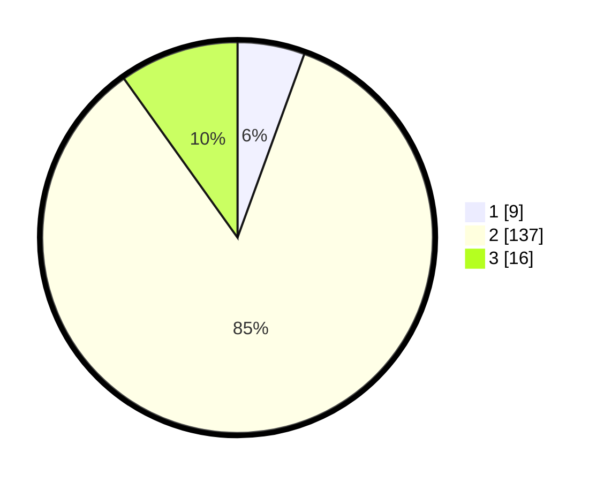

# Hasil

## Grafik

## Tabel

| No. | Nama Paslon    | Suara | Suara (raw) | Persentase |
|:--- |:-------------- | -----:| -----------:| ----------:|
| 1   | ANIES MUHAIMIN | 9     | [9][p-1]    | 5,56       |
| 2   | PRABOWO GIBRAN | 137   | [137][p-2]  | 84,57      |
| 3   | GANJAR MAHFUD  | 16    | [16][p-3]   | 9,88       |

[p-1]: https://github.com/gigit-pemilu/pemilu-2024-35-jawa-timur/blob/main/pilpres/hitung-suara/sub/35-jawa-timur/sub/09-jember/sub/01-jombang/sub/2005-wringinagung/sub/012-tps/sub/paslon-1.txt
[p-2]: https://github.com/gigit-pemilu/pemilu-2024-35-jawa-timur/blob/main/pilpres/hitung-suara/sub/35-jawa-timur/sub/09-jember/sub/01-jombang/sub/2005-wringinagung/sub/012-tps/sub/paslon-2.txt
[p-3]: https://github.com/gigit-pemilu/pemilu-2024-35-jawa-timur/blob/main/pilpres/hitung-suara/sub/35-jawa-timur/sub/09-jember/sub/01-jombang/sub/2005-wringinagung/sub/012-tps/sub/paslon-3.txt

## Foto C Plano

https://sirekap-obj-formc.kpu.go.id/660b/pemilu/ppwp/35/09/01/20/05/3509012005012-20240214-220823--be74d37b-4f59-4ea6-b3ad-ddf5590893be.jpg

https://sirekap-obj-formc.kpu.go.id/660b/pemilu/ppwp/35/09/01/20/05/3509012005012-20240214-220836--fd6e3c9b-7032-4c72-bc0e-454e6f514225.jpg

https://sirekap-obj-formc.kpu.go.id/660b/pemilu/ppwp/35/09/01/20/05/3509012005012-20240214-220841--4de966ab-8281-4c76-b591-0d85c614d419.jpg

## Metadata

| Key        | Value               |
| ---------- | ------------------- |
| Time Stamp | 2024-02-15 15:30:25 |

