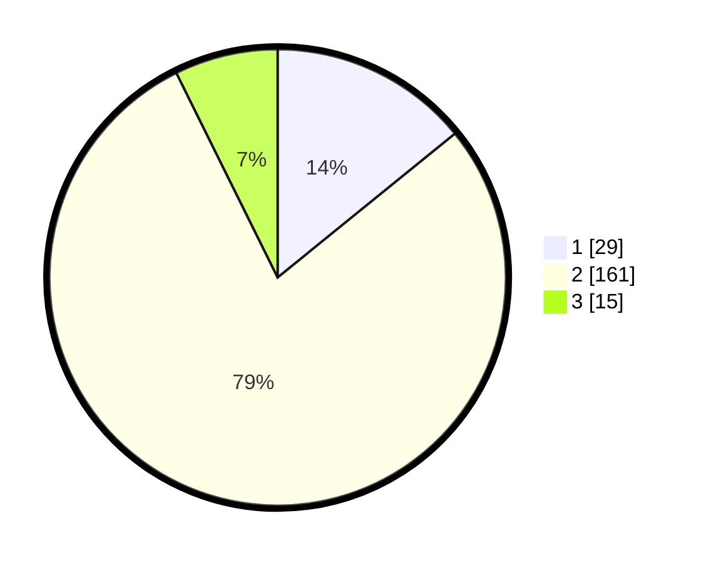

# Hasil

## Grafik

## Tabel

| No. | Nama Paslon    | Suara | Suara (raw) | Persentase |
|:--- |:-------------- | -----:| -----------:| ----------:|
| 1   | ANIES MUHAIMIN | 29    | [29][p-1]   | 14,15      |
| 2   | PRABOWO GIBRAN | 161   | [161][p-2]  | 78,54      |
| 3   | GANJAR MAHFUD  | 15    | [15][p-3]   | 7,32       |

[p-1]: https://github.com/gigit-pemilu/pemilu-2024/blob/main/pilpres/hitung-suara/sub/35-jawa-timur/sub/09-jember/sub/01-jombang/sub/2005-wringinagung/sub/020-tps/sub/paslon-1.txt
[p-2]: https://github.com/gigit-pemilu/pemilu-2024/blob/main/pilpres/hitung-suara/sub/35-jawa-timur/sub/09-jember/sub/01-jombang/sub/2005-wringinagung/sub/020-tps/sub/paslon-2.txt
[p-3]: https://github.com/gigit-pemilu/pemilu-2024/blob/main/pilpres/hitung-suara/sub/35-jawa-timur/sub/09-jember/sub/01-jombang/sub/2005-wringinagung/sub/020-tps/sub/paslon-3.txt

## Foto C Plano

https://sirekap-obj-formc.kpu.go.id/e172/pemilu/ppwp/35/09/01/20/05/3509012005020-20240214-203324--d7efa869-3197-4035-9059-89b4ec88e7dd.jpg

https://sirekap-obj-formc.kpu.go.id/e172/pemilu/ppwp/35/09/01/20/05/3509012005020-20240214-201228--00bb31a3-d315-4f1b-9e7f-320e26425392.jpg

https://sirekap-obj-formc.kpu.go.id/e172/pemilu/ppwp/35/09/01/20/05/3509012005020-20240214-201224--634946a4-80fd-421f-b9f2-404d49c11f76.jpg

## Metadata

| Key        | Value               |
| ---------- | ------------------- |
| Time Stamp | 2024-02-16 00:30:27 |

