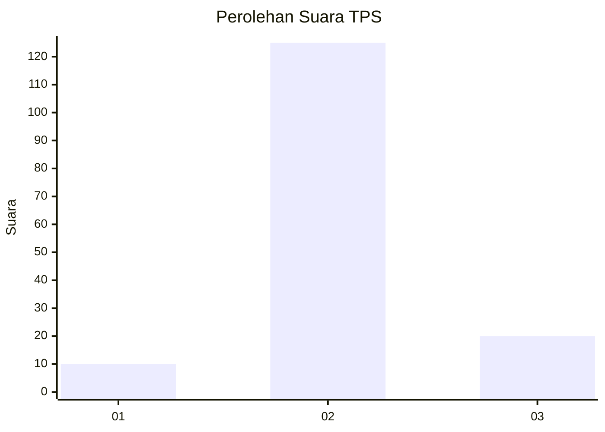
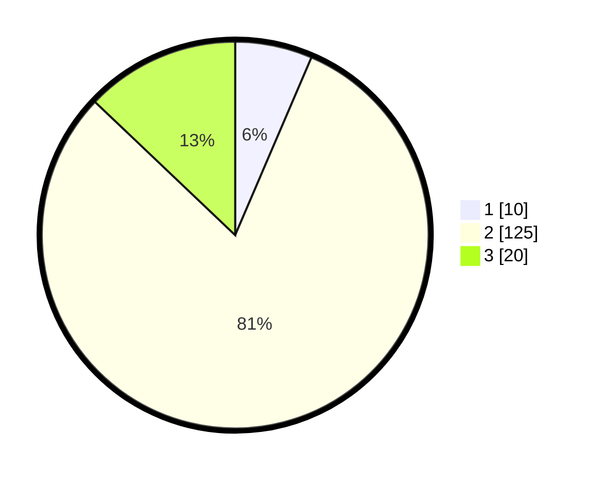

# Hasil

## Grafik

## Tabel

| No. | Nama Paslon    | Suara | Suara (raw) | Persentase |
|:--- |:-------------- | -----:| -----------:| ----------:|
| 1   | ANIES MUHAIMIN | 10    | [10][p-1]   | 6,45       |
| 2   | PRABOWO GIBRAN | 125   | [125][p-2]  | 80,65      |
| 3   | GANJAR MAHFUD  | 20    | [20][p-3]   | 12,90      |

[p-1]: https://github.com/gigit-pemilu/pemilu-2024/blob/main/pilpres/hitung-suara/sub/35-jawa-timur/sub/09-jember/sub/01-jombang/sub/2005-wringinagung/sub/045-tps/sub/paslon-1.txt
[p-2]: https://github.com/gigit-pemilu/pemilu-2024/blob/main/pilpres/hitung-suara/sub/35-jawa-timur/sub/09-jember/sub/01-jombang/sub/2005-wringinagung/sub/045-tps/sub/paslon-2.txt
[p-3]: https://github.com/gigit-pemilu/pemilu-2024/blob/main/pilpres/hitung-suara/sub/35-jawa-timur/sub/09-jember/sub/01-jombang/sub/2005-wringinagung/sub/045-tps/sub/paslon-3.txt

## Foto C Plano

https://sirekap-obj-formc.kpu.go.id/291a/pemilu/ppwp/35/09/01/20/05/3509012005045-20240214-223614--ffa22a62-3880-477d-8858-6c8526bc3c10.jpg

https://sirekap-obj-formc.kpu.go.id/291a/pemilu/ppwp/35/09/01/20/05/3509012005045-20240214-223746--646b2b75-4541-4e61-994a-512d2396070e.jpg

https://sirekap-obj-formc.kpu.go.id/291a/pemilu/ppwp/35/09/01/20/05/3509012005045-20240214-223901--50eec092-0f81-490e-97fa-6cd4941803f9.jpg

## Metadata

| Key        | Value               |
| ---------- | ------------------- |
| Time Stamp | 2024-02-15 12:00:28 |

