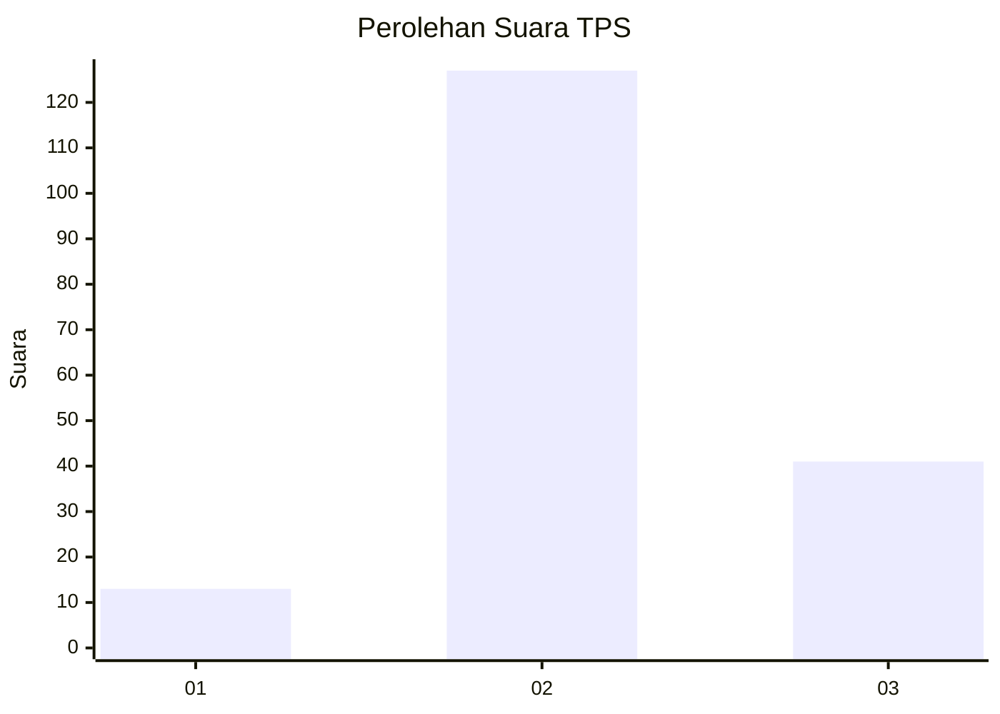
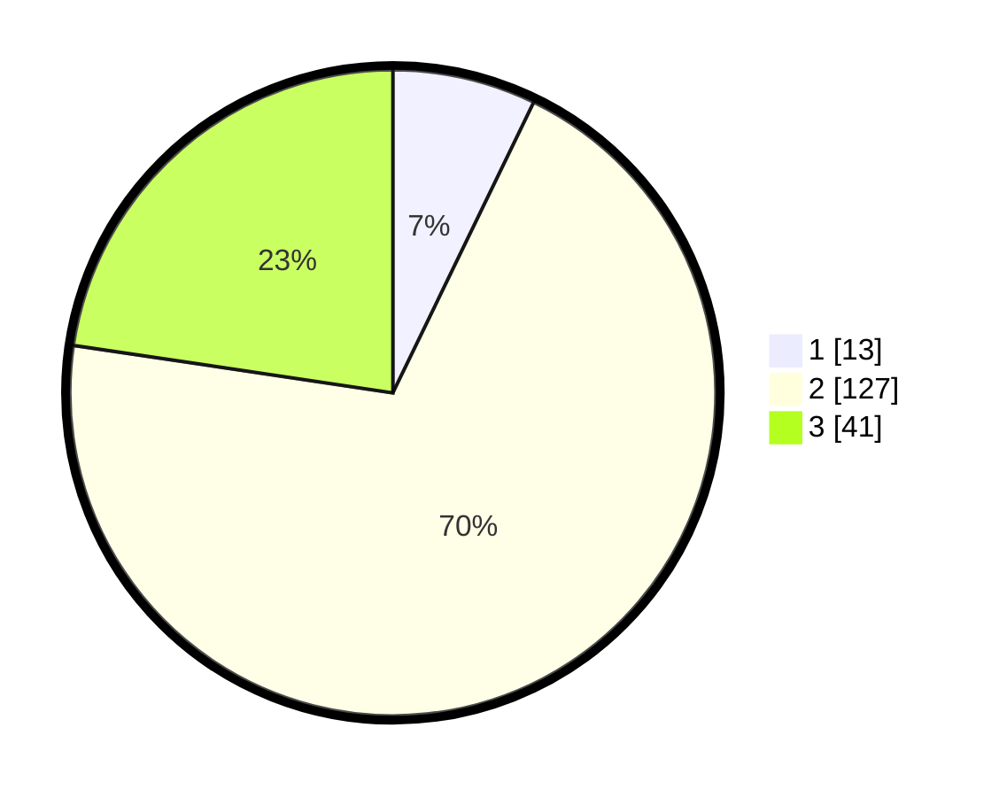

# Hasil

## Grafik

## Tabel

| No. | Nama Paslon    | Suara | Suara (raw) | Persentase |
|:--- |:-------------- | -----:| -----------:| ----------:|
| 1   | ANIES MUHAIMIN | 13    | [13][p-1]   | 7,18       |
| 2   | PRABOWO GIBRAN | 127   | [127][p-2]  | 70,17      |
| 3   | GANJAR MAHFUD  | 41    | [41][p-3]   | 22,65      |

[p-1]: https://github.com/gigit-pemilu/pemilu-2024-35-jawa-timur/blob/main/pilpres/hitung-suara/sub/35-jawa-timur/sub/09-jember/sub/01-jombang/sub/2006-sarimulyo/sub/001-tps/sub/paslon-1.txt
[p-2]: https://github.com/gigit-pemilu/pemilu-2024-35-jawa-timur/blob/main/pilpres/hitung-suara/sub/35-jawa-timur/sub/09-jember/sub/01-jombang/sub/2006-sarimulyo/sub/001-tps/sub/paslon-2.txt
[p-3]: https://github.com/gigit-pemilu/pemilu-2024-35-jawa-timur/blob/main/pilpres/hitung-suara/sub/35-jawa-timur/sub/09-jember/sub/01-jombang/sub/2006-sarimulyo/sub/001-tps/sub/paslon-3.txt

## Foto C Plano

https://sirekap-obj-formc.kpu.go.id/e60f/pemilu/ppwp/35/09/01/20/06/3509012006001-20240214-155831--6d31bb19-52ba-4dcb-914f-e284cb5345dd.jpg

https://sirekap-obj-formc.kpu.go.id/e60f/pemilu/ppwp/35/09/01/20/06/3509012006001-20240215-005101--7e288957-94d3-4063-8c37-ef5a9a7f7866.jpg

https://sirekap-obj-formc.kpu.go.id/e60f/pemilu/ppwp/35/09/01/20/06/3509012006001-20240215-005359--fa472223-4016-4fe9-b2c4-6240e17ae900.jpg

## Metadata

| Key        | Value               |
| ---------- | ------------------- |
| Time Stamp | 2024-02-16 00:30:27 |

