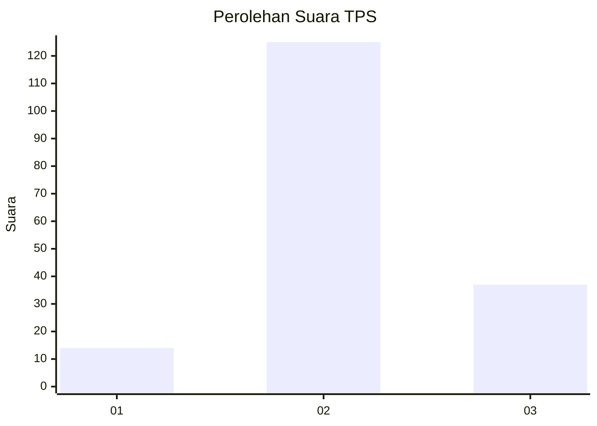
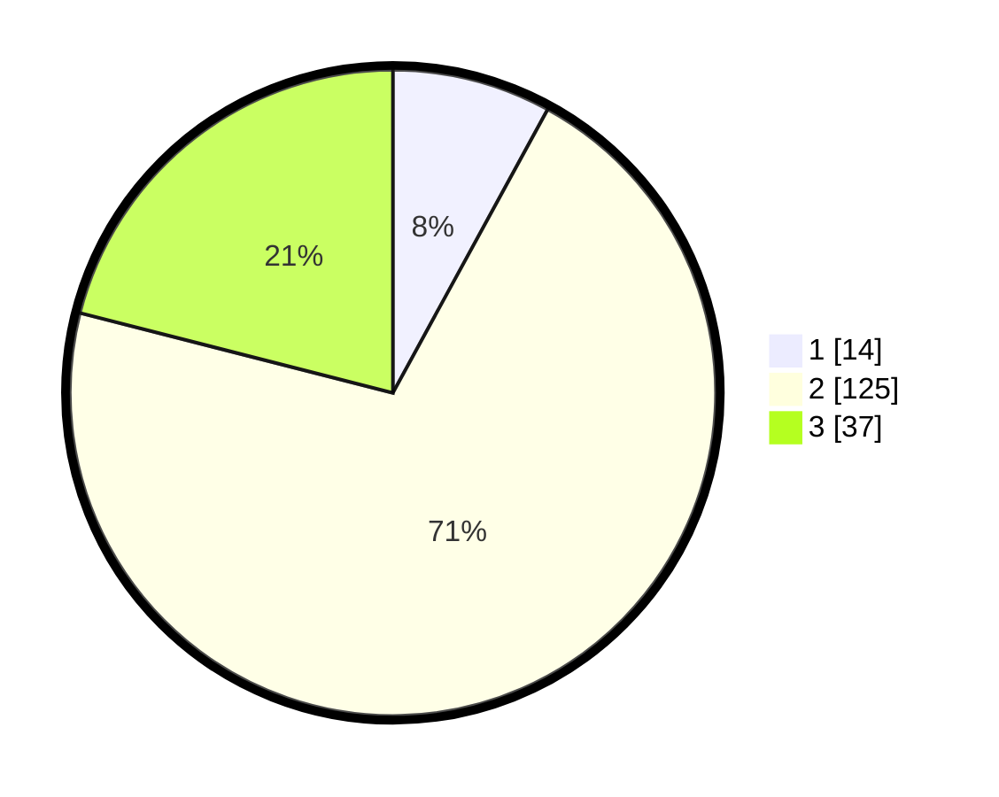

# Hasil

## Grafik

## Tabel

| No. | Nama Paslon    | Suara | Suara (raw) | Persentase |
|:--- |:-------------- | -----:| -----------:| ----------:|
| 1   | ANIES MUHAIMIN | 14    | [14][p-1]   | 7,95       |
| 2   | PRABOWO GIBRAN | 125   | [125][p-2]  | 71,02      |
| 3   | GANJAR MAHFUD  | 37    | [37][p-3]   | 21,02      |

[p-1]: https://github.com/gigit-pemilu/pemilu-2024/blob/main/pilpres/hitung-suara/sub/35-jawa-timur/sub/09-jember/sub/01-jombang/sub/2006-sarimulyo/sub/002-tps/sub/paslon-1.txt
[p-2]: https://github.com/gigit-pemilu/pemilu-2024/blob/main/pilpres/hitung-suara/sub/35-jawa-timur/sub/09-jember/sub/01-jombang/sub/2006-sarimulyo/sub/002-tps/sub/paslon-2.txt
[p-3]: https://github.com/gigit-pemilu/pemilu-2024/blob/main/pilpres/hitung-suara/sub/35-jawa-timur/sub/09-jember/sub/01-jombang/sub/2006-sarimulyo/sub/002-tps/sub/paslon-3.txt

## Foto C Plano

https://sirekap-obj-formc.kpu.go.id/4859/pemilu/ppwp/35/09/01/20/06/3509012006002-20240214-230859--5d0f9ba5-021a-4ff0-bdbb-f23577602101.jpg

https://sirekap-obj-formc.kpu.go.id/4859/pemilu/ppwp/35/09/01/20/06/3509012006002-20240214-230920--99aadf96-179d-43ed-b774-4675f1af0074.jpg

https://sirekap-obj-formc.kpu.go.id/4859/pemilu/ppwp/35/09/01/20/06/3509012006002-20240214-230951--fd8e8a72-7050-4fea-a7ea-d3fd4d58a3d1.jpg

## Metadata

| Key        | Value               |
| ---------- | ------------------- |
| Time Stamp | 2024-02-15 12:00:28 |

