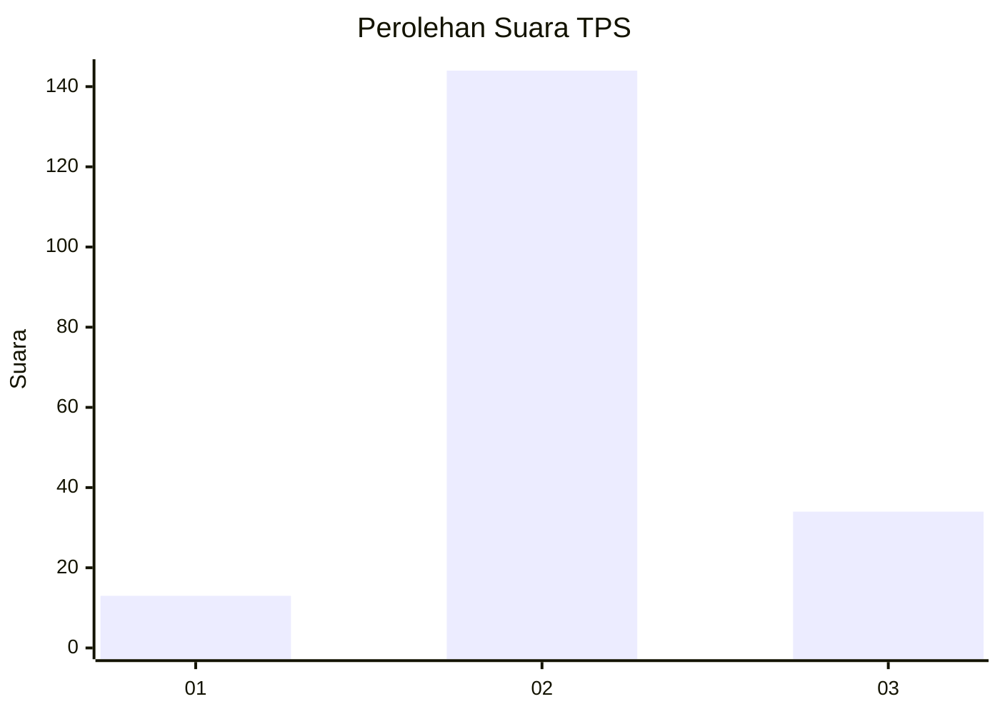

# Hasil

## Grafik

## Tabel

| No. | Nama Paslon    | Suara | Suara (raw) | Persentase |
|:--- |:-------------- | -----:| -----------:| ----------:|
| 1   | ANIES MUHAIMIN | 13    | [13][p-1]   | 6,81       |
| 2   | PRABOWO GIBRAN | 144   | [144][p-2]  | 75,39      |
| 3   | GANJAR MAHFUD  | 34    | [34][p-3]   | 17,80      |

[p-1]: https://github.com/gigit-pemilu/pemilu-2024/blob/main/pilpres/hitung-suara/sub/35-jawa-timur/sub/09-jember/sub/01-jombang/sub/2006-sarimulyo/sub/003-tps/sub/paslon-1.txt
[p-2]: https://github.com/gigit-pemilu/pemilu-2024/blob/main/pilpres/hitung-suara/sub/35-jawa-timur/sub/09-jember/sub/01-jombang/sub/2006-sarimulyo/sub/003-tps/sub/paslon-2.txt
[p-3]: https://github.com/gigit-pemilu/pemilu-2024/blob/main/pilpres/hitung-suara/sub/35-jawa-timur/sub/09-jember/sub/01-jombang/sub/2006-sarimulyo/sub/003-tps/sub/paslon-3.txt

## Foto C Plano

https://sirekap-obj-formc.kpu.go.id/08d8/pemilu/ppwp/35/09/01/20/06/3509012006003-20240214-221129--b31805d6-4c04-4fb7-8f60-5d278748e19a.jpg

https://sirekap-obj-formc.kpu.go.id/08d8/pemilu/ppwp/35/09/01/20/06/3509012006003-20240214-221255--fd8b43e9-6ac7-4f40-a2e2-0e22dc9abfbd.jpg

https://sirekap-obj-formc.kpu.go.id/08d8/pemilu/ppwp/35/09/01/20/06/3509012006003-20240214-221407--9c306b13-8e64-4e95-a05c-2f0a30d954cb.jpg

## Metadata

| Key        | Value               |
| ---------- | ------------------- |
| Time Stamp | 2024-02-15 15:30:25 |

