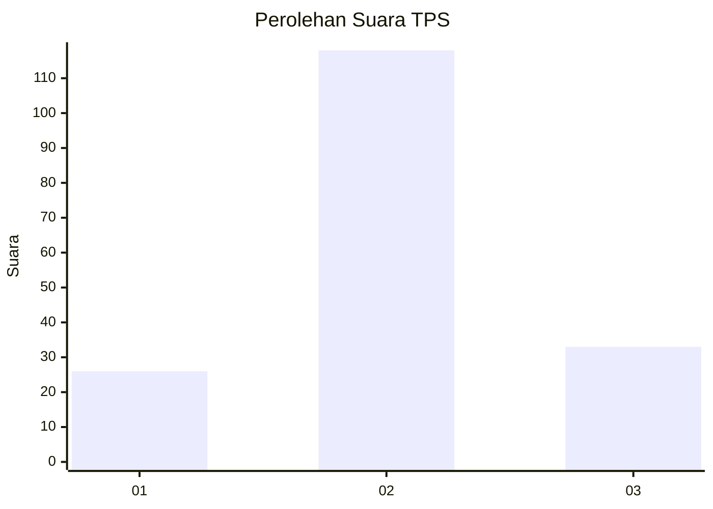
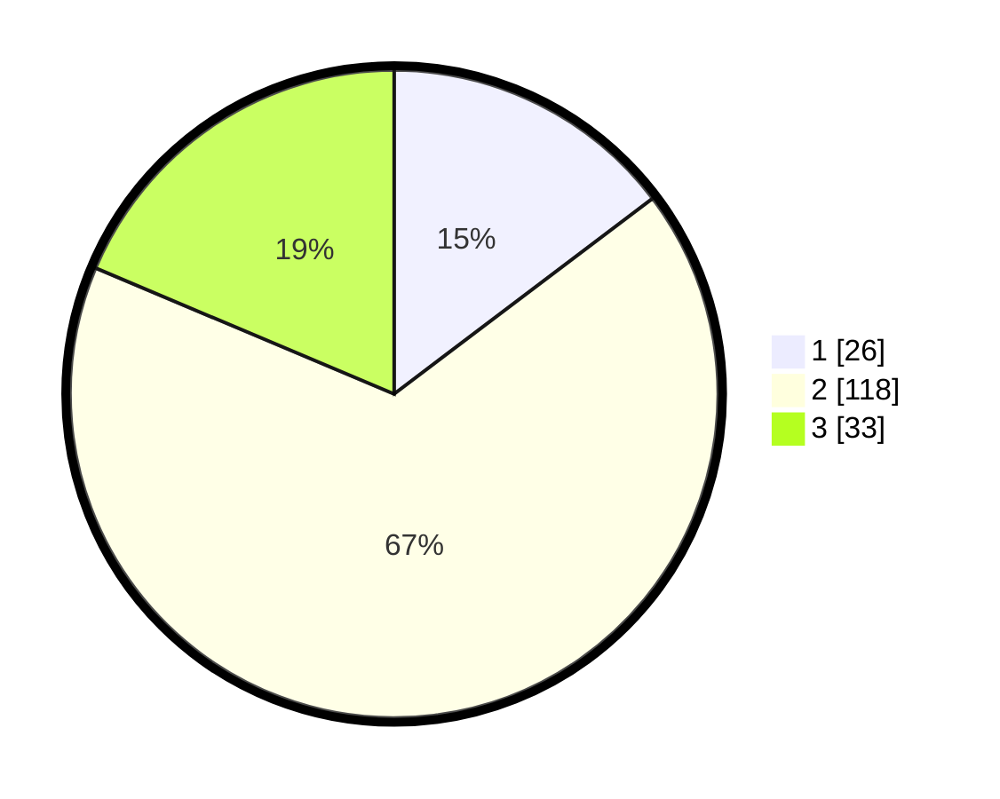

# Hasil

## Grafik

## Tabel

| No. | Nama Paslon    | Suara | Suara (raw) | Persentase |
|:--- |:-------------- | -----:| -----------:| ----------:|
| 1   | ANIES MUHAIMIN | 26    | [26][p-1]   | 14,69      |
| 2   | PRABOWO GIBRAN | 118   | [118][p-2]  | 66,67      |
| 3   | GANJAR MAHFUD  | 33    | [33][p-3]   | 18,64      |

[p-1]: https://github.com/gigit-pemilu/pemilu-2024/blob/main/pilpres/hitung-suara/sub/35-jawa-timur/sub/09-jember/sub/01-jombang/sub/2006-sarimulyo/sub/004-tps/sub/paslon-1.txt
[p-2]: https://github.com/gigit-pemilu/pemilu-2024/blob/main/pilpres/hitung-suara/sub/35-jawa-timur/sub/09-jember/sub/01-jombang/sub/2006-sarimulyo/sub/004-tps/sub/paslon-2.txt
[p-3]: https://github.com/gigit-pemilu/pemilu-2024/blob/main/pilpres/hitung-suara/sub/35-jawa-timur/sub/09-jember/sub/01-jombang/sub/2006-sarimulyo/sub/004-tps/sub/paslon-3.txt

## Foto C Plano

https://sirekap-obj-formc.kpu.go.id/17cc/pemilu/ppwp/35/09/01/20/06/3509012006004-20240214-233237--c80c1253-1a66-4cf7-92be-b4cb7df95766.jpg

https://sirekap-obj-formc.kpu.go.id/17cc/pemilu/ppwp/35/09/01/20/06/3509012006004-20240214-233316--53caa427-ba5d-442e-a17e-4e972e0fb6e1.jpg

https://sirekap-obj-formc.kpu.go.id/17cc/pemilu/ppwp/35/09/01/20/06/3509012006004-20240214-233458--02dc1053-83e9-4295-ab5d-2f0f26bc2567.jpg

## Metadata

| Key        | Value               |
| ---------- | ------------------- |
| Time Stamp | 2024-02-15 15:30:25 |

